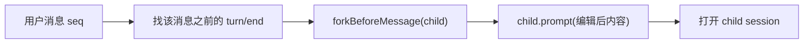
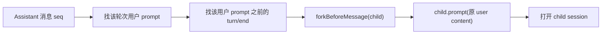

## Context

DSH Web 的会话历史由 `SessionEvent` append-only log 派生。`ctx.sessions.fork` 已经支持按“已完成轮次 turn/end”切出 child session，Web 端也有 Branch 按钮，但只覆盖“从最后一条 Assistant 消息分支”。用户消息没有动作条，也没有手动重试。

本 change 的目标不是改写历史，而是把“编辑/重试”实现为“分支派生”：在目标消息之前的稳定边界派生 child，再写入/重发用户内容，让模型在新上下文中继续。这样父会话、旧回答、历史工具调用都保持可回放，符合 DSH 的事件溯源与 KV-cache 设计。

## Goals / Non-Goals

**Goals:**

- 让 DSH Web 用户气泡支持“编辑已发送消息”。
- 让 DSH Web Assistant 动作条支持“重试/重新生成”。
- 把 Branch/Edit/Retry 统一为可理解、可测试的分支派生动作。
- 用插件方式交付，不修改 agent loop。
- 通过最小 additive upstream seam 开放用户消息动作条。

**Non-Goals:**

- 不原地修改 `SessionEvent` 或已有消息内容。
- 不实现会话树/时间线可视化（后续可另开 change）。
- 不在 V1 支持编辑 Assistant 消息、工具调用或附件二进制。
- 不把 fork/prompt 逻辑复制进浏览器组件；组件只提交 typed intent。
- 不自动重试未知/partial/stale 状态；失败必须可见且可 reconcile。

## Decisions

### 1. 编辑 = forkBefore + prompt(新内容)

- 非首轮：fork 边界取目标用户消息之前的最近 `turn/end`。
- 首轮：需要 `forkBeforeMessage` 支持 `seedLength: 0` 的 child；未落地前可禁用或退化为新建空 session。
- 保存成功后自动打开 child；父会话保持不变。

### 2. 重试 = forkBefore + prompt(原内容)

- 重试按钮只出现在可定位到安全用户 prompt 的 Assistant 消息上。
- 如果目标轮次是当前正在运行的轮次，禁用。

### 3. 客户端只做 presentation + typed intent

按钮、内联编辑器、pending 状态属于 client package；fork/prompt 调用通过 `ctx.sessions` 或注入的 `ChatRewriteController` 完成，组件不直接持有业务状态。

### 4. 需要的最小 upstream seam

- `conversation.chat.user-actions` slot：与现有 `assistant-actions` 对称，让外部插件给用户气泡加动作。
- 可选 `session.forkBeforeMessage` RPC：支持首轮 `seedLength: 0` 和精确“目标消息之前”边界。
- 这两个 seam 都必须在 `client/deepseek-harness` 用 Agent Note handoff，不在 Harness Plugins 内 fork DSH core。

### 5. 失败与边界策略

- `unknown`/`partial`/`stale` 不自动重试，显示错误并要求 reconcile。
- 运行中轮次、无前置 turn/end、非文本内容、已归档 session 都禁用 mutation。
- child 已创建但打开失败时，保留 child 在列表，并显示可恢复错误。

## Test Specification

| 层 | 场景 | 命令 | 证据 |
| --- | --- | --- | --- |
| unit | 边界计算：非首轮/首轮/运行中/unknown seq | `pnpm --filter @yeisme/dsh-client-ui-conversation-rewrite run test` | Vitest result |
| unit | Edit 内联编辑器保存/取消/空内容 | `pnpm --filter @yeisme/dsh-client-ui-conversation-rewrite run test` | Vitest result |
| unit | Retry 按钮 loading/error/disabled | `pnpm --filter @yeisme/dsh-client-ui-conversation-rewrite run test` | Vitest result |
| integration | fork + prompt 派生 child 并打开 | `pnpm --filter @yeisme/dsh-client-ui-conversation-rewrite run test:integration` | Vitest result |
| build | typecheck/build | `pnpm --filter @yeisme/dsh-client-ui-conversation-rewrite run typecheck && pnpm --filter @yeisme/dsh-client-ui-conversation-rewrite run build` | exit 0 |
| e2e | 历史消息编辑后 child 重新回答；Assistant Retry 生成新分支 | `cd client/deepseek-harness && pnpm run test:e2e`（含 DSH seam 后） | e2e result |

## Risks / Trade-offs

- [上游 seam 未合并] → 插件先做 Assistant Retry（已有 assistant-actions slot），Edit 的 user-actions 待 seam 合入后启用。
- [首轮无法精确 fork] → 非首轮先交付；首轮用 `forkBeforeMessage` 或新建空 session 降级，明确记录差异。
- [用户误解“编辑=新分支”] → UI 文案明确“保存后将创建新分支，原对话保留”。
- [与现有 Branch 语义重复] → 统一为分支家族，共享边界计算和 child 打开逻辑。

## Migration Plan

1. 发布 `@yeisme/dsh-client-ui-conversation-rewrite` 与 `@yeisme/dsh-conversation-rewrite` 为 `0.1.0-rc.1`。
2. 先注册 Assistant Retry；user-actions seam 合并后启用 Edit。
3. 后续接入 `session.forkBeforeMessage` 后启用首轮编辑/重试。
4. Rollback：移除 bundle row 和 client plugin；无数据迁移。

## Open Questions

- `forkBeforeMessage` 是否作为独立 RPC，还是扩展 `session.fork` 的 `atSeq: 'before-message'` 语义？
- 编辑用户消息时，附件/图片是保留、替换还是禁止？
- 重试按钮是否只出现在最后一条 Assistant，还是所有历史 Assistant 消息都可重试？
