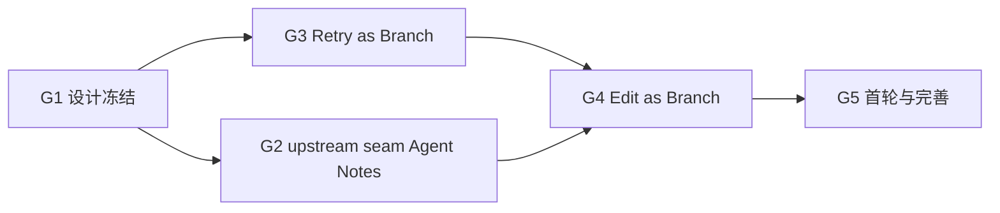

# DSH Conversation Rewrite Goal

本 Goal 驱动 `dsh-conversation-rewrite-plugin-v1` 完成 DSH Web 编辑/重试/分支体验的后续推进。目标是把根级 `docs/design/dsh-web-conversation-rewrite-plugin-v1.md` 变成可执行的子项目 OpenSpec 任务，并协调 DSH 上游 seam handoff。

## 总目标 G0

在不修改 DSH 会话日志、不绕过 append-only 纪律、不复制 DSH core 私有实现的前提下，让 DSH Web 用户能够编辑已发送用户消息、手动重试 Assistant 回答，并把 Branch/Edit/Retry 统一为可验证的分支派生交互；通过 Harness Plugins 插件与最小 additive upstream seam 交付。

## 必达子目标

| Goal | 结果 | Owner change | 完成定义 |
| --- | --- | --- | --- |
| G1 设计冻结 | 根设计 + OpenSpec proposal/design/tasks/spec 一致，能力账本无缺漏 | `dsh-conversation-rewrite-plugin-v1` | `openspec validate --strict` 通过 |
| G2 upstream seam | `conversation.chat.user-actions` slot 与 `session.forkBeforeMessage` 的 Agent Note handoff 被 DSH 接受 | `client/deepseek-harness` Agent Notes | 两个 Agent Note 格式验证通过且被接受 |
| G3 Retry as Branch | Assistant 消息可手动重试，child 派生并重发原 prompt | `dsh-conversation-rewrite-plugin-v1` | 非首轮 integration 测试全绿 |
| G4 Edit as Branch | 用户消息可内联编辑并保存为 child，原会话不变 | `dsh-conversation-rewrite-plugin-v1` | 非首轮 integration 测试全绿 |
| G5 首轮与完善 | 首轮编辑/重试、a11y、附件边界、branch lineage 视觉 | `dsh-conversation-rewrite-plugin-v1` + DSH Host | e2e 与组件矩阵全绿 |

## 硬不变量

1. `SessionEvent` 是 append-only canonical truth；Edit/Retry 永远派生 child，绝不原地改写历史。
2. 组件只提交 typed intent；fork/prompt 由 `ctx.sessions` 或 Host RPC 执行。
3. 未知/partial/stale/运行中状态只显示禁用或 typed error，绝不自动重试。
4. 所有 slot 注册和 controller 必须 effect-scoped dispose。
5. 不 import DSH core 私有实现、不复制 DOM patch、不依赖未发布 API。
6. 所有集成/组件/e2e 证据写入对应子项目 `temp/integration-test-runs/<run-id>/`，并完成脱敏。

## 并行 DAG



- G1 是后续所有任务的输入。
- G2 与 G3 可并行：Retry 使用现有 assistant-actions slot，不依赖 user-actions。
- Edit 依赖 G2 的 user-actions slot；若 slot 未合入，Edit 先保持禁用。
- 首轮能力依赖 `session.forkBeforeMessage`。

## 推进命令

```bash
# Harness Plugins 子项目
cd /workspaces/yeisme-agent/agent/harness-plugins
openspec status --change dsh-conversation-rewrite-plugin-v1
openspec validate dsh-conversation-rewrite-plugin-v1 --strict --no-interactive

# DSH 上游 Agent Note 验证（seam handoff 后）
cd /workspaces/yeisme-agent/client/deepseek-harness
pnpm run verify-agent-note-format
pnpm run verify-translation-pairing
```

> 若使用 Ordo goal target 导入，可把本文件作为目标定义；绑定命令按各自仓库现有 `ordo goal target bind` 流程执行。
