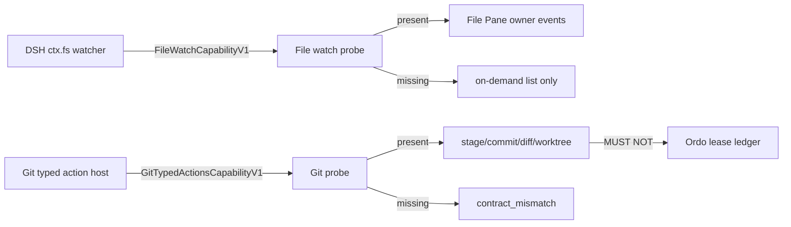

## Context

File Pane 已有 `@yeisme/dsh-file-host` 按需 `listEntries`。DSH `ctx.fs` watcher 仍是 `additive-change-required`。Git typed action host 同样未合入。本 change 冻结探测合同，使 File/Git 在 seam 未到前诚实降级。

## Goals / Non-Goals

**Goals:**

- File 变化只消费 owner event；缺 capability 不得宣称实时。
- Git 只接受 typed action；任意 argv 拒绝。
- 危险 Git 动作带 preview/approval/receipt。
- worktree/lease：客户端不得释放 Ordo lease。

**Non-Goals:**

- 不在浏览器实现 inotify / chokidar / 轮询。
- 不向 deepseek-harness 提交合入（只写 upstream-prs 合同骨架）。
- 不解封 BrowserSession。
- 不把 File Pane 做成第二文件系统。

## Decisions

1. `FileWatchCapabilityV1` 是唯一 live 声明。缺它时 freshness 不得为 live；用户显式 refresh 才 reconcile。
2. 事件 payload 只含 opaque entry ref、kind、parentRef、cursor；禁止绝对路径、file://、凭据。
3. Git action 枚举封闭：`status`、`diff`、`stage`、`unstage`、`commit`、`worktree.create`、`worktree.remove`。未知 id → `not_available`。
4. `worktree.remove` 即使 owner 允许，也不得调用 Ordo `lease.release`。
5. 上游 `fs-watch` 与 `git-typed-actions` 分系列；插件 probe 独立。

## Risks / Trade-offs

- File 在 seam 合入前仍是静态树；这是诚实降级，不是功能缺失伪装。
- Git 无 typed host 时 Manager 入口 disabled + 原因，杜绝死按钮。
