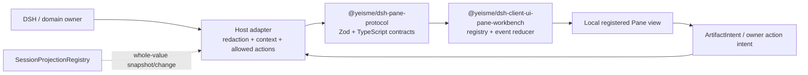

## Context

Harness Plugins 当前已有 Ordo host/client/preset/bundle，但没有跨插件 Pane contract。`dsh-pane-workbench-interaction-v1` 已决定 Pane layout 由一个纯 bounded reducer 拥有；本 change 不能创建第二 layout reducer，只补齐 provider SDK、safe projection、事件恢复和 artifact handoff。

此前 `dsh-plugin-package-consolidation-v1` 将“通用 UI kit”排除，因为当时只有 Ordo 一个已证明 consumer。新的根级能力台账已承诺 Subagent、Browser、File、Terminal、Git、Plan+Skills、Eikona、Sonora、Auctra、Pinax、Anatomia 与 Ordo；证据阈值已经变化。本 change 的 scope change 是“允许最小 headless platform”，不是授权共享领域组件或业务状态机。

### Contract surface classification

| Surface | 变更类型 | 版本姿态 | 兼容要求 |
| --- | --- | --- | --- |
| `@yeisme/dsh-pane-protocol` public TS API | additive new | `0.1.0-rc.1`, experimental | 未宣布稳定；字段扩展默认 optional |
| `@yeisme/dsh-client-ui-pane-workbench` public TS API | additive new | `0.1.0-rc.1`, experimental | 不重用 Ordo client export |
| Pane event schema | additive new | `pane.event.v1alpha1` | unknown optional field 忽略，unknown required schema fail closed |
| Artifact schema | additive new | `pane.artifact.v1alpha1` | owner/ref/version 不可缺失 |

没有 breaking surface、deprecation window 或存储迁移。若后续重命名字段或 package，必须另建 migration change；不能借 pre-1.0 身份静默断代。

## Goals / Non-Goals

**Goals:**

- 为 Host、Client、Composition、Observation 四面提供一组小而稳定的 headless 类型和验证器。
- 提供纯 reducer/registry，使 snapshot、event、duplicate、gap、reset、contract mismatch 与 generation switch 可确定性测试。
- 证明 DSH `SessionProjectionRegistry` 的 whole-value projection 可作为 Pane event source，而无需客户端轮询。
- 证明 typed artifact handoff 只携带安全 ref，并把 mutation admission 留给 owner。
- 给后续 React chrome、bundle 和领域 provider 留下 additive seam。

**Non-Goals:**

- 首切片不实现 React Pane chrome、drag/docking、persistence、`shell.overlay` 或 profile bundle。
- 不实现 File/Git/Browser/Terminal/Ordo 或创作领域状态机。
- 不创建 generic fetch、browser domain store、任意 iframe bridge、scheduler 或 action executor。
- 不把 schema manifest 手写为发布事实；developer CLI 在后续任务生成 package manifest/compatibility metadata。

## Decisions

### 1. 采用 protocol package + 单一 client engine



`packages/host/pane-protocol` 只含 wire-safe contract 和纯函数，不依赖 React 或领域 package。`packages/client/ui-pane-workbench` 是既有 core Pane change 规划的唯一 client engine；本 change 只交付其 registry/event foundation，后续 reducer/chrome 继续由 `dsh-pane-workbench-interaction-v1` tasks 推进。

替代方案“每个 domain plugin 自带 event schema 和 registry”会导致重连、状态语义和安全字段分裂；拒绝。替代方案“把 shared protocol 放进某个 Ordo package”会错误绑定领域 owner；拒绝。

### 2. 插件定义是本地代码描述符，不是远程 UI 清单

`PanePluginDefinitionV1` 的最小字段：

```text
id, version, apiVersion, owner,
faces: { host, client, composition, observation },
capabilities: { required[], optional[] },
permissions[],
views[], commands[], artifactKinds[],
compatibility: { dshApiRange, experimental }
```

Client `views[].componentKey` 只用于查找当前 bundle 本地已注册 factory；wire projection 不得提供 module URL、component name、script、iframe permission 或任意 fetch。Registry 以 `plugin id + generation` 为逻辑 identity，注册返回精确 disposer；同 generation 重复 id 拒绝，不允许 last-write-wins 覆盖。

### 3. Event runtime 使用 whole-value snapshot 与 typed incremental op

`PaneEventEnvelopeV1` 使用：

```text
schema, stream, cursor, sequence,
context { workspaceRef, sessionRef?, principalRef?, revision },
entityRef, entityVersion,
op: snapshot | upsert | remove | append | invalidate | action_receipt | reset,
occurredAt, observedAt, freshness,
payload, traceRef?, receiptRef?
```

`applyPaneEvent(previous, event)` 是纯函数：

- 首个 `snapshot` 建立 stream/context/cursor/sequence 与 entity map。
- duplicate/older sequence 返回 same state reference。
- sequence gap、context revision mismatch、entity version rollback、unknown schema major 进入 `reconcile_required`，保留 last safe snapshot 并禁用 mutation。
- `reset` 清空 entity projection，但保留 typed reason；新 generation 必须先 snapshot 才可 ready。
- `action_receipt` 只记录 bounded receipt ref/status，不把客户端请求推断为成功。

DSH session projection 本身提供 whole-value snapshot/change；Host adapter 负责把 `asOfSeq` 映射为 Pane cursor/sequence。domain SSE/WebSocket 可产生 incremental op，但必须满足相同 envelope。

### 4. Artifact handoff 只传 ref 和 intent

`ArtifactRefV1` 包含 owner、kind、ref、version、mediaType、安全 title/summary、evidence refs 和 capabilities；禁止正文、credential、raw prompt、provider payload、绝对路径。`ArtifactIntentV1` 只允许 `open|compare|attach_context|transform|handoff|link`，并包含 source、target owner/pane、context revision 和 idempotency key。

本地 validator 只验证 shape、安全长度和明确禁止字段；它不判断 permission、cost、rights、target version 或是否可执行。Host/domain owner 必须重新 admission 并返回 preview/approval/rejection/receipt。

### 5. 首切片 canary 不依赖 UI 装配

两个 mock provider：

1. `notes-preview`：只读 snapshot/upsert/open intent。
2. `media-review`：artifact renderer + approval-required action receipt。

它们验证 registry、capability gating、duplicate id、dispose、generation reset、event gap 与 artifact handoff。真实 DSH canary 使用发布版 `@deepseek-ai/dsh-session-projection` 和 `@deepseek-ai/dsh-session`：测试内注册一个纯 projection unit，append 安全 log event，读取 snapshot/change，再映射到 Pane event reducer。该测试证明 official seam 可接入，不把 canary key 作为生产功能发布。

### 6. 状态与安全预算

- summary/title/reason 等字符串有长度上限；payload 由 plugin-specific Zod schema 验证后才进入 reducer。
- entity map、append timeline 和 receipts 都有显式上限；超限进入 bounded truncation 或 reconcile，不无界保留。
- `ready/running/attention_required/approval_required/stale/offline/permission_denied/contract_mismatch/unknown/reconcile_required` 使用同一 enum。
- Registry 和 event runtime 不持久化；后续 persistence 只保存 core Pane spec 允许的安全 UI state。

### 7. Source independence 与许可

生产依赖、imports、README、fixture 与 build output 不得包含 `dsh-better-sidebar` package/path/source marker。允许在 OpenSpec/README 中作为公开交互研究来源引用，但不得复制非平凡 TypeScript、CSS、测试或构建产物。source-independence test 对 package manifest、source import 和最终 tarball 执行扫描。

## Test Specification

| 层 | 场景 | 命令 | 证据 |
| --- | --- | --- | --- |
| protocol unit | valid/invalid plugin、event、artifact、forbidden fields | `pnpm --filter @yeisme/dsh-pane-protocol test` | Vitest result |
| client unit | registry/dispose/generation、snapshot/duplicate/gap/reset | `pnpm --filter @yeisme/dsh-client-ui-pane-workbench test` | Vitest result |
| integration | 真实 SessionProjectionRegistry snapshot/change → Pane reducer | client focused test | `temp/integration-test-runs/<run-id>/`（后续 runner） |
| build contract | exports/dts/tarball/source independence | package build + pack check | build output / tarball listing |

首切片不声称 browser/profile UI 已验证；只有 `shell.overlay` bundle 完成后才能增加 browser evidence。

## Risks / Trade-offs

- [protocol 过早冻结] → 标记 experimental，首批只包含所有 Pane 都需要的安全字段；领域 payload 仍由 owner schema 扩展。
- [host category 中放 shared protocol 命名不直观] → package 名保持 owner-neutral；后续若 workspace 支持 `packages/shared/*`，迁移必须走 additive alias，不直接改路径。
- [event reducer 演变为领域 store] → 只保存 generic entity/ref/receipt projection，禁止领域 transition 和 action admission。
- [真实 DSH canary 只覆盖 session projection] → 明确这是 Wave 0 seam 证明；WebSocket/SSE 和 browser profile 留到具体 provider/overlay change。
- [并行 dirty worktree] → 新文件限制在新 change、新 package 与 planned client package；不修改 Ordo package 和现有未提交代码。

## Migration Plan

1. 创建 protocol package 和 client foundation，版本 `0.1.0-rc.1`，默认不挂 profile、不注册 UI。
2. 通过 mock + real DSH projection canary 后，由 `dsh-pane-workbench-interaction-v1` 继续 core reducer/chrome。
3. developer CLI、bundle/profile 和 `shell.overlay` 在同 change 后续任务交付；失败时不以 DOM patch 替代。
4. 后续 domain Pane 逐个依赖 protocol minor-compatible range，并提供 payload schema/adapter。

Rollback：删除新 package/workspace registration 或关闭 feature registration。因为没有持久化、profile patch、领域 mutation 或数据迁移，rollback 不需要 reverse migration。实验 surface 一旦发布，后续仍采用 additive field/alias；删除或重命名另建 change。

## Scope Change Log

| 能力 | 决策 | 依据 |
| --- | --- | --- |
| 最小 headless Pane platform | deliver-now | 已有 10+ required providers，复用阈值成立 |
| Layout reducer / React chrome | retained in existing owner change | 避免第二 engine |
| Developer CLI / manifest | retain-next in this change | 先稳定最小 contract，再生成发布 metadata |
| `shell.overlay` / bundle | retain-next | 首切片先证明 official projection seam |
| Domain Pane state | moved behind typed contract | canonical owner 不变 |
| Generic UI kit / shared domain components | rejected | 复用只发生在 protocol/chrome primitives，不共享业务状态机 |

## Open Questions

- 发布前是否将 protocol package 物理路径迁为未来 `packages/shared/pane-protocol`；在 workspace 规则未变前保持 `packages/host/pane-protocol`。
- Developer CLI 是否扩展官方 `dsh plugin`，还是发布 `dsh-pane`；需先验证官方 command extension seam，不能制造冲突命令。
