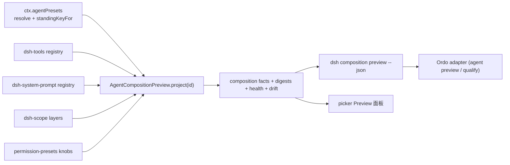
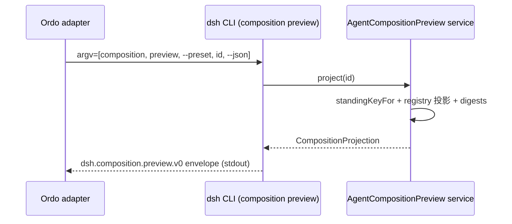

## Context

DSH 是 plugin-based harness（vendored Cordis）。`packages/preset/agent-presets` 已提供 roster、standing mount、`standingKeyFor(id)`（冷读：确保 mount 但不启动 agent/session/turn）、`mount()`（拒绝 unscoped target / 不可用 row / root-realm service）与 copy-only authoring。本 change 把这些能力组合成一个**纯读投影面**，供 picker 与 Ordo 消费。

约束：pre-release 无外部消费者，优先正确基础；所有公开面（service、CLI envelope、UI slot）一旦落地即成为待维护 seam，因此本设计只加最小 additive 面。

## Goals / Non-Goals

**Goals:** 无会话组合投影 + digests；三层 health；drift/lineage；机器命令 `preview`/`smoke`；picker 只读 Preview 面板。

**Non-Goals:** 不做风险/成熟度/资质判断；不做模型可见工具；不改 mounting/generation 语义；不做 bundle/pack。

## Decisions

### 1. 新包 `packages/preset/agent-composition-preview`，服务键 `agentCompositionPreview`



Service 定义（拟，最终字段以实现为准）：

- `project(id?): Promise<CompositionProjection>`：解析 preset（默认 `defaultId`），`standingKeyFor(id)` 确保 standing mount，随后在该 standing scope 下读取 registries 投影 tools / prompt sections / projection units / permission knobs，计算每项 digest 与整体 `capability_digest`，附三层 health 与 drift。
- `smoke(id?): Promise<SmokeReport>`：等价 `project()` 加显式 dispose 校验（投影完成后不残留本服务的任何注册），供 CLI smoke 命令复用。
- 纯读、无订阅、无 durable 写。缓存只以 composition stamp + digest 失效；每次调用重读 roster（与 `list()`/`resolve()` 的 unmemoized 约定一致）。

投影类型（客户端安全子集 `./types`）：

```text
dsh.composition.preview.v0
  preset: { id, trust, composition_stamp, generation }
  health: { shape_ok, mount_ok, reason?, provable_mount_ref? }
  drift: { state: none|unknown|diverged, source_id?, source_digest?, copy_digest? }
  composition:
    tools[]: { name, schema_digest, source_plugin, source_layer }
    prompt_sections[]: { id, section_digest, source_plugin }
    projection_units[]: { key, source }
    permissions: { sandbox_mode, approval_policy, contrib_source }
  capability_digest
  generated_at
```

digest 规范：tool 项 = sha256(canonical JSON of name + schema)；schema 序列化必须稳定（实现期确认 registry 是否已有稳定序列化，否则新增最小 canonical 化 helper）；section 项 = sha256(section text)；`capability_digest` = sha256(canonical JSON of composition 段)。

### 2. 三层 health，不互相冒充

- `shape_ok`：来自 roster discovery 的既有 health（可解析、有 named rows）。
- `mount_ok`：`standingKeyFor(id)` 成功即 true；被拒时附 reason（unscoped / unusable row / root-realm service / broken）。
- `provable_mount_ref`：mount 成功时的引用（generation + stamp），是「无会话冷读证明」的可追溯锚点。
- broken preset：返回 typed `composition_invalid` + reason，不返回空组合。

### 3. CLI：`dsh composition preview` / `dsh composition smoke`

- `dsh composition preview --preset <id> --json`：stdout 输出单个 `dsh.composition.preview.v0` envelope；非 `--json` 输出人类摘要（工具数、权限档、health、drift）。
- `dsh composition smoke --preset <id> --json`：boot 真实组合树 → mount → 投影 → dispose；不发起任何模型请求；exit 0 表示 mount + 投影 + 清理全通过；输出 redacted `dsh.composition.smoke.v0` 摘要（health、工具数、drift、耗时），禁止输出 raw prompt/schema 正文/绝对路径。
- 命令只走 app 层 facade，不复制投影逻辑；错误码与 `--agent`/`--explain` 遵守 repo CLI 输出合同（`ai-native-cli-output-contract`）。

### 4. Picker 只读 Preview 面板（`packages/client/ui-agent-preset` additive）

- `AgentPresetRow`/`AgentPresetSeat` 增加 Preview 动作：打开只读面板，展示 tools（name + 来源）、prompt sections（id，无正文）、权限档、health 三层、drift、capability_digest 前 12 位；maturity 槽位只在 Ordo 投影注入时渲染，DSH 不本地计算。
- 面板数据来自 host `agentCompositionPreview` 的 typed client 投影（走现有 client bridge 模式，不直连 registry）。
- 每次打开重新取投影（freshness 以 `generated_at` + stamp 展示）；preset 文件变化后下一次打开自然重读（roster 不被 watch 的既有约定）。
- ToolView：本切片不新增模型可见工具；若后续实现 `agent_preview` 工具，必须新增 session event 记录模型可见输入（model-visible ⟺ logged）。
- a11y：面板支持键盘导航、focus 回归、screen reader、reduced motion（对齐 repo 既有 client 规则）。

### 5. `copy()` lineage（additive）

`copy()` 在落盘时同时写入 `lineage.yml`（service 生成，用户与 agent 不手写）：`{ schema: dsh.preset_lineage.v0, source_id, source_digest, copied_at }`。投影计算 `drift`：

- 有 lineage 且 source 仍存在：比较当前 source 的 `capability_digest` 与 `source_digest`，一致为 `none`，不一致为 `diverged`。
- 有 lineage 但 source 已删：`unknown`（不可比较，不猜测）。
- 无 lineage（旧 copy）：`unknown`。
- `remove()`/`copy()` 拒绝逻辑不变；lineage 只增不修。

## 数据流（CLI 供 Ordo 消费）



Ordo 侧通过受审本地 CLI adapter（argv 数组、env allowlist、timeout、stdout/stderr budget）消费，并对 envelope 做 schema 校验；DSH 不感知 Ordo。

## Failure Registry

| 失败 | Rescue |
| --- | --- |
| preset broken / row 不可用 / root-realm service | `composition_invalid` + reason；smoke 非零退出 |
| 投影中组合文件被改（stamp 漂移） | 重读一次；仍不一致则返回 stale 结果并标记 |
| 无 lineage 或 source 已删 | drift=`unknown`，不猜测 |
| 权限 knobs 无法解析 | 返回 `permissions_unknown` + reason，不默认安全 |
| 投影 dispose 残留注册 | smoke 报告失败，修 dispose 后重跑 |
| schema 序列化不稳定 | 实现期加 canonical 化 helper 与 snapshot 测试 |

## Risks / Trade-offs

- [registry digest 稳定性未知] → 实现期先验证 `dsh-tools`/`dsh-system-prompt` 是否有稳定序列化；没有则加最小 helper 并用 snapshot 钉住。
- [standing scope 读取工具的 API 是否公开] → 若现 registry API 只支持 agent 作用域读取，需最小 additive 读口；不得绕过 scope 读取全局层冒充 preset 层。
- [面板与 Ordo 数据回填耦合] → maturity 槽位是 optional 注入，DSH 不本地推导；无 Ordo 数据时隐藏而非显示未认证状态。
- [smoke 被误用为资质] → smoke 只报告 mount/投影/清理事实；`qualified` 语义只由 Ordo receipt 产生。

## Open Questions

1. 投影读口形态：registries 现 API 能否在 standing scope 下无 agent 读取？不能则新增最小读口。
2. `dsh composition smoke` 是否纳入 `test:snapshot` 式 keyless 回放基线（推荐纳入）。
3. lineage.yml 放 preset 目录是否影响 Loader（非组合文件应被忽略）；实现期确认目录内额外文件不影响 mount 与 copy 语义。
