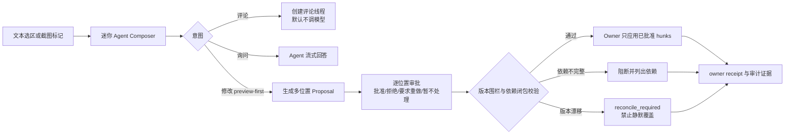

## Context

用户在 DSH Web 中阅读 Agent 回复、Markdown 预览与文件内容时，产生的判断（"这里不对""这里改成块级编辑器"）目前只能整段复制进主输入框，丢失位置；截图反馈更是完全脱离工作台。与此同时，浏览器上下文不可信：页面内容、文件内容与截图都可能携带注入指令，不能当作系统指令执行；浏览器也不持有文件真相，任何写回都必须经过 File Host 版本围栏。

本变更新增三个包：`@yeisme/dsh-selection-host`（纯合同 + node 参考实现）、`@yeisme/dsh-client-ui-selection-annotation`（浏览器侧交互）、`@yeisme/dsh-selection-annotation`（可安装 bundle）。不触碰 DSH core、不复制 Conversation Composer 实现、不建第二个文件 store。

### UI Spec

- 产品姿态：engineering tool、high-density、calm、低饱和；批注是工作流不是画板。
- 浮动操作条：选区上方 8px，空间不足自动翻转；不遮挡选区；键盘可导航、`Esc` 关闭；窄面板降级为图标按钮；选区滚出视口时收缩为边缘锚点而不是消失。
- Compact Composer：默认宽 360px（280–480 可调），输入 1–6 行自增，聚焦后展开完整 footer；每个上下文卡片显示文件、行号或截图标记；标题行显示锚定位置（`package.json · L18–24`）。
- 审批面板：按位置成行（checkbox + 标题 + 状态），不是单一"全部接受"；操作=批准/拒绝/要求修改/暂不处理/查看来源/查看 diff/在完整工作台打开。
- 状态语义色只使用 visual-kit 语义 token；截图标记编号 `#N` 与 Agent 回复引用一一对应；无 DOM 映射的截图锚点明确标注"图像批注"，不伪造代码位置。
- 视觉黑名单：无渐变、glass、装饰阴影、随机色、card 堆叠、大标题空状态、只靠颜色表达状态。

## Goals / Non-Goals

**Goals:**

- 完整可测试的 Selection Anchor V1 类型、zod 校验、quote digest 与 reanchor 证据。
- Markdown 渲染选区在有源码位置提示时精确映射回 `.md` 源码范围；无提示时诚实降级，不伪造行号。
- 浮动操作条 + Compact Composer seam：一次交互内从选区进入询问/评论/修改意图，展开不丢草稿。
- 截图标注画布：≥20 个独立标记、归一化坐标缩放对齐、多点联合提交、`#N` 引用。
- 多位置审批状态机：pending→approved/rejected/revision_requested/stale；approved→applying→applied/failed/reconcile_required。
- 部分批准只应用已批准且依赖完整的 hunks；依赖不完整阻断并列出依赖；版本漂移 fail-closed 进 reconcile。
- 隐私：密码遮盖、private DOM 区域排除、日志/证据不落原始截图与敏感字段。
- 键盘用户可完成选择→评论→发送→审批全流程。

**Non-Goals:**

- 不在本仓实现系统窗口/完整桌面截图（保留 Desktop Client owner，只留 capability-gated handoff 合同）。
- 不实现跨会话评论恢复（V2，committed）与多人实时协作（exploratory）。
- 不支持无审批自动修改（rejected）。
- 不把 Conversation Composer 的实现复制进本仓；只用 seam 消费。
- 不建文件 store、不绕过 File Host `writeText` 版本围栏、不解析任意 patch 字符串。

## Capability Ledger（冻结）

| 能力 | 状态 | 交付 |
|---|---|---|
| 文本选中后询问 Agent | required | V1 ✅ |
| Markdown 渲染内容选区映射回源码 | required | V1 ✅（宿主提示就绪时精确映射，缺失诚实降级） |
| 文件源码选区评论 | required | V1 ✅ |
| 选区人工编辑 | required | V1 ✅（编辑意图经 Composer/宿主桥接） |
| Agent 局部修改并展示 diff | required | V1 ✅（hunk 级 safeSummary + 查看局部 diff 动作；渲染由宿主桥接） |
| 多位置逐项批准、拒绝、要求重做 | required | V1 ✅ |
| 可见页面和完整页面截图批注 | required | V1 ✅（合同+画布；真实捕获待 Web adapter seam） |
| 截图多点、多区域联合提交 | required | V1 ✅ |
| 迷你版 Agent 输入框 | required | V1 ✅（seam + overlay） |
| 系统窗口、完整桌面截图 | V2 | 保留独立 Desktop owner；Web probe 永远 unavailable |
| 评论跨会话恢复 | committed | V2，需独立 OpenSpec；V1 不部分实现、不移除扩展点 |
| 多人实时协作评论 | exploratory | 后续，不承诺时间表 |
| 无审批自动修改 | rejected | 永久拒绝 |

## 总体流程

## Decisions

### 1. 锚点是唯一 join 键，五类共用合同

所有交互对象（评论、询问、修改提案）都引用 `anchorId`。五类锚点（FileRange / MarkdownRange / DomRegion / ImagePoint / ImageRegion）共用 artifactRef、artifactVersion、kind、quotePreview、quoteDigest、createdAt、freshness、reanchorEvidence。浏览器只保存临时选择状态；持久化对象必须由 annotation service 发布。

替代方案是按视图各建一套坐标，会导致跨视图无法 join 与审计断链，因此拒绝。

### 2. Markdown 映射消费宿主源码提示，缺失即降级

渲染 DOM 携带 `data-source-line`/`data-source-start` 系提示时向上收敛出源码行范围并校验单调性；没有提示时降级为 DomRegion 锚点并标记 `unmapped`，绝不从渲染顺序猜行号。这满足"无 DOM 映射时明确标记为图像/渲染批注，不伪造代码位置"。

### 3. 截图锚点使用图像归一化坐标

`ImageRegion` 存 0..1 的 x/y/width/height，显示时按当前显示尺寸反算。缩放、窗口变化、高 DPI 下标记仍对齐；artifact 记录 naturalWidth/naturalHeight 供审计。CSS 像素只存在于瞬时交互层。

### 4. Composer 是 seam，不是复制品

`AgentComposerSeamV1` 描述紧凑密度、intent、anchor、approvalPolicy、expandable 与 draft 句柄；本仓提供 `createCompactComposerController` 实现 draft 保留、意图切换、行数与宽度约束、preview-first 强制。真实模型调用、附件、权限状态由宿主 Composer/Runtime 注入的 adapter 承接；adapter 缺失时评论/询问照常工作，修改意图显示 unavailable 而非死按钮。

### 5. 审批是 per-hunk 状态机，应用是 owner 动作

`ProposalHunkV1.decision` 只能由用户动作推进；`applyApproved` 在 owner 侧执行：先做依赖闭包校验（approved hunk 依赖非 approved hunk → 阻断并列出），再按 artifact 分组做 baseVersion 围栏校验（冲突 → `reconcile_required`，不写入），最后逐 hunk 应用并返回 receipt。浏览器只发 `{proposalId, expectedVersions}`，不发送 patch 文本。

### 6. 截图来源按 capability 分层

`WebCaptureAdapterV1` 只提供 viewport/fullPage；`DesktopCaptureAdapterV1`（window/fullDesktop）是独立 capability，Web 侧 probe 永远 unavailable 并说明需要 Desktop Client，不渲染入口。捕获前展示范围预览，密码字段与 private 区域在画布冻结前 redact。

### 7. 隐私是合同的一部分而非实现细节

锚点/批注/提案的持久化字段白名单化：不存原始截图字节（只存 artifactRef+digest+尺寸）、不存 Authorization/cookie/隐藏指令；证据目录同样脱敏。页面/文件/截图内容进入 prompt 时标记为不可信上下文，仅作为引用材料拼接，不作为指令解释。

### 8. 最小实现路径

host 合同包（纯类型+校验+参考实现）→ client 交互包（纯逻辑控制器 + React 组件 + jsdom 测试）→ bundle（ModuleLoader 单文件 + 冒烟）。三包可独立交付，缺 host seam 时 client 诚实降级。

## Risks / Trade-offs

- 宿主渲染器不提供源码提示时 Markdown 锚点退化为 DomRegion：接受，诚实降级优于伪造；上游 seam 需求固化为后续 upstream-pr 提案。
- 内存 annotation service 只是参考实现：生产持久化由 owner 服务交付；合同先冻结，避免 consumer 迁移。
- 归一化坐标在裁剪/重采样 artifact 上会失真：要求 artifact 记录 natural 尺寸并禁止对已裁剪 artifact 重开画布。

## Migration Plan

1. 新增三个包与 bundle 行，不改任何现有包导出。
2. `dsh plugin --profile web add @yeisme/dsh-selection-annotation` 即启用；无 host seam 时入口不渲染或禁用并显示原因。
3. 后续 V2：跨会话评论恢复、Desktop capture owner seam、upstream 源码位置提示。

## Open Questions

- Conversation Composer 的真实 adapter 接口名（等待 DSH 上游 seam 合入后对齐，本变更以 seam 类型占位）。
- 评论跨会话恢复的持久化 owner（V2 决策）。

## Verification Evidence

### 2026-08-28 实施结果

三包全绿（完成门=本仓协议对接，不依赖官方 host seam）：

- `@yeisme/dsh-selection-host`：typecheck 0 错、`tsdown` 构建通过、Vitest
  27/27（五类锚点 zod 合同、fail-closed、批注批生命周期与 20 标记、
  `buildAgentRequest` 不可信上下文投影、状态机、部分批准/依赖阻断/版本
  围栏、receipt 脱敏）。
- `@yeisme/dsh-client-ui-selection-annotation`：typecheck 0 错、构建通过、
  Vitest 45/45（源码映射+诚实降级、归一化坐标缩放/高 DPI 不变式、
  Composer 草稿保留/preview-first 拒绝/评论不调模型、工具条翻转/键盘/Esc/
  边缘锚点、审批面板、批注画布 ≥20 标记、jsdom 端到端闭环）。
- `@yeisme/dsh-selection-annotation`（bundle）：`pnpm test` = build + 真实
  产物冒烟（ModuleLoader banner id 校验、选区后工具条可见、overlay 挂载、
  kill-switch、dispose 干净）。
- 仓库级 `check:bundles`：22/22 PASS（新 bundle 的 client.js 无外部
  workspace require，banner id 与包名一致）。
- `openspec validate dsh-selection-agent-review-v1 --strict --no-interactive`：
  valid。

### Integration evidence

- `temp/integration-test-runs/2026-08-28T14-32-23-016Z-396372/` — host
  node 参考实现闭环（脱敏 stdout/stderr/env/summary）。
- `temp/integration-test-runs/2026-08-28T14-32-40Z-client-flow/` — client
  jsdom 集成闭环（选区→工具条→Composer→提交事件；批注→提案→逐位置审批→
  版本围栏应用 receipt；漂移协调），输出无敏感键。

### 测试与证据矩阵

| 覆盖项 | 测试位置 |
|---|---|
| 文件源码选区 / 五类锚点合同 | host `tests/anchors.spec.ts`、`tests/node.spec.ts` |
| Markdown 渲染选区映射（有/无提示、倒置提示） | client `tests/unit/dom-anchors.spec.tsx` |
| 跨块选择、折叠选区 | client `tests/unit/dom-anchors.spec.tsx` |
| 滚出视口边缘锚点 / 翻转 / 键盘 / Esc / 窄图标 | client `tests/unit/toolbar.spec.tsx` |
| 归一化坐标缩放、高 DPI、越界 clamp | client `tests/unit/image-region.spec.ts`、`tests/unit/AnnotationCanvas.spec.tsx` |
| ≥20 多位置批注、矩形拖拽、上限截断 | client `tests/unit/AnnotationCanvas.spec.tsx` |
| Composer 展开/收缩、preview-first、评论不调模型、历史 | client `tests/unit/composer.spec.ts` |
| 部分批准、依赖冲突、版本冲突行 | host `tests/proposal.spec.ts`、client `tests/unit/approval.spec.ts` |
| 补丁依赖阻断（依赖组） | host `tests/node.spec.ts` |
| 文件版本冲突 → reconcile | host `tests/node.spec.ts`、client `tests/integration/flow.spec.tsx` |
| 不可信上下文 / receipt 脱敏 / patch 字符串拒绝 | host `tests/anchors.spec.ts`、`tests/node.spec.ts`、`tests/batch.spec.ts` |
| jsdom 端到端闭环（选择→提交事件；批注→审批→应用） | client `tests/integration/flow.spec.tsx` |
| 真实产物冒烟（ModuleLoader/kill-switch/dispose） | bundle `scripts/smoke-bundle.mjs` |

### Compatibility verdict

纯 additive：新增三个包与一个 capability delta，未修改任何现有包导出或
consumer 语义；未安装 bundle 的宿主行为不变。`pnpm-lock.yaml` 的在途改动
属于其他并行会话，本变更不提交 lockfile。

### Rollback

`dsh plugin --profile web remove @yeisme/dsh-selection-annotation`；源码回滚
= revert 三个新增包 + openspec change 目录（无共享文件改动）。
