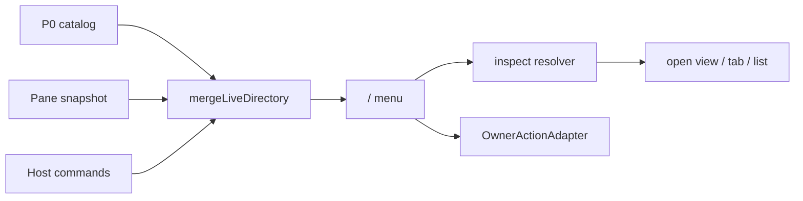

# Design: dsh-slash-directory-hotplug-v1

## D1 三层 live 目录

P0 保留名最高。面板之间 canonical 冲突：后到者 disabled + reason，热路径绝不 throw。`mergeCommandSources` 的 fail-loud 仍给构建期静态源用。

## D2 `/pane` 与 launcher 投影

command-experience 不写死面板名单。它订阅 `paneWorkbench.views` 与 `commands`：

- picker 可见 view → `/pane` 候选
- `presentation.launcher === true` → 默认 slash 名（`.` / `_` → `-`）
- 可选 `slash.name` → 短名（`/creator`）

卸载 dispose 后目录立即去掉这些行。

## D3 inspect 命令接线

`/mcp` 不是 pane：解析到 conversation view `mcp-inspector`。没有 view-switcher seam 时，若插件已安装则返回“在 Tools 页打开”的诚实文本，不假装已经切 tab。

`/skills` 调用 `openView(workspace.agent-context)` 并带 `metadata.tab = skills`。Agent Context 视图读取该 metadata。

`/plugins` 只读列出当前 ctx/registry 插件 id，不 RPC。

## D4 官方 commands 同步

`syncInspectRegistrations` 把 inspect/navigation 条目注册到官方 `commands`。pane/host 变化时增删注册。已由 host 注册的 `host-command:*` 不再二次包装。

Composer 在 host 进程执行 slash：能打开的表面就打开；不能打开就返回禁用/指引文本。Client 侧 runtime 在同一 JS 上下文有 `paneWorkbench` 时真正 `openView`。

## D5 真实 runtime 集成加固（2026-08-28 落地）

三个只在真实 `dsh web` boot 中暴露、单测 fake 全部漏掉的问题：

1. **Host 面必须 `inject: ['commands']`**。cordis loader 的 fiber 在服务就位即启动；
   空 inject 时 apply 常跑在 dsh-base 提供 `commands` 之前，fail-closed 静默跳过
   全部 inspect 注册（症状：菜单里一条都没有）。ordo-commands / yeisme-commands
   一直用 wait-for inject，这就是它们能出现的原因。
2. **官方同名命令必须让位**。官方 registry 先到先得且重复注册硬失败；
   P0 的 `goal`/`plan` 与官方 `dsh-command-goal`/plan 插件撞名，我们若先注册会
   炸掉官方插件的 boot（"command goal is already registered" 整树失败）。
   core 侧 `OFFICIAL_OWNED_INSPECT_NAMES`（goal/plan）目录仍列出但永不投影到
   host；bundle 侧注册前 `commands.find()` 二次让位。
3. **插件清单读 `ctx.loader.entries()`**。host ctx 没有 `plugins` 服务，
   `registry.keys()` 也不是插件表（`/plugins` 空清单、`/mcp` 误报未安装）。
   bundle 侧投影 loader entry 表（与官方 plugin-inventory 同源）。

验证：临时 DSH_HOME 最小 profile boot 成功 + `/plugins` 落 command/run|done 持久
记录；真实 web profile `/` 菜单出现 commands/diff/explorer/git/mcp/pane/plugins/
skills/status + ordo/yeismo-notice，`/mcp` 返回 "The mcp-inspector view is
installed…"。dsh-desktop-workbench client bundle 的 `require("module")` externals
漂移（并行会话已修）会整树失败——client 端任何 bundle 构建期必须保持 externals 纯净。
