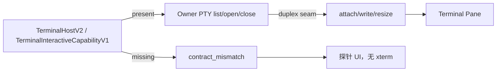

## Context

Terminal Pane 已能列出 `TerminalHostV2` 会话；缺 V2 时显示不可用。用户要的是 Codex 风格可用终端，但官方 duplex PTY seam 尚未合入。本 change 把交互设计写死，避免本地伪造 stream。

## Goals / Non-Goals

**Goals:**

- 明确 capability 探测与 fail-closed 文案。
- 有 V2 时允许 list/open/close；input 仅在 duplex 可用时启用。
- detach 不杀 PTY；session switch 只断开本地投影。
- 探针 UI 继续完善，便于用户看清缺什么。

**Non-Goals:**

- 不解封 xterm.js / Codicons / 商品区终端实现。
- 不在浏览器维护第二个 PTY 状态机。
- 不轮询刷新假输出。
- 不把 File/Git 终端化。

## Decisions

1. `TerminalInteractiveCapabilityV1` 或 `isTerminalHostV2(host)` 是交互入口的唯一通行证。缺一即 `contract_mismatch`。
2. 允许的 typed 动作：`listTerminals`、`openTerminal`、`closeTerminal`。`attach` / `write` / `resize` 必须等 owner duplex；当前 `TerminalPanel` 只在 V2 host 上挂载，仍不得伪造 bytes。
3. timeout 与断线不得标成“已连接”。freshness 只允许 `fresh` / `unknown` / `offline` / `contract_mismatch`。
4. View close 只卸载投影，MUST NOT 默认 close PTY，除非用户点“关闭终端”。
5. 上游 seam 未到前，Workbench 继续显示探针而不是死按钮。

## Risks / Trade-offs

- 用户会感觉终端“还不能打字”。这是诚实降级：没有 duplex 就没有输入。
- 若未来解封 xterm，必须另开 change，并证明 owner stream 已存在。

## Test Specification

| 层 | 场景 | 命令 | 证据 |
| --- | --- | --- | --- |
| unit | 无 V2 host 时 contract_mismatch | `pnpm --filter @yeisme/dsh-client-ui-desktop-workbench run test` | TerminalPane 文案与 data-freshness |
| unit | V2 host 可 list/open | 同上 | 不创建假 stream |
| spec | OpenSpec 严格校验 | `openspec validate dsh-terminal-interactive-v1 --strict --no-interactive` | exit 0 |
