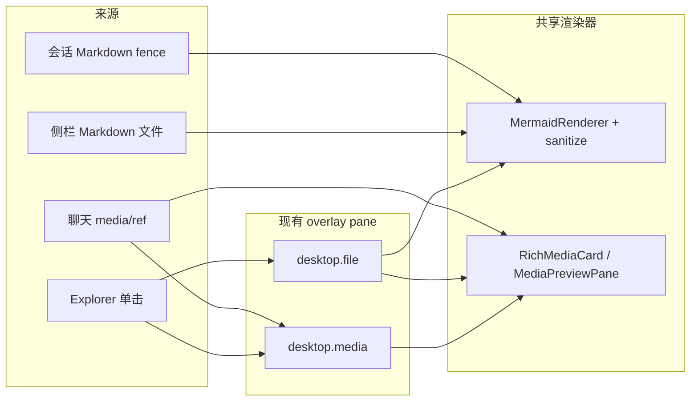

# dsh-web-render-preview-v1 设计

## Context

DSH Web markdown 管线没有 fence 钩子。`@yeisme/dsh-client-ui-mermaid-render` 用 MutationObserver 在会话 DOM 上嫁接 SVG，聊天路径可用。`FileOpenPane` 用自写 `renderMarkdown()`，fence 变成无语言 class 的 `<pre><code>`，hydrate 找不到锚点。`dsh-rich-media` 已撤掉第二套 sidebar 工作台；`desktop.media` 仅在 `ctx.get('dsh.mediaHost')` 存在时注册，官方 DSH 几乎没有该服务，侧栏因此没有媒体入口。

约束：不 fork DSH core；不 shadowing `assistant` cell；浏览器只拿 opaque ref 与短时授权 URL；完成门是包测试，不是官方 `dsh web`。

## Goals / Non-Goals

**Goals:**

- 聊天与文件 Markdown 共用 `MermaidRenderer` + SVG 白名单净化。
- 侧栏始终有「媒体」入口，打开现有 overlay pane；无投影时诚实空态。
- Explorer 媒体 kind 与聊天卡片可 `openView` 进同一 overlay。
- FileOpenPane 在授权 URL 下预览 image/audio/video/PDF。

**Non-Goals:**

- 官方 `conversation.chat.markdown-fence` seam 合入。
- 恢复 V1 五 Tab 第二工作台。
- PDF.js / Office / WaveSurfer / hls.js 静态依赖。
- KaTeX、替换宿主 CodeBlock、执行 HTML/SVG script。

## Decisions

### 1. 抽出 hydrate，不新开 markdown 包

`MermaidGraftController` 增加可对任意根调用的 `hydrate(root)`（内部即 `scan` + 稳定门）。聊天 `apply()` 继续观察 `document`。`FileOpenPane` 在 Markdown HTML 落地后对 pane 根调用一次，`stableMs=0`（文件内容已 settle）。

备选：新建 `@yeisme/dsh-client-ui-markdown-preview`。拒绝：避免第三套 markdown 与循环依赖。`renderMarkdown` 留在 desktop-workbench，只给 mermaid fence 打 `language-mermaid`。

### 2. `desktop.media` 唯一 kind

Desktop Workbench 始终 `registerView({ kind: 'desktop.media' })`。不并行注册 `workspace.media-library` 到生产 sidebar。`sidebar.footer.action` order 42，接在 Files/Git 之后。无 `dsh.mediaHost` 时组件渲染空态，不省略按钮。

备选：无 host 时隐藏入口。拒绝：用户无法发现能力；空态更诚实。

### 3. Explorer 按 kind 分流

`image|audio|video|pdf`（或对应 mediaType）打开 `desktop.media` 并带上从 `FileEntryV1` 适配的 `MediaRefV1`（opaque id，禁止 path）。文本/Markdown/其它仍走 `desktop.file`。

### 4. 安全

- mermaid：`securityLevel:'strict'` + 现有 SVG 白名单。
- Markdown：先 escape 再打 fence class。
- 媒体：只渲染 Host `resolveUrl` / `resolvePreviewUrl` 返回的短时 URL；PDF iframe `sandbox="allow-same-origin"`。
- kill-switch：`localStorage['dsh-mermaid'] === 'off'`；README 与代码对齐。

### 5. 主题与视觉

继续 `prefers-color-scheme`。能 probe DSH 主题 seat 则跟随，缺席不阻塞。figure 样式改用 visual-kit token fallback，不手写第二套灰边。

## Risks / Trade-offs

- [上游改 CodeBlock DOM] → 锚点单测先红，再改 `findMermaidFenceCodes`。
- [侧栏多一个 footer 按钮] → order 42，不抢「窗格」。
- [无 mediaHost 时空入口] → 空态写明原因，禁止猜 URL。
- [文件 Markdown 动态 import mermaid] → hydrate 失败保持源码可见；desktop-workbench 对 mermaid 包用 optional 动态 import，缺包不崩。

## Migration Plan

Additive。已安装 mermaid / rich-media / desktop-workbench 的 profile 升级包即可。回滚：还原包版本或卸载对应 plugin 行；无持久化、无数据迁移。

## Open Questions

无。上游 fence seam 仍为 Track 2，本切片不阻塞。
