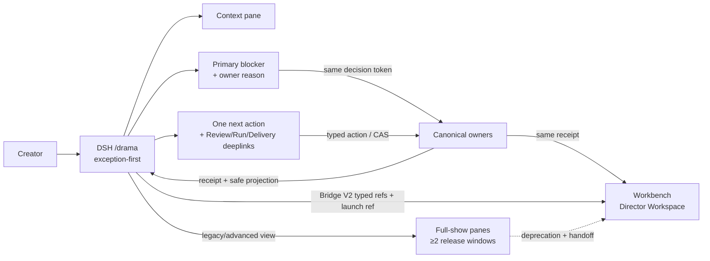

## Context

根级组合合同冻结后，DSH 的产品角色从“可扩为全剧 operational console”收敛为“异常优先导演台”。既有 `dsh-ai-drama-*` 插件已具备 Context/Review/Run pane、Bridge V2 launch ref 与 receipt 消费；本 change 只调整默认投影、decision token 消费与 legacy pane 治理，不动 owner 合同。完整真值在根 change `ai-drama-director-workspace-editor-roundtrip-v1` 与本仓 `docs/design/ai-drama-director-pack.md`。

## Decisions

1. **默认 preset 收敛**：`director` preset 只保留 Context、Review、Run；`show-control` 及 Story/Visual/Audio/Delivery 等全剧 panes 转为按需打开的 legacy/advanced 视图，导航优先级降级但不删除。
2. **异常优先投影语义**：`/drama` 默认回答四问——当前 context、primary blocker、owner reason（为什么需要我决定）、一个 owner-approved next action，附 Review/Run/Delivery 深链；多阻塞时只排序呈现首个，附“还有 N 项”进入 Workbench。
3. **决策 token 只做 consumer**：DSH 渲染 owner-authored decision token 的文本摘要（exact target/effect/owner/expiry），提交经 server-minted CAS；receipt 返回后只刷新 projection。已终态 token 幂等返回原 receipt 或 stale/already_decided，绝不重复 mutation。
4. **handoff 不扩展桥语义**：打开 Workbench 或外编流程时只传 Bridge V2 的 typed refs 与 launch ref；进入目标端后由目标端重新鉴权、refetch，DSH 缓存不当 canonical state。
5. **兼容窗口治理**：旧 full-show panes 至少保留两个连续插件发布窗口，显示 deprecation 文案与 Workbench handoff，读取相同 owner projection，并记录使用率；退役由后续独立 removal change 处理（consumer evidence + deprecation window + rollback）。
6. **证据分层**：状态词汇表与 reason codes 的组件 golden、decision 幂等契约用例、legacy pane 兼容快照；集成运行写 `temp/integration-test-runs/<run-id>/`，脱敏 secret/raw prompt/private args/绝对路径。

## Goals / Non-Goals

**Goals:**

- 最低认知负荷：默认只看当前阻塞与下一动作。
- 与 Workbench 共用同一 decision identity，任一端决定后另一端只刷新 projection。
- 旧用户能力不消失：全剧 panes 在兼容窗口内完整可用。

**Non-Goals:**

- 不建第二调度器/lease/approval ledger/capacity reservation/terminal result。
- 不复制 Workbench scene graph、Scaena `EditRevision`/bundle/diff/rebase、Ordo ledger。
- 不解析任意 shell、URL、executable、env 或 host path；args 只接受安全 ref 模式。
- 不引入模型可见的 decision 工具（若后续需要，独立 spec 与 session event）。

## Risks / Trade-offs

- [DSH 用户认为能力被删除] → 兼容窗口内保留全剧 panes，deprecation 文案说明去向并记录使用率；回滚 = 恢复旧导航优先级，不改 owner state。
- [异常优先掩盖多阻塞] → 投影包含 blocker 计数与进入 Workbench 的深链；DSH 不做本地排序持久化。
- [decision 双写] → server-minted token + CAS + 幂等 receipt；客户端不建本地审批记录。

## Migration Plan

1. 先实现异常优先默认投影与 decision token consumer（additive），旧 preset 保持可用。
2. 切换默认 preset 为 `director`；legacy/advanced panes 标记 deprecation 并接 Workbench handoff。
3. 至少两个插件发布窗口后，按独立 removal change 评估退役；回滚 = 恢复旧导航优先级，不迁移、不删除、不回写 owner state。

## Open Questions

- 多阻塞排序键（owner severity vs. 时间）与“还有 N 项”的呈现阈值，由实现阶段切片评审固定。
- legacy pane 使用率指标上报粒度（本地计数 vs. 遥测）取决于本仓 catalog/工具策略。

## References

- 根 change：`openspec/changes/ai-drama-director-workspace-editor-roundtrip-v1/`（`ai-drama-client-composition` delta）。
- `docs/design/ai-drama-director-pack.md` 与 capability gap ledger。
- 已归档 `dsh-ai-drama-director-pack-v1`、`dsh-workbench-ai-drama-bridge-v2`。
- Workbench owner change：`client/yeisme-workbench/openspec/changes/workbench-ai-drama-director-canvas-v1/`。
