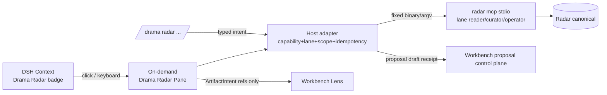

## Context

Harness Plugins 已有 Director Pack（`dsh-ai-drama-director`）、Pane registry、safe projection 与 typed artifact intent；本 change 复用该平台，不创建第二侧栏、第二 Pane reducer 或永久默认占位。Radar 提供 `radar mcp --transport stdio --lane reader|curator/curator|operator` 与脱敏 handoff fixtures。DSH 是“正在和 Agent 做事”时的上下文入口：badge 显示紧凑摘要，命令与按需 Pane 承载查看/比较/保存/忽略/提案草稿与 Workbench handoff。



## Goals / Non-Goals

**Goals:**

- Context badge 快速回答“今天有几个适合我的机会、数据多新”。
- 键盘可达的命令族与按需 Pane，动作经 typed intent + owner receipt 收敛。
- empty/degraded/stale/offline 状态文本+图标双表达，不冒充完成。
- Workbench handoff 只携带安全 refs。

**Non-Goals:**

- 不创建第二套 plugin platform、侧栏或 Pane reducer。
- 不直接读 Radar SQLite、配置、audit 或执行任意 shell。
- 不自动 accept proposal、不触发 collect/daily_run。

## Decisions

### 1. 入口组合：badge + `/drama radar` + 按需 Pane

badge 只显示紧凑摘要（`Radar · 5 fits · 2 new · fresh 38m`），degraded/empty/stale/offline 时文本+图标双表达。点击 badge 或 `/drama radar` 打开按需 Pane；会话不默认占用永久 Pane。

首版命令族（解析只生成 typed intent）：

```text
/drama radar
/drama radar open <opportunity-ref>
/drama radar save <opportunity-ref>
/drama radar dismiss <opportunity-ref>
/drama radar compare <ref-a> <ref-b>
/drama radar proposal <opportunity-ref>
/drama radar workbench <opportunity-or-edition-ref>
/drama radar refresh
```

### 2. Capability probe 与诚实降级

host adapter 启动时 probe 三样东西：Radar binary 可达且 contract version 匹配、`radar mcp capabilities` 返回 ready、DSH 官方 Pane slot 可用。任一缺失：禁用或隐藏入口并显示 reason（`needs_radar`、`contract_mismatch`、`seam_unavailable` 等），不使用私有 DOM、iframe 或 fork fallback，不伪造 ready。

### 3. typed intent + 交集校验

命令/Pane 只生成 typed intent；host adapter 重新校验 capability、lane、scope 与 idempotency。有效动作 = Radar lane ∩ 插件 operation allowlist ∩ capability：reader 只读；curator `save/dismiss`（`feedback_add`）；`refresh` 走 operator 但仅 `edition_build`，不得隐式 collect/daily_run。重复 intent 不重复写反馈。

### 4. Pane 状态与恢复

list/detail/compare 是可丢弃 UI projection，reload 后从 Radar refs 恢复。状态覆盖 ready/empty/degraded/stale/offline/permission_denied/contract_mismatch/action_pending/reconcile_required；非 ready 各给安全 next action。mutation 超时/断线进入 unknown，按 idempotency key 对账 receipt，不自动重放。Pane 键盘可达、焦点可恢复、aria label 完整；若存在终端/TUI renderer，`update(state, event)`/`render(state, w, h)` 必须可确定测试并支持固定尺寸 snapshot。

### 5. Workbench handoff 与 proposal

`/drama radar workbench <ref>` 生成只含 edition/opportunity/profile revision refs 的 deep-link（`PersonalRadarOpportunityHandoffV1` 或兼容 ArtifactIntent）；Workbench 重新向 owner 读取 projection。`/drama radar proposal <ref>` 创建 pending review 草稿：标明 profile revision、reason/evidence refs、known limitations 与 target owner；用户 accept 后目标 domain owner 才创建 canonical project。stale Profile/Edition 时 proposal 要求 refresh/review，不静默更新引用。

## Risks / Trade-offs

- [官方 Pane seam 不可用] → probe + disabled reason，诚实降级。
- [badge 噪音] → 只在 ready/degraded 时显示摘要；offline 时降级为只读标记。
- [重复反馈] → idempotency key 全链路。
- [意图与实现漂移] → 契约负例测试：未注册 intent、越 lane action、过期 ref 一律拒绝。

## Migration Plan

1. 先交付 capability probe + badge + 命令（只读 intent）。
2. 再加按需 Pane（list/detail）与 curator save/dismiss。
3. 再加 compare、confirmed `edition_build` refresh、Workbench handoff 与 proposal 草稿。
4. 验证 empty/degraded/stale/offline/mismatch、重复提交、断线 reconcile、焦点恢复与窄屏。
5. 回滚只移除 badge/命令/Pane 入口，Radar canonical state 不动。

## Open Questions

- 包边界最终落在独立 `@yeisme/dsh-personal-radar-*` 还是并入 Director Pack 行，按 bundle 合同校验与发布粒度决定。
- badge 默认显隐策略（ready 时常显 vs 仅 degraded 时提示）待 DSH 使用证据决定。
