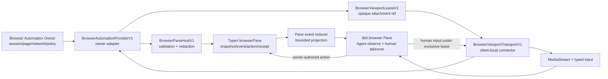

## Context

Pane protocol 已具备 experimental plugin definition、safe projection、snapshot/event reducer、typed action descriptor/request/receipt、reconcile 与 generation lifecycle。Pane Workbench 也已提供 Right/Bottom region、非 singleton view、Tab、split、resize、retention 和本地 component factory。Browser Pane 不需要另造工作台或修改 DSH core。

缺口在于浏览器自动化 authority。真实浏览器可能持有页面进程、网络访问、cookie、下载、截图、DOM evidence、Agent 输入和人工接管。它既不能留在 React state，也不能由 `ctx.web`、URL、iframe 或客户端 fetch 冒充。仓库里的 `BrowserSession` 还可能表示 DSH Web 登录会话，因此本 change 使用 `BrowserAutomation*` 作为独立公开命名空间。

本 change 采用契约优先交付：先实现 Pane、类型、fake Provider 与 fake viewport Transport。真实 Browser Automation Owner、媒体服务和生产网络策略另行立项。

## Goals / Non-Goals

### Goals

- 提供 Agent 协作浏览：Agent 驱动页面，人类观察；人类可排他接管并归还控制。
- 冻结 Browser Pane 的 package、plugin、capability、projection、event、action 与 viewport attachment 合同。
- 低频状态复用 Pane protocol/Typert，实时视口与输入使用独立、可取消的 client-local Transport。
- 只向浏览器传有界 safe projection；敏感网络、凭据、下载和 evidence 原文留在 owner。
- 覆盖 context/session/generation/page epoch 切换、人工接管、unknown/reconcile、HMR 与 dispose。
- Provider 缺失时提供诚实、可访问、可测试的诊断体验。

### Non-Goals

- 不选择或实现真实 Browser Automation Provider、浏览器进程、CDP/WebRTC 服务或远程浏览器部署。
- 不创建或销毁 Provider session；v0.1 只附着已有 opaque session。
- 不提供任意 iframe、browser-side arbitrary fetch、DOM injection、URL proxy、网络代理或凭据 store。
- 不让 Browser Pane 成为 automation scheduler、Agent planner、download store、evidence truth 或第二个 domain state。
- 不提供 clipboard、文件上传、拖放上传、camera、microphone、geolocation 或 notification permission。
- 不修改 DSH core 私有 API、DOM、路由、登录会话或 Desktop Workbench bundle。

## Ownership And Packages

| Package / Owner | Responsibility |
| --- | --- |
| `packages/host/dsh-browser-host/` / `@yeisme/dsh-browser-host` | Provider port、wire types、validators、safe projection adapter、Typert `browserPane` service/events、fake Provider |
| `packages/client/ui-browser-pane/` / `@yeisme/dsh-client-ui-browser-pane` | reducer/controller、Browser Pane React view、fake viewport Transport、a11y/responsive component tests |
| `packages/bundle/dsh-browser-pane/` / `@yeisme/dsh-browser-pane` | host/client composition、plugin definition、Pane/command registration、bundle conformance 与 README |
| Browser Automation Owner | session/process/page/network/policy/credential/download/evidence/stream、Agent 输入、人工租约与终态 receipt |
| DSH Core | 公开 plugin/client slots、Typert Remote、HMR/dispose lifecycle；不为此 change 承担浏览器 domain state |

Browser bundle 独立发布，不能通过 `@yeisme/dsh-desktop-workbench` 暗中变成强依赖。未来 Provider adapter 可以依赖某个获批服务，但 `@yeisme/dsh-client-ui-browser-pane` 必须保持 provider-neutral。

## Architecture



两条通道职责不可混用：

1. **低频 control plane**：probe、snapshot、events、action descriptors、requests、receipts、reconcile。只传 JSON-safe、有界、可审计数据。
2. **高频 viewport plane**：媒体流、pointer、wheel、keyboard、text 与 resize。Typert 只传 opaque lease 元数据；`MediaStream`、媒体地址、短期凭据和 Transport 内部状态不得进入 Pane projection。

## Decisions

### D1. Public identifiers are frozen before implementation

| Surface | Value |
| --- | --- |
| plugin id | `dsh-browser-pane` |
| Pane kind | `dsh.browser` |
| component key | `browser-pane` |
| command / slash | `browser.open` / `browser` |
| Host context key | `dsh.browserPaneHost` |
| Client Transport context key | `dsh.browserViewportTransport` |
| Typert service/namespace | `browserPane` |
| stream id | `browser.automation` |
| initial package version | `0.1.0-rc.1` experimental |
| capabilities | `browser.automation.projection.v0.1`, `browser.automation.event.v0.1`, `browser.automation.action.v0.1`, `browser.viewport.attachment.v0.1` |

Automation capabilities 是 plugin definition 的 optional capabilities。bundle 安装后可以注册诊断 view；只有 probe 返回 exact compatible provider 时才发布 live action descriptors 和 viewport attachment。这样既不会因缺少 Provider 产生死按钮，也不会把 search-only profile 冒充为可操作浏览器。

Pane view registration：

```ts
{
  descriptor: {
    kind: 'dsh.browser',
    label: 'Browser',
    componentKey: 'browser-pane',
    role: 'content',
    preferredRegion: 'right',
    retention: 'keep-alive',
    singleton: false,
  },
  presentation: {
    icon: 'window',
    defaultEdge: 'right',
    defaultSize: 720,
    minWidth: 480,
    minHeight: 320,
  },
}
```

一个 Pane instance 绑定一个 `sessionRef`，`resourceKey` 使用该 opaque ref。Provider session 可以包含多个页面；页面作为 Pane 内部 Tab，不创建第二层 Workbench Pane。v0.1 不提供 create/terminate session action。

### D2. BrowserAutomationProviderV1 is the external authority port

Provider port 的最小面如下。具体 transport 可以不同，但语义必须一致：

```ts
interface BrowserProviderProbeInputV1 {
  context: PaneContextV1
  acceptedSpecVersions: readonly string[]
}

type BrowserPaneReasonCodeV1 =
  | 'search_only'
  | 'provider_missing'
  | 'provider_unreachable'
  | 'spec_version_unsupported'
  | 'capability_missing'
  | 'permission_denied'
  | 'contract_digest_mismatch'
  | 'no_active_session'

interface BrowserProviderProbeV1 {
  specVersion: '0.1'
  state:
    | 'ready'
    | 'search_only'
    | 'needs_contract'
    | 'unavailable'
    | 'permission_denied'
    | 'contract_mismatch'
  capabilities: readonly string[]
  providerRef?: string
  contractDigest?: string
  runtimeGeneration?: string
  reasonCode?: BrowserPaneReasonCodeV1
}

interface BrowserProviderBindingV1 {
  context: PaneContextV1
  providerRef: string
  contractDigest: string
  runtimeGeneration: string
}

interface BrowserAutomationBindingV1 extends BrowserProviderBindingV1 {
  sessionRef: string
  sessionVersion: string
}

interface BrowserAutomationSubscribeInputV1 {
  binding: BrowserAutomationBindingV1
  cursor?: string
  signal: AbortSignal
  onEvent(event: PaneEventEnvelopeV1): void
}

interface BrowserAutomationSubscriptionHandleV1 {
  dispose(): void
}

interface BrowserDispatchInputV1 {
  binding: BrowserAutomationBindingV1
  action: PaneActionRequestV1
}

interface BrowserReconcileRequestV1 {
  binding: BrowserAutomationBindingV1
  cursor?: string
  receiptRef?: string
}

interface BrowserViewportOpenRequestV1 {
  binding: BrowserAutomationBindingV1
  pageRef: string
  pageVersion: string
  desiredWidth: number
  desiredHeight: number
}

interface BrowserViewportCloseRequestV1 {
  binding: BrowserAutomationBindingV1
  viewportLeaseRef: string
}

interface BrowserAutomationProviderV1 {
  probe(input: BrowserProviderProbeInputV1): Promise<BrowserProviderProbeV1>
  listSessions(input: BrowserProviderBindingV1): Promise<BrowserAutomationSessionDiscoveryV1>
  readSnapshot(input: BrowserAutomationBindingV1): Promise<PaneEventEnvelopeV1>
  subscribe(input: BrowserAutomationSubscribeInputV1): Promise<BrowserAutomationSubscriptionHandleV1>
  dispatch(input: BrowserDispatchInputV1): Promise<PaneActionReceiptV1>
  reconcile(input: BrowserReconcileRequestV1): Promise<PaneEventEnvelopeV1>
  openViewport(input: BrowserViewportOpenRequestV1): Promise<BrowserViewportLeaseV1>
  closeViewport(input: BrowserViewportCloseRequestV1): Promise<void>
  dispose(): void
}
```

`probe.state=ready` 时 `providerRef`、`contractDigest`、`runtimeGeneration` 和四项 capability 必须全部存在；其他状态不得返回可执行 action 或 viewport lease。`reasonCode` 使用上面的 closed set，不能包含 Provider error、URL、path 或敏感策略原文。

`BrowserPaneHostV1` 是浏览器可见的低频安全面，挂在 `dsh.browserPaneHost`，并由 Typert `browserPane` namespace 暴露 `probe`、`listSessions`、`snapshot`、`dispatch`、`reconcile`、`openViewport` 与 `closeViewport`。增量事件使用 Typert event forwarding；客户端不得用 timer polling 补事件。

session discovery 只返回安全 handle：

```ts
interface BrowserAutomationSessionHandleV1 {
  sessionRef: string
  sessionVersion: string
  label: string
  phase:
    | 'ready'
    | 'running'
    | 'attention_required'
    | 'approval_required'
    | 'stale'
    | 'offline'
    | 'unknown'
  pageCount: number
  lastActivityAt?: string
}

interface BrowserAutomationSessionDiscoveryV1 {
  providerRef: string
  contractDigest: string
  runtimeGeneration: string
  sessions: readonly BrowserAutomationSessionHandleV1[]
  defaultSessionRef?: string
  omittedSessionCount: number
}
```

`sessions` 最多 16 条，不含 location、URL 或页面内容。`browser.open` / `/browser` 在一条 session 时直接打开；多条时显示安全 session picker；零条时显示“Provider 可用但暂无可附着 session”。外部 owner 也可以通过 typed `open_view` deep-link 传入 `sessionRef`，Host 必须重新验证该 ref 属于当前 context。Pane 不提供 session create/terminate。

所有调用精确绑定：

- `PaneContextV1` 的 workspace/session/revision/policy/runtime generation；
- provider、automation session 和 active page opaque refs；
- target version、Provider contract digest 与 viewport epoch；
- action descriptor ref 与 idempotency key；高频人工输入由 viewport Transport 在内部追加当前 control lease binding，通用 Pane 请求不读取 lease ref。

任一 binding 不一致必须返回 `contract_mismatch`、`stale` 或 `reconcile_required`，不能猜测新目标。

### D3. Projection is bounded, URL-redacted and credential-free

Provider snapshot/event 复用 `PaneEventEnvelopeV1`。Domain entity 只允许下列 safe summary：

```ts
interface BrowserSafeLocationV1 {
  scheme: 'http' | 'https'
  hostLabel: string
  pathLabel?: string
  queryHidden: boolean
  fragmentHidden: boolean
}

interface BrowserAutomationSessionSummaryV1 {
  kind: 'browser_session'
  label: string
  phase: 'ready' | 'running' | 'attention_required' | 'approval_required' | 'stale' | 'offline' | 'unknown'
  activePageRef?: string
  pageCount: number
  omittedPageCount: number
  viewportAvailable: boolean
  controlMode: 'agent' | 'human' | 'transition' | 'unknown'
  controlEpoch?: string
  humanControlExpiresAt?: string
}

interface BrowserPageSummaryV1 {
  kind: 'browser_page'
  label: string
  location?: BrowserSafeLocationV1
  loading: boolean
  canGoBack: boolean
  canGoForward: boolean
  canStop: boolean
  selected: boolean
}
```

活动、evidence 和 download 使用独立 summary entity/timeline item，只包含 kind、actor、bounded summary、status、occurredAt、opaque refs 和版本。不得包含：

- cookie、Authorization、raw header、secret、token、credential value/ref；
- raw/full URL、userinfo、query value、fragment value、signed URL；
- absolute path、download bytes、raw DOM、完整 page text、screenshot bytes；
- raw prompt、provider payload、private tool arguments 或完整思维链。

`pathLabel` 不带前导 slash，只展示最多 160 字符的安全段摘要，例如 `account / …`。host label 使用 punycode/ASCII 规范化；query/fragment 只以 hidden boolean 表示。

Domain budgets：

| Data | Limit | Overflow behavior |
| --- | ---: | --- |
| event payload | 64 KiB | reject as `contract_mismatch` |
| discoverable sessions | 16 | 保留 default/最近活动 sessions 并填写 `omittedSessionCount` |
| visible page summaries | 32 | 必须保留 active page，其余按最近使用截断并填写 `omittedPageCount` |
| activity timeline | 200 | 保留最新尾部并标记 `partial` |
| evidence summaries | 64 | 保留 opaque refs；不内联内容 |
| download summaries | 50 | 保留最新 metadata；不内联文件 |
| receipts | 100 | 使用 Pane protocol 上限，receipt 不得被 activity 合并丢失 |

### D4. Viewport attachment is opaque and client-local

`openViewport` 返回：

```ts
interface BrowserViewportLeaseV1 {
  leaseRef: string
  attachmentRef: string
  sessionRef: string
  pageRef: string
  runtimeGeneration: string
  viewportEpoch: string
  width: number
  height: number
  deviceScaleFactor: number
  expiresAt: string
}

interface BrowserViewportTransportV1 {
  connect(
    lease: BrowserViewportLeaseV1,
    options: { signal: AbortSignal },
  ): Promise<BrowserViewportAttachmentV1>
}

interface BrowserViewportAttachmentV1 {
  stream: MediaStream
  sendInput(event: BrowserHumanInputEventV1): Promise<BrowserInputAckV1>
  resize(input: BrowserViewportResizeV1): Promise<BrowserInputAckV1>
  detach(): Promise<void>
}

interface BrowserControlLeaseV1 {
  controlLeaseRef: string
  holder: 'human'
  sessionRef: string
  pageRef: string
  runtimeGeneration: string
  viewportEpoch: string
  issuedAt: string
  expiresAt: string
}

interface BrowserInputBindingV1 {
  sessionRef: string
  pageRef: string
  runtimeGeneration: string
  viewportEpoch: string
  sequence: number
}

type BrowserHumanInputEventV1 =
  | BrowserInputBindingV1 & {
      kind: 'pointer'
      phase: 'move' | 'down' | 'up'
      x: number
      y: number
      button: 0 | 1 | 2 | 3 | 4
      buttons: number
      modifiers: readonly ('Alt' | 'Control' | 'Meta' | 'Shift')[]
    }
  | BrowserInputBindingV1 & {
      kind: 'wheel'
      deltaX: number
      deltaY: number
      modifiers: readonly ('Alt' | 'Control' | 'Meta' | 'Shift')[]
    }
  | BrowserInputBindingV1 & {
      kind: 'key'
      phase: 'down' | 'up'
      key: string
      code: string
      repeat: boolean
      modifiers: readonly ('Alt' | 'Control' | 'Meta' | 'Shift')[]
    }
  | BrowserInputBindingV1 & {
      kind: 'text'
      text: string
    }

interface BrowserViewportResizeV1 extends BrowserInputBindingV1 {
  width: number
  height: number
}

interface BrowserInputAckV1 {
  sequence: number
  status: 'accepted' | 'rejected' | 'stale'
  reasonCode?:
    | 'lease_missing'
    | 'lease_expired'
    | 'binding_mismatch'
    | 'sequence_gap'
    | 'input_unsupported'
    | 'transport_closed'
    | 'owner_rejected'
}
```

`BrowserViewportTransportV1` 通过 client context key `dsh.browserViewportTransport` 注入。`leaseRef` 与 `attachmentRef` 只是 owner 解析的 opaque correlation refs，不得是 URL、path、credential，也不能单独完成授权。真实 Transport 必须同时验证当前 authenticated connector、session/page/generation/epoch binding 与 lease expiry；generic Pane、Typert event、持久化、日志和截图证据都看不到连接 secret。

fake Transport 使用合成 `MediaStream` 或等价 test track，覆盖 attach、ended、stalled、resize、page switch 与 detach。真实 WebRTC/CDP/remote canvas adapter 不属于 v0.1。

### D5. Agent and human control are mutually exclusive

默认 `controlMode=agent`。人类点击“接管”时提交 `browser.control.takeover` action：

1. Owner 在页面安全边界暂停 Agent 输入并处理在途 Agent action。
2. Owner 返回 `accepted` 后，通过 projection 发布 `transition`。
3. Owner 只在确认 Agent 输入已冻结后，通过普通 projection 发布 `controlMode=human`、control epoch 与过期状态；authenticated viewport Transport 同时接收并仅在内部保留 `BrowserControlLeaseV1`。
4. `BrowserControlLeaseV1` 不返回给通用 Pane controller，也不进入 projection、Typert event、restore state、日志或 evidence；它不是可复制的 bearer credential，Transport 必须把它绑定到当前 authenticated connector。
5. `sendInput`/`resize` 由 Transport 在内部追加当前 control lease binding，再与 session/page/generation/viewport epoch 和 monotonic sequence 一并校验；通用 Pane state 不读取或持久化 lease ref。
6. 租约期间 Owner 拒绝 Agent input；Pane 不提供并行“双控”模式。
7. `browser.control.release`、租约过期或 owner revoke 后，Pane 先停止人工输入；只有新 projection 确认 `agent` 后才显示已归还。

takeover/release 的 transport timeout 一律进入 `unknown` 或 `reconcile_required`。Pane 不重放点击、键盘或 release；重新获得 snapshot/lease 后才恢复。

人工输入 v0.1 仅允许：

- pointer move/down/up、wheel；
- key down/up、text insert；
- viewport resize。

pointer 坐标使用去除 letterbox 后的 `[0,1]` 归一化视口坐标；move 可以按 animation frame 合并，但已发送 sequence 必须连续。wheel delta 必须有限且单事件限制在 `[-10000,10000]`；`key`/`code` 各不超过 128 字符，modifier 使用去重后的闭集；text 单事件最多 4096 字符；resize 限制为 320–4096 × 240–4096。已发送的非 move 输入和 resize 必须获得 ack，不能在失败后自动重放。clipboard、file picker、drag-and-drop upload、camera、microphone、geolocation 与 notification 始终禁用。

### D6. Browser actions are owner-authored intents

Owner 通过 `PaneActionDescriptorV1` 发布当前可用动作。固定 action ids：

| Action id | Target | Notes |
| --- | --- | --- |
| `browser.navigate` | active page | text field `target`，`maxLength=2048`；只在一次 request 内携带完整目标 |
| `browser.history.back` / `browser.history.forward` | page | 由 owner 的 navigation state 决定是否发布 |
| `browser.reload` / `browser.stop` | page | loading state 互斥 |
| `browser.tab.open` | session | 可选 `target`；pageCount 达 owner 上限时不发布 |
| `browser.tab.close` / `browser.tab.activate` | page | active/last-page policy 由 owner 决定 |
| `browser.control.takeover` / `browser.control.release` | session/page | 排他 control lease |
| `browser.download.request` | owner-authored download candidate | 返回 metadata/evidence refs，不返回 path、bytes 或 URL |
| `browser.evidence.screenshot` / `browser.evidence.dom` | page/version | 返回 owner evidence refs，不内联原文 |

每个 action 必须绑定 exact context、expected target ref/version、descriptor expiry 和 idempotency key。Host 还必须把 `descriptorRef` 解析到当前 binding 下缓存的 Provider contract digest；映射缺失、过期或 digest 不一致都返回 `contract_mismatch`。Client 不乐观修改页面、Tab、控制权、下载或 evidence 状态；只接受 receipt 与后续 projection。

### D7. Navigation input is ephemeral and owner-validated

地址栏显示 `BrowserSafeLocationV1`，不是 raw URL。用户进入编辑态后可以输入完整目标，但该值：

- 只存在于组件草稿和一次 `PaneActionRequestV1.values.target`；
- 不进入 Pane projection、restore state、event、receipt、日志、telemetry 或 evidence；
- 不回填 owner 返回的错误摘要；
- 组件卸载、context/page/generation 切换或提交完成后清除。

Host 先限制 target 为 1–2048 字符，再用标准 URL parser 校验；只接受带显式 scheme 的 absolute `http`/`https` URL，拒绝 bare host、relative target、userinfo、`file`、`data`、`javascript` 和 malformed input。Pane 不把无 scheme 输入猜成 search 或补全地址。DNS、redirect、SSRF、private network、egress、host allow/deny 与 credential injection 全由 Browser Automation Owner 执行。Pane 不能依据 host label 推导安全性。

### D8. Pane state and UI are deterministic

本地 phase 与 provider status 分开：

- local phase：`probing`、`search_only`、`needs_contract`、`unavailable`、`connecting`、`active`；
- provider status：复用 Pane protocol 的 `ready`、`running`、`attention_required`、`approval_required`、`stale`、`offline`、`permission_denied`、`contract_mismatch`、`unknown`、`reconcile_required`。

只有 `active + ready/running + fresh + exact binding` 可以启用普通 actions；manual takeover 还要求 viewport capability。`stale`、`offline`、`unknown`、`reconcile_required` 或 transition 状态立即冻结 mutation。

`browser.open` 先完成 probe/session discovery，再调用 Pane Workbench `openView`。打开失败不创建无 binding 的页面 Pane；Provider 存在但没有 session 时，命令打开一次性诊断/选择面，而不是创建 automation session。

布局：

```text
┌─ Browser ─────────────────────────────────────────────┐
│ [Page A] [Page B] [+]                    Agent control │
├────────────────────────────────────────────────────────┤
│ [←] [→] [↻/×] [safe host · path summary] [Take over]  │
├────────────────────────────────────────────────────────┤
│                                                        │
│             interactive video viewport                 │
│        owner cursor / Agent activity overlay            │
│                                                        │
├────────────────────────────────────────────────────────┤
│ Activity · Evidence · Downloads · Receipts             │
└────────────────────────────────────────────────────────┘
```

- 主视口使用 `<video playsInline muted>`，按 owner intrinsic size 等比 letterbox；不使用 iframe。
- Tab strip 最多显示 32 个页面，溢出使用本地菜单；active page 必须可达。
- activity/evidence/download drawer 可折叠，不遮挡 takeover 状态。
- 390 px 使用单列 toolbar 和 drawer overlay；768 px 使用压缩 Tab/toolbar；1440 px 可固定右侧 drawer。
- 键盘支持 Tab/Shift+Tab、Alt+Left/Right、Ctrl/Cmd+R、Ctrl/Cmd+L、Escape 退出地址编辑；快捷键只在 Pane 聚焦且不与 DSH 全局快捷键冲突时生效。
- Human keyboard input 只在 viewport 明确获得焦点、control mode 为 `human` 且本地 Transport 持有有效 lease 时发送；地址栏、Tab、drawer 与其他控件聚焦时不得转发按键，也不得注册 window-level 全局键盘捕获。
- 控制状态、loading、stale、offline、approval 和 errors 不能只依赖颜色；live region 只播报低频状态，不播报 pointer movement。
- `prefers-reduced-motion` 下禁用非必要 cursor tween 和 loading 动画。

### D9. Lifecycle is generation- and epoch-scoped

每次 context/session/runtime generation/page/viewport epoch 变化：

1. 立即禁用 mutation 与人工输入。
2. Abort pending probe/snapshot/action/reconcile。
3. 取消 Typert event subscription。
4. detach viewport、停止 MediaStream tracks、移除 observers/listeners，并清除临时地址草稿。
5. 丢弃旧 generation/epoch 的 event、receipt、input ack 与 Transport callback。
6. 新 binding 必须先获得完整 snapshot，再按需申请新 viewport lease。

Pane Tab 切换、Pane 关闭、HMR、bundle dispose 和页面隐藏都执行同一幂等 teardown。关闭 Pane 只 detach view，不 terminate Provider session。

### D10. Browser content remains untrusted evidence

页面文本、DOM、OCR、图片、下载名、QR code、网页提示和页面生成的 action-like 文案只能作为 quoted evidence。它们不能：

- 扩大 Agent、Host、filesystem、network、credential 或 approval authority；
- 自动触发 tool、download、upload、navigation 或 takeover；
- 伪造 owner receipt、approval 或 policy status；
- 直接进入普通 Agent system/context。

screenshot/DOM evidence 只返回 owner-controlled opaque refs。后续查看原文必须经过独立授权的 evidence resolver，并沿用 bounded rendering 与内容隔离。

## Failure And Recovery Matrix

| Condition | UI | Mutation |
| --- | --- | --- |
| only `ctx.web` / search | `search_only`，可显示 owner-authored摘要 | 全部禁用 |
| no Provider | `needs_contract`，显示缺少 capability | 全部禁用 |
| Provider unreachable | `unavailable` / `offline` | 全部禁用，可显式 probe |
| schema/digest mismatch | `contract_mismatch` | 全部禁用，要求升级 Provider/bundle |
| event gap/version rollback | 保留最后安全 projection，`reconcile_required` | 禁用，显式 snapshot/reconcile |
| action timeout | `unknown` | 不 retry，按 receiptRef reconcile |
| viewport ended/stalled | 保留低频状态，视口显示断开 | 停止人工输入，可申请新 lease |
| control lease expired/revoked | 显示 transition/unknown 直到新 projection | 立即停止人工输入 |
| permission denied | 显示 owner reason code，不泄露策略细节 | 全部禁用 |

## Compatibility And Rollback

- 所有新 surface 为 `0.1.0-rc.1` experimental/additive；没有已发布 consumer。
- 当前 change 内从 `BrowserSessionProviderV1` 改为 `BrowserAutomationProviderV1` 不需要 shim。首个 RC 发布后，字段删除、改名、必填化、action id 复用或 package 改名必须另建 migration change，并至少保留一个 release 的兼容窗口。
- 老 profile、Pane 与 Desktop Workbench 在未安装 bundle 时行为不变。
- 回滚步骤：从 profile/bundle registry 移除 `@yeisme/dsh-browser-pane`，执行 plugin disposer，停止客户端订阅和附件。Provider session/evidence/download 仍由其 owner 保留或清理。
- 真实 Provider 上线必须有独立 feature flag/registration row；移除 adapter 即可回到 `needs_contract`，不需要数据迁移。

## Test Specification

| Layer | Required coverage | Command |
| --- | --- | --- |
| host contract | valid/invalid probe/session discovery、snapshot、event、actions、digest/binding、forbidden fields、budgets | `pnpm --filter @yeisme/dsh-browser-host run test` |
| client reducer | snapshot、duplicate、gap、reset、late event、context/generation/epoch switch、bounded state | `pnpm --filter @yeisme/dsh-client-ui-browser-pane run test` |
| viewport/control | attach/detach/ended/resize、takeover grant/deny/expire/release、no dual control、no input replay | `pnpm --filter @yeisme/dsh-client-ui-browser-pane run test` |
| component/a11y | all phases/statuses、390/768/1440、keyboard、focus、screen reader、reduced motion | `pnpm --filter @yeisme/dsh-client-ui-browser-pane run test` |
| bundle | plugin ids/capabilities、optional probe、local factory、Typert wire parity、source independence、dispose | `pnpm --filter @yeisme/dsh-browser-pane run test` |
| package build | strict types and ESM bundles | `pnpm --filter @yeisme/dsh-browser-host run typecheck && pnpm --filter @yeisme/dsh-client-ui-browser-pane run typecheck && pnpm --filter @yeisme/dsh-browser-pane run build` |
| repository conformance | bundle declarations and OpenSpec | `pnpm run check:bundles && openspec validate dsh-browser-pane-v1 --strict --no-interactive` |

fake-provider integration 必须通过真实 bundle、Pane Registry、Typert `browserPane` Remote/event、Pane reducer 和 fake viewport Transport 跑通：

1. bundle 安装并打开已有 fake session；
2. Agent activity 更新并显示实时合成视口；
3. 人类请求 takeover，Owner 授予排他 lease；
4. 人工 pointer/key 输入获得连续 ack，Agent 输入被拒绝；
5. 人类 release，Owner projection 恢复 `agent`；
6. generation reset 后旧 event/stream/input ack 被丢弃；
7. bundle dispose 后无 subscription、track、observer 或 listener 残留。

integration evidence 写入 `temp/integration-test-runs/<run-id>/`，至少包含 `summary.json`、`command.txt`、`stdout.log`、`stderr.log`、`env.json` 与 `artifacts/`。失败必须保留证据和原始退出码；所有内容脱敏 token、Authorization、URL query、raw prompt、provider payload、private tool arguments、绝对路径与完整思维链。

官方 DSH merge、`dsh web` 启动、真实 Browser Provider 和生产网络访问不是本 change 的完成门。
