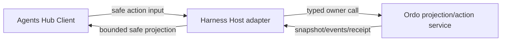

## Context

Harness Plugins 已拥有 Agents icon entry、Subagent Monitor、Ordo Agent Team Pane、pane/event runtime、bundle 与 safe Host/Client boundary。现有 Ordo pane 主要覆盖 run/DAG 只读观察；新 change 在同一插件 owner 内增加 Team V1 collaboration experience，但不能让 browser 直接调用 Ordo CLI/broker、持有 token 或创建 domain store。

Ordo child change 提供 projection/events/actions，TUI child change提供终端 renderer。Web 负责 DSH Host adapter、safe projection、React/client view、graph/list、responsive/accessibility 和 lifecycle cleanup。

## Goals / Non-Goals

**Goals:**

- 在现有 Agents 入口中组合 Session Agents 与 Ordo Teams。
- 提供 task-flow + graph-first 的 Delivery collaboration workspace。
- 让 Host 安全代理 snapshot/events/actions，browser 只持有 ephemeral view state。
- 与 TUI 共享 Team V1 facts/actions/receipts fixtures。
- 覆盖 desktop/tablet、keyboard、semantic fallback 与 reduced-motion。

**Non-Goals:**

- 不新建独立 Web app、不 fork DSH core、不实现 iframe bridge。
- 不让 browser 连接 broker、spawn CLI、持久化 domain ledger 或 credential。
- 不拥有 scheduler、task、Room、Activity、control、approval 或 completion。
- 不支持 mobile editing、多租户切换参数、target merge/push/deploy。

## Decisions

### 1. 复用现有 Ordo Agent Ops Host/Client 包



Host 继续拥有 context binding、credential、cursor、backoff、cache lifetime、action dispatch 与 dispose。Client 只保存 view、selection、graph viewport、drawer/tab、Room draft和 pending UI状态；刷新后所有 owner facts从 snapshot重建。

### 2. Unified Hub 是现有 pane view

Agents icon 仍是 icon-only accessible control。Hub 注册为 reviewed pane/client view，内部 tab 为 `Session Agents | Ordo Teams`。旧 Subagent Monitor 和 Ordo Ops Pane 保留 fallback/deep link，不复制到新独立 route/app。

### 3. Component hierarchy

```text
AgentsHub
├─ HubHeader (owner, freshness, maturity, control)
├─ HubViewTabs (Session Agents | Ordo Teams)
└─ OrdoTeamWorkspace
   ├─ DeliveryPicker / TaskQueue
   ├─ TaskAgentGraph
   ├─ ContextRegion
   │  ├─ Inspector
   │  ├─ Room
   │  └─ Activity
   └─ OwnerActionPalette / Confirmation
```

Task Queue 与 semantic relation list 是可访问的完整事实面；graph 是关系/聚焦增强，不是唯一入口。

### 4. Responsive layout

- `1024px+`：约 `280px / minmax(0, 1fr) / 320px` 三栏。
- `768–1023px`：Task Queue + graph 主区，context 在 right drawer。
- `<768px`：readable task/relationship list、current control/freshness 和 unsupported-editing guidance；不承诺移动端 graph mutation。

layout 改变保留 selection、graph viewport、Room draft和 read-only detail；context revision变化会使 mutation preview失效。

### 5. Task-Agent graph semantics

role-slot 与 task 分区；assignment/handoff 跨区；dependency 在 task layer。坐标和 cluster属于 client view state，status、criticality、blocker、actions来自 Host projection。active/blocked/critical/current neighborhood不可隐藏；completed/idle可 cluster。任何 graph fact都有 Task Queue/Inspector/semantic relation list等价表示。

### 6. Snapshot/event state machine

```text
unavailable
   ↓ capability ready
loading snapshot
   ↓
live(cursor, generation, freshness)
   ├─ duplicate event → ignore
   ├─ gap/expired/drift → refreshing snapshot
   ├─ disconnect → stale read-only + reconnect action
   └─ context switch/HMR → dispose → loading snapshot
```

Host 在 browser 之前验证 seq、stream、context、schema 和 redaction。Client reducer根据 generation 丢弃 late result，不维护离线 mutation queue。

### 7. Action and control flow

Client 只渲染 server-authored action descriptors：

1. 用户选择 action。
2. Host 以当前 context/target/control revision获取或验证 preview。
3. Client 展示 effect、risk、required inputs、holder/target和 evidence refs。
4. 用户明确确认；Host recheck后 apply。
5. Client 显示 receipt/pending，等待 owner event或 refreshed snapshot。

Take Control 同样走该路径；成功后旧 TUI holder会由 Ordo event转只读。失去 control或revision变化会关闭/失效 pending confirmation。

### 8. Security boundary

- Browser 永不接收 broker token、Authorization、cookie value、absolute path、PID、raw URL、provider payload、prompt、tool args/result 或 reasoning。
- Host safe schema只允许 opaque refs、bounded summaries、states、reason codes、versions、freshness、evidence refs和allowed actions。
- URL/deep link只携带 opaque Delivery/view ref，不携带 credential/workspace path。
- localStorage/sessionStorage 不保存 owner snapshot、Room body或approval ref；必要偏好仅保存非敏感 layout/view key。
- unsafe projection触发 fail-closed typed state，不进行 best-effort渲染。

### 9. Accessibility and motion

所有任务/关系/动作均可从 semantic controls访问；focus order稳定，drawer/dialog close后返回触发点。状态使用 text/icon/shape/ARIA，不只依赖颜色。`prefers-reduced-motion` 禁用 graph tween/pulse，持续运行不使用无限动画。

### 10. Shared fixtures and visual acceptance

消费 Ordo child change的共享 fixtures：single writer、handoff/control transfer、Room promotion、candidate acceptance、8-writer simulation、event gap、legacy fallback。语义测试固定 facts/actions/receipts；Web 另维护 1280px、1024px、800px、<768 read-only、high contrast、reduced-motion、large graph 和 degraded states visual fixtures。

## Risks / Trade-offs

- [Web 变成第二 domain store] → owner facts只来自 snapshot/events；Client state类型只允许 view/pending UI，禁止本地 task mutation reducer。
- [Graph 在大规模时卡顿或不可读] → clustering/LOD、bounded visible labels、Task Queue virtualization和 semantic fallback。
- [Host/Client capability 组合复杂] → workspace capability matrix明确 read/action/maturity，缺失时诚实 fallback。
- [旧轻量 Ordo pane 与新 Hub 重复] →旧 pane保留兼容 fallback/deep link，新 Team V1 以 Hub为 canonical client surface。
- [浏览器调试泄漏 Room 内容] → safe projection validator、console/log禁止正文、fixture sentinel检查和 screenshot审查。

## Migration Plan

1. 添加 capability matrix、safe projection types和共享 fixtures，默认 Team V1 unavailable。
2. 实现 Host read path、snapshot/event lifecycle和 read-only Hub/Task Queue/graph。
3. 加入 Room/Activity、surface control和 owner Action Palette；补负向安全测试。
4. 完成 visual/accessibility fixtures与 docs/cookbook，再启用 internal bundle capability。
5. 回滚时移除/禁用 Team V1 view registration，继续提供 Session Agents和旧 Ordo Ops Pane；不迁移 browser/domain data。

## Open Questions

无阻塞问题。DSH 官方 seam 未提供的入口或布局能力继续 capability-probe并诚实禁用，不作为插件 change 的完成阻塞。

