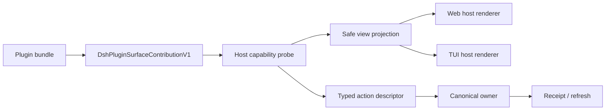

## Context

仓库当前有静态 catalog、28 个可安装 bundle、内部 SDK、command-experience 和最小参考插件。Web 插件多以 React/slot 为呈现，dsh-tui 则是零 React 的独立 renderer；可共享的稳定交集应是命令、safe projection、typed action 和 health，而不是组件实现。

## Goals / Non-Goals

**Goals:**

- 提供一个小而完整的个人编码基础组合，并让 packs 显式、可诊断、可重复安装。
- 建立 Web/TUI 都能消费的内部稳定插件 wire contract。
- 单插件失败可隔离，所有 disabled 状态有 reason/fix/receipt。
- 用 fixtures 和 toolchain 阻止 command/view/action schema 漂移。

**Non-Goals:**

- 不建立 marketplace、网络 registry、遥测或第三方 public semver。
- 不让插件拥有 DSH Session、Git candidate、Ordo run/lease 或领域 canonical state。
- 不允许任意终端绘制、DOM component 跨表面复用或客户端执行 shell string。

## Decisions

### 1. Base pack 是组合 bundle，不是新 runtime

`@yeisme/dsh-personal-coding-base` 只通过现有 Cordis patch 组合已验证的 host/core 包，首版包含 command experience、file/document、Git typed actions、terminal、devtools/diagnostics、plugin contracts 与 Ordo command projection。浏览器、创作、AI drama、personal radar 等留在显式 packs。

### 2. 插件合同按 contribution + projection + action 分层

Contribution 固定 `id`、`contract_version`、`surfaces`、`commands`、`views`、`actions`、`health` 与 `dispose`。view projection 只含 bounded scalar、opaque ref、safe summary、freshness/revision 和 evidence ref。六种 kind 使用同一数据 schema，不承诺同一布局。

### 3. Mutation 永远回到 owner

action descriptor 声明 `effect=read|local_write|external_write|danger`、`risk`、`preview_policy`、`action_ref`、`expected_revision`。read 可直接执行 typed action；其余必须 owner preview/receipt。客户端不得从 label、fix 或 command hint 构造 argv。

### 4. 故障隔离属于合同

probe、registration、refresh、projection decode、action preview/apply、dispose 每一阶段都产生 `available|degraded|disabled` health。异常被转换为 bounded reason/code/fix，不能 throw 穿透宿主启动。基础包自身 critical contribution 失败时 setup/doctor 报红；可选 pack 失败只隔离 pack。

### 5. Parity 检查语义，不比较像素

共享 fixture 固定 command/view/action id、owner、effect/risk、schema version、capability state、disabled reason code 和 sample receipts。Web/TUI renderer 各自做视觉/TTY测试；parity 工具不要求 DOM 与 terminal frame 一致。

### 6. 兼容策略

新 SDK symbol 和 V1 schema 为 additive。`registerCommandConsole`、现有 pane/slot contracts 和 bundle patch 不改变。V1 未声明 public semver，但对 Yeisme 内部 profile 视为稳定：字段只能 optional/additive 演进；rename/removal 需要新 contract version、至少一个 release 双读和回滚说明。

## Risks / Trade-offs

- [固定 view kinds 限制插件表达] → 通过 view composition 和 typed action 满足首版；只按真实需求 additive 扩展。
- [基础包依赖过多] → 以黄金路径为准建立 allowlist，并通过 bundle graph/size/startup smoke 门阻止膨胀。
- [Web/TUI owner capability 不同] → parity fixture 允许相同 id 呈 `unavailable`，但 reason code 和修复语义必须一致。
- [插件错误信息泄密] → 所有 health/error 走 bounded redaction schema，禁止透传 stack、argv、token 和 provider payload。

## Migration Plan

1. SDK 新增 V1 类型、codec、probe 和 fixtures；现有消费者零修改可继续编译。
2. 示例插件增加一个 command + list/detail + previewed action 的双表面参考。
3. 新建 base bundle 与静态 catalog 条目，setup 通过路径安装；不自动修改既有 profile。
4. Web/TUI consumer 分别接入新 seam；缺 seam 时 contribution disabled，不影响旧插件。
5. rollback 移除 base bundle/profile 行或停用 V1 registration；现有 bundles/commands 继续可用。

## Open Questions

无。
