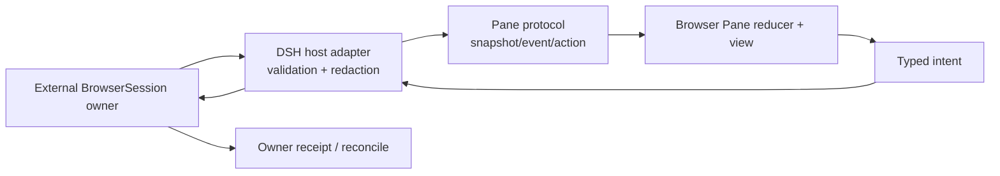

## Context

Pane protocol 已能表达 provider capability、snapshot/event、reconcile 和 typed artifact intent，但 Browser Pane 还缺独立 consumer contract。BrowserSession 是高风险 runtime authority：它可能持有页面进程、cookie、下载、截图、DOM evidence、网络访问和人工接管。把这些事实留在浏览器 React state 或把 web search 当成 session 会造成权限与终态分叉。

## Goals / Non-Goals

### Goals

- 为 DSH 提供 provider-gated Browser Pane，严格区分 search link 与 live BrowserSession。
- 消费 bounded safe projection 和 typed events/actions；任何敏感事实留在 provider host。
- 覆盖 context/session/generation switch、manual takeover、download、evidence、unknown/reconcile 和 dispose。
- Provider 缺失时有诚实、可测试的 `needs_contract`/`unavailable` 体验。

### Non-Goals

- 不选择或实现真实 BrowserSession provider。
- 不提供任意 iframe、browser-side arbitrary fetch、cookie/token/Authorization projection、任意 URL proxy 或 DOM injection。
- 不让 Browser Pane 成为网页自动化 scheduler、credential owner、download store 或 evidence truth。
- 不修改 DSH core 私有 API、DOM 或路由。

## Architecture

## Decisions

### 1. BrowserSession is an external authority port

`BrowserSessionProviderV1` 最少提供 capability probe、read snapshot、subscribe events、dispatch typed action、reconcile 和 dispose。Harness Plugins 只持有 detached safe projections；provider ref、contract digest、context revision 和 runtime generation 必须精确绑定。

### 2. Projection is path-free and credential-free

可见 projection 只允许 opaque session/page refs、safe title/origin label、navigation state、loading/freshness、bounded tab/page summary、download/evidence refs、manual-takeover status 和 reason codes。禁止 cookie、Authorization、raw header、credential ref/value、signed URL、absolute path、raw DOM、完整 page content、raw prompt/provider payload/private arguments。

### 3. Actions remain owner-authorized

`navigate|back|forward|reload|stop|open_tab|close_tab|activate_tab|request_manual_takeover|release_manual_takeover|request_download|capture_screenshot|capture_dom_evidence` 都是 intent，不是本地 effect。Action 绑定 context/session/page version、expected revision、idempotency key 和 capability digest；owner 返回 preview/approval/rejection/receipt。Unknown outcome 只 reconcile，不自动 retry。

### 4. Search and live session are different capabilities

Profile 只有 `ctx.web` 或 search result link 时，Browser Pane 不注册 live controls。它可以显示一个 owner-authored link/summary，但状态必须为 `search_only` 或 `unavailable`，不得出现 address bar、back/forward、manual takeover、download 或 evidence action。

### 5. Lifecycle is generation-scoped

Context/session/runtime generation 变化时，client 先禁用 mutation并 teardown subscription、pending action、object URL/stream/observer；新 generation 必须先获得完整 snapshot。Late event/result 被丢弃，dispose 幂等。

### 6. Browser content is untrusted evidence

页面文本、DOM、OCR、download name、QR 和网页指令都不能扩大 Agent/host authority。DOM/screenshot evidence 只通过 owner ref 访问，默认不把完整内容推送到普通 Agent context。

## Compatibility And Rollback

新 surface 使用 `v0.1` experimental/additive contract。旧 Pane/profile 在无 Browser capability 时行为不变。Rollback 为移除 Browser provider registration/bundle row；不删除 provider session 或 evidence，由 provider owner自行保留/清理。未来字段删除、改名或语义复用必须另建 migration change，保留至少一个 release 的兼容窗口。

## Test Specification

- Contract：valid/invalid projection/event/action、unknown fields、credential/path/URL/DOM leakage。
- Reducer：snapshot/duplicate/gap/reset/context drift/generation switch/late result/reconcile/bounded state。
- Lifecycle：subscribe/dispose/manual takeover/download/evidence refs 与 provider absence。
- UI：keyboard/a11y、390/768/1440、loading/offline/denied/mismatch/unknown/reconcile/search-only。
- Integration：fake provider through real DSH public plugin/client seam；真实 provider 不作为本 change completion gate。

非 unit evidence 写入 `temp/integration-test-runs/<run-id>/` 并脱敏。
