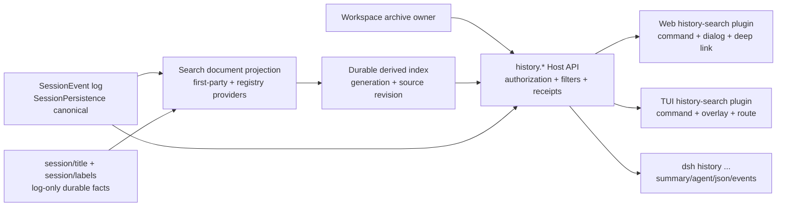

## Context

### 当前状态

DSH 的 `SessionEvent` append-only log 已经是模型历史、恢复、分叉、导出和回放的唯一真相；`SessionPersistence` 具有 JSONL 与 SQLite provider，`ctx.sessionQuery` 已经提供跨 live/persisted corpus 的读取、过滤、trace 与 SQLite FTS5 搜索。Web 侧栏也已经有 `session.search`：客户端即时匹配标题/工作区，Host 搜索当前 user/assistant message surface，结果上限 20 条且只打开 Session，不跳转到命中事件。

当前产品差距不是“没有任何搜索代码”，而是以下能力没有形成一个完整产品合同：

- shipped profile 默认以 `openAt: never` 关闭全文搜索，索引使用 `:memory:` 占位；
- `SessionPersistence` 没有 retention/delete API，现状依赖“数据不被主动清理”而不是明确长期保留合同；
- `session/title`、归档状态、工作区元信息和未来用户标签没有进入统一 Host 搜索结果；
- 搜索只覆盖 current message surface，compaction 后被 shadow 的历史对话无法作为全局历史命中；
- 结果没有 cursor、命中种类、highlight range、归档标记和 event deep link；
- Web 侧栏搜索是一个局部导航控件，尚无命令面板/全局历史对话框；
- TUI runtime 已有 renderer-neutral `TuiPluginRegistry` 雏形，但 command/panel 贡献还没有共享历史搜索 action、overlay 和 route 合同。

### 产品研究记录

- 研究问题：Codex/ChatGPT 桌面端如何找回过去聊天；Claude/Claude Code 如何搜索 prompt 历史、选择并恢复会话；哪些行为应成为 DSH 共享合同而不是视觉模仿。
- 检索日期：2026-08-17。
- 方法：3 批标准研究、9 个检索式，原始候选 80 条；搜索结果噪声未做全量语义去重，按官方域名筛选后保留 8 个候选，最终打开并采纳 4 个官方文档页面。
- 关键证据：OpenAI 官方项目文档说明桌面端可按短语或 branch name 搜索 past chats，并把 command menu 与 past-chat search 作为不同入口；Anthropic 官方文档说明 Claude Code 本地保存每个 conversation，`--resume`/`/resume` 打开会话选择器，同时 `Ctrl+R` 的 fullscreen search 可在 current session/current project/all projects 间切换并折叠重复 prompt。[OpenAI Projects and chats](https://learn.chatgpt.com/docs/projects.md)、[OpenAI desktop commands](https://learn.chatgpt.com/docs/reference/commands.md)、[Anthropic common workflows](https://docs.anthropic.com/en/docs/claude-code/common-workflows)、[Anthropic interactive mode](https://docs.anthropic.com/en/docs/claude-code/interactive-mode)
- 对本设计的影响：Web 采用“command menu 入口 + 独立 global history search”；TUI 明确区分 `Ctrl+R` prompt recall 与全局 session search；两端都支持从命中恢复 Session，但不复制竞品未公开的索引、排序或存储实现。
- 限制：外部文档可以证明用户可见行为，不能证明内部索引结构、数据保留周期或标签实现；这些部分只根据 DSH 本地合同设计。

### 准入与能力台账

准入结论为 `split-owner`：DSH Host/Session packages 拥有 canonical log、标签、归档委托、索引、授权和 result contract；Web 与 TUI 是 experience host，只保存 query、selection、overlay、scroll 和快捷键等短期展示状态。

| 能力 | 分类 | canonical owner | experience host | 交付状态 | 验证路径 |
| --- | --- | --- | --- | --- | --- |
| 长期会话日志 | required | DSH `SessionPersistence` | Web/TUI/CLI | deliver-now | 重启、归档、compaction 后仍可读取 |
| 持久派生索引 | required | DSH `SessionQuery` provider | Web/TUI/CLI | deliver-now | unchanged source 不重扫；reset 可重建 |
| 标题与用户标签搜索 | required | DSH title/label services | Web/TUI/CLI | deliver-now | title/label exact、prefix、CJK 用例 |
| 全对话正文搜索 | required | DSH search document registry | Web/TUI/CLI | deliver-now | current/shadowed message 命中 |
| 历史会话选择与恢复 | required | DSH history API | Web/TUI | deliver-now | 从结果恢复 cold/archived Session |
| 命中事件深链 | required | DSH history API + client route | Web/TUI | deliver-now | 打开 Session 并定位 event/message |
| Web 命令面板入口 | required | Web client plugin | Web | deliver-now | command、shortcut、sidebar 分工 |
| TUI 历史搜索插件 | required | TUI app public registries | TUI | deliver-now | plugin load/unload/replay/keymap |
| CLI/agent 输出 | committed | DSH CLI | shell/agents | deliver-now | summary、`--agent`、`--json`、`--events` |
| 批量导入/跨设备同步 | not-requested | 未决 | 未决 | 不在 V1 | 需另开 change |
| 向量语义搜索 | not-requested | 未决 | 未决 | 不在 V1 | 需另开 change |

### 约束

- DSH 上游仓（deepseek-ai/deepseek-harness）禁止在子项目内创建 `openspec/`；其具体实现设计使用 Agent Notes。2026-08-20 起 monorepo 不再维护 `client/deepseek-harness` fork：Agent Note 与配套实现在 PR staging worktree 起草、固化为本仓 `upstream-prs/<slug>/`（含 note 草案）后以 PR 提交上游；note 的 format/pairing gates 在该 worktree 内运行。
- “everything is a plugin”：新行为必须走现有 capability、event、command、client/TUI registry，不修改 agent loop。
- TUI 必须保持 `update(state,event) -> state + effects` 与 renderer-neutral scene；插件不得直接执行 I/O 或写 stdout/stderr。
- 搜索索引是派生数据，不得成为第二份 Session truth；归档、标签与恢复结果必须回到 owner service。
- 不输出/索引 reasoning、raw provider payload、hidden prompt、credential、Authorization、private tool arguments 或完整思维链。

## Goals / Non-Goals

**Goals:**

- 让一个 DSH profile 中所有有权访问的历史 Session 在重启、归档与 compaction 后仍可被搜索和恢复。
- 让 title、user labels、workspace display metadata、user/assistant messages 使用一个可扩展 search document contract。
- 让 Web、TUI 与 CLI 消费同一个 `history.*` action/result model，并提供一致的 filter、cursor、deep link 和 typed failure。
- 对英文、中文/CJK 与代码标识符提供可预测的本地检索，不要求云服务或 embeddings。
- 以 additive 合同扩展现有 `session.search`，保留可关闭、可重建、可回滚能力。
- 把索引 freshness、build/reconcile、disabled、corrupt 与 partial 状态变成用户可见事实。

**Non-Goals:**

- 不让 Agent 默认读取或注入全部历史；模型访问历史需另开有权限的 tool/approval change。
- 不把跨 profile、跨用户、跨设备、云端同步或团队共享纳入 V1 的“global”。V1 global 仅指当前 DSH profile/identity 可见的全部 workspace 与 archived Session。
- 不在 V1 做 embedding、LLM rerank、自动 memory、自动摘要、相似会话推荐或自然语言 query planning。
- 不把 archive 解释为 delete，也不新增自动清理策略；显式 purge/delete 需独立设计恢复窗口与审计。
- 不把 Web React slot、Pi component、SQLite handle、绝对路径或 raw SessionEvent 暴露为客户端插件合同。
- 不替换当前侧栏快速搜索；它继续服务当前导航和低延迟标题/工作区匹配。

## Decisions

### 1. 采用“一份历史真相 + 一份可丢弃索引 + 多个客户端投影”



`SessionPersistence` 继续保存完整 append-only 日志；index 只保存搜索文档、source revision、registry digest、ranking 字段与 cursor generation。任何索引缺失或损坏都不得影响 Session resume/export，且必须可由 canonical log 重建。

替代方案“Web/TUI 各自建立本地搜索库”会产生不同归档范围、不同权限和无法对齐的 deep link，因此拒绝。替代方案“把搜索索引直接当会话数据库”会让 rebuild、tokenizer 变更和 rollback 触碰原始历史，因此拒绝。

### 2. 长期保存采用 provider-neutral 合同，不强制替换现有 JSONL

V1 把“长期”定义为：已物化 Session 默认无限期保留；进程重启、客户端卸载、归档和 compaction 不删除原始日志；只有未来显式 purge 才能删除。现有 JSONL 与 SQLite persistence provider 都满足 canonical role，V1 不要求为启用搜索而迁移日志格式。

shipped composition 将 `session-query-sqlite` 从 `:memory:`/`openAt: never` 的关闭占位演进为用户级 durable path + `openAt: first-search`。第一次搜索延迟打开 SQLite 并增量 reconcile，避免无搜索场景承担启动告警与 I/O。索引路径必须与 persistence 数据库分离。

替代方案“默认切换 canonical persistence 到 SQLite”会扩大迁移、raw export 与 downgrade 风险，但对本需求没有必要，因此留给独立 change。

### 3. 标签是 log-backed latest snapshot，不是浏览器 localStorage

新增 `ctx.sessionLabels` capability 与 log-only `session/labels` 事件。事件保存规范化后的完整 label snapshot、revision、source 和 updatedAt；写入接口接受 `expectedRevision`，冲突返回 typed failure。完整 snapshot 比 add/remove delta 更容易在 replay、fork、cold inspection 和 out-of-order client response 中确定性折叠。

标签约束：

- 每个 Session 最多 32 个 label；每个 label 最大 64 UTF-8 bytes；
- 输入先去控制字符、trim、Unicode NFKC 与 whitespace collapse；
- 比较键使用 Unicode case-insensitive normalization，显示值保留首次/最新接受的用户大小写；
- 空值、重复值和仅标点值拒绝；
- 事件 envelope 标记 `ignorable: true`，旧 build 可保留并跳过它而不拒绝整个 Session；
- fork 默认继承当前标签 snapshot，并记录 source 为 `fork`；用户可随后独立修改。

归档继续由现有 Workspace archive owner 管理。`history.archive`/`history.unarchive` 只是统一 facade，必须委托 owner 并返回 receipt，不能在搜索插件中维护第二个 archive set。

### 4. 扩展 search document provider registry，而不是继续硬编码 event switch

现有 `extractSessionEventText()` 只识别少数第一方 event，未知插件事件一律不搜索。新增 `SessionSearchDocumentProvider` registry：provider 声明 id、version、event types、document kinds 与纯投影函数；投影输入是 cloned header + validated event，输出是 bounded text、kind、surface policy 和安全 metadata，不允许 I/O。

第一方 provider 通过同一 registry 提供：

- `title`：现有 `session/title`；
- `label`：`session/labels` 中每个 label；
- `user-message`：人类 user text；
- `assistant-message`：assistant final message text；
- `workspace`：授权后可见的 display name/ref；
- `tool`：默认关闭，仅在明确 filter/config 下索引经过 owner redaction 的 tool name/result summary。

registry roster 与 provider version 形成 `registryDigest`。digest 变化时索引进入 `reconcile_required` 并按 generation 重建受影响文档，不能静默混用旧新 projection。

### 5. 新增 `history.*`，保留 `session.search` v1

现有 `session.search` 继续返回 `{sessionId,snippet}`，保持 Web 侧栏兼容。新增 API/RPC family：

| Method | 责任 |
| --- | --- |
| `history.search` | 跨 Session 分页搜索、filter、facet、index state 与 deep link |
| `history.get` | 读取一个授权后的 Session summary、labels 与可恢复 anchor |
| `history.labels.set` | expected-revision 标签替换 |
| `history.archive` / `history.unarchive` | 委托 Workspace archive owner |
| `history.reindex` | 启动/观察可取消的派生索引 rebuild |
| `history.health` | index mode、generation、source coverage、last reconcile 与 typed failure |

逻辑结果：

```text
HistorySearchHitV1 {
  session: { id, title?, labels[], workspaceRef?, updatedAt, archived, origin? },
  bestMatch: {
    kind: title | label | workspace | user-message | assistant-message | tool,
    eventSeq?, messageId?, surface: current | shadowed | log-only,
    snippet, highlights[]
  },
  anchor: { sessionId, eventSeq?, messageId? }
}
```

请求支持 `scope=all|workspace|session`、`includeArchived`、`kinds[]`、created/updated time range、limit 与 cursor。cursor 绑定 normalized request、authorization revision、index generation 与 provider instance；变化后返回 `HISTORY_CURSOR_STALE`，客户端从第一页重试。

结果不返回 provider score、绝对 cwd、原始 event payload 或搜索数据库 row id。remote client 只得到 opaque workspace/session refs 与 safe display metadata。

### 6. 全局历史默认搜索“完整可见对话”，侧栏继续搜索“当前表面”

全局历史默认包含：title、labels、workspace display metadata，以及 `current` 和 `shadowed` 的 user/assistant final messages。这样 compaction 不会让过去讨论从历史检索中消失；shadowed 命中在 UI 标记为“历史上下文”，避免用户误以为它仍在当前模型 context。

侧栏 `session.search` 保持 current surface、非归档、20 条与无 deep link 的快速导航语义。工具参数/结果、stream chunks、request headers、reasoning、hidden prompt 和 provider payload 默认不进入任一全文索引。

### 7. 排序与多语言检索由 Host 定义，客户端不重排

排序优先级：normalized exact title/label > title/label prefix > user-message > assistant-message > workspace > opt-in tool；同级按 match quality、updatedAt、session id、event seq 做稳定 tie-break。API 不暴露可依赖的 numeric score。

tokenization 采用无需 native extension 的双通道：

- `unicode61`/word token 用于拉丁文本与自然语言 phrase；
- Host 预生成 CJK bigram、camelCase/snake_case/path segment 与 punctuation-stripped identifier token；
- 2 个及以上 CJK 字符支持 substring-style content match；
- 单字符查询只搜索 title/label/workspace metadata 并返回 refine hint，不扫描全部正文；
- query 被当作 data，不允许执行 FTS syntax；NUL、控制字符和超过 wire limit 的输入在边界拒绝。

替代方案“直接使用 embeddings”增加模型成本、隐私面和结果不可复现性，不符合本地历史找回的首期目标。替代方案“只用 unicode61”对中文与代码标识符召回不足，因此拒绝。

### 8. Web 使用两个搜索层级，并接入截图所示命令面板

Web 侧栏搜索继续即时过滤当前 Session 列表。全局入口新增：

- 命令面板项 `Search history`，描述为 “Search titles, labels, and past sessions”；
- 快捷键 `Cmd/Ctrl+G` 直接打开 global history dialog；`Cmd/Ctrl+K` 继续打开通用 command menu；
- composer slash command `/history` 打开同一 dialog，不创建 model turn；
- `/resume` 打开空 query 的 recent history/session picker；
- 结果显示 title、labels、workspace、时间、archived badge、match kind 与 snippet；
- Enter 恢复并打开 Session，若 anchor 存在则定位并高亮命中 node；
- query 保留到 dialog 关闭，打开 Session 后不写入 Session log。

dialog 只保存 presentation state。标签、归档和恢复 mutation 都显示 pending receipt；失败不进行 optimistic success。

### 9. TUI 历史搜索是公共插件，不是 shell 私有分支

TUI built-in plugin id 为 `history-search`，最初放在 `tui-app` 的 named plugin directory，等独立复用成立后再拆包。它通过公共 registry 提供：

- commands：`history.search`、`session.resume`、`session.labels`、`session.archive`；
- route/overlay：`history.search` 与 `history.resume`；
- keymap：`Ctrl+Shift+F` 打开全局历史；`Ctrl+R` 保留 prompt history recall，不改义；
- effects：仅调用 typed `history.*` actions，所有完成/失败回流为 plugin event；
- semantic view：wide/standard/narrow 下的 query、scope、filter、result list、preview 与 index state。

纯状态至少包含 `closed|opening|searching|ready|loading_more|opening_session|offline|disabled|reconcile_required|error`。plugin unload 必须取消请求、释放 overlay/focus/keymap、忽略 late completion 并恢复此前 focus。renderer failure 使用 generic list fallback，Host result 保持可检查。

### 10. CLI 与自动化使用一个 projection、多个 renderer

新增真实命令：

```bash
dsh history search "oauth callback" --scope all
dsh history search "发布流程" --include-archived --json
dsh history show <session-id> --agent
dsh history tag <session-id> --add backend --add release
dsh history archive <session-id>
dsh history unarchive <session-id>
dsh history reindex --events
dsh history doctor --json
```

默认输出是简短 English human summary；`--agent` 使用稳定 key=value；`--json` 使用共享 envelope；`reindex --events` 输出 start/progress/end 或 error NDJSON。所有 renderer 来自同一 `HistoryCommandProjection`，机器输出不含 ANSI、日志、raw prompts、绝对路径、secrets 或完整 event payload。

### 11. 授权、隐私与索引状态是 Host 责任

每次 search 先确定当前 principal/profile 可见 Session corpus，再执行或过滤结果；不能让客户端把任意 session id 绑定到 SQL。archived 不是越权入口。未来 remote/multi-user deployment 必须把 authorization revision 绑定 cursor。

索引文件请求 owner-only 权限，诊断只显示 configured/disabled、path source、generation、document counts、coverage 与 redacted digest，不输出正文。`metadata-only` 配置允许只索引 title/label/workspace；默认 local single-user profile可启用 message content。配置变化触发 generation rebuild。

### 12. 性能与 freshness 采用增量 reconcile 和显式预算

索引复用 `listSnapshots()` 的 source-qualified revision：unchanged Session 不 inspect；新增/变化/删除 Session 事务性 reconcile；live rows shadow persisted rows；provider/digest 或 schema 变化进入重建 generation。

发布验收基线：10,000 Session、1,000,000 searchable document 的 warm first page p95 不高于 250 ms；输入到 Web/TUI loading state 不高于 50 ms；unchanged reopen 不全量 inspect；首次 rebuild 可取消、可观察，不阻塞 composer 或 transcript。具体基准硬件和 fixtures 由 DSH Agent Note handoff 固定。

## Risks / Trade-offs

- [派生索引包含敏感对话文本] → owner-only 文件权限、metadata-only 模式、默认排除 tool/reasoning/provider payload、统一 redaction、reindex 后清除旧 generation；不宣称磁盘加密。
- [搜索完整 shadowed history 会命中过时内容] → 结果标记 surface，UI 显示“历史上下文”，打开时定位原事件而非冒充当前 context。
- [CJK/identifier auxiliary tokens 增大索引] → bounded token generation、基准监控 index/log size ratio、单字符正文搜索 fail-fast。
- [同步 SQLite MATCH 阻塞 Node event loop] → first-page limit、cooperative budget、后台 rebuild、性能门；若证据仍不达标，再评估 worker-thread provider，不提前引入 native service。
- [provider registry 变更造成混合语义] → digest 绑定 generation/cursor，变化时 fail closed 并 reconcile。
- [旧 build 不认识标签事件] → event 标记 `ignorable: true`，标签不是恢复 model surface 所必需；downgrade 仍可读会话。
- [Web 与 TUI 键位冲突] → command 始终有可见 fallback；TUI protected bindings 不能被插件静默覆盖；`Ctrl+R` 不改义。
- [归档/标签操作被插件乐观提交] → owner receipt 是唯一成功依据，断线或 timeout 显示 unknown/reconcile，不本地推断。
- [本仓 OpenSpec 与 DSH 上游 handoff 通道分工] → 本 change 只持有跨模块架构与 handoff；DSH 具体实现、测试与 closeout 经 upstream-prs PR staging 使用上游 Agent Notes。

## Migration Plan

1. 冻结本 change 与 DSH 两个 proposed Agent Notes，记录 `history.*`、label event、search document registry、Web/TUI command ids 和兼容分类。
2. 在 DSH 中先增加 additive label/service/search contracts、schema fixtures 与 index generation；不改变 shipped Web 行为。
3. 提供 durable derived-index path 与 `openAt: first-search`，对现有 JSONL/SQLite logs 做非破坏增量 reconcile；验证 unchanged restart 不重扫。
4. 增加 `history.*` Apiproxy/client-runtime actions 与 CLI；保留 `session.search`，并用 adapter contract test 固定旧响应。
5. 接入 Web global dialog/command entries；侧栏搜索不变。
6. 在 TUI public registry 达到 overlay/route/effect acceptance 后装配 `history-search` built-in plugin；不在 feature plugin 内增加私有 runtime seam。
7. 运行 package、contract、component、Web、TUI replay/PTY、performance 和 corruption/reindex 验证；非 unit 证据写入 DSH 现有证据体系，不写入本 change。

回滚：卸载 Web/TUI/CLI command contributions，把 `session-query-sqlite.openAt` 设回 `never` 或禁用 `history` profile。派生索引可保留或由 `dsh history reindex --reset` 受控重建；原始 Session logs、`session.search` 和 archive set 不变。已写入的 `session/labels` 事件保持 ignorable，旧 build 继续加载 Session。V1 没有 deprecation window，因为没有删除、重命名或重定义既有稳定面。

## Open Questions

- `history.search` 是否在首个 alpha 就开放 opt-in `tool` kind，还是只交付 title/label/workspace/user/assistant；默认答案为后者，除非 redaction fixture 证明 tool summary 安全且有明显找回价值。
- Web global dialog 是否同时提供“复用该 user prompt 到 composer”动作；首切片只承诺恢复/打开 Session，prompt reuse 可在不改变 search contract 的后续小版本增加。
- 性能证据是否要求将 synchronous SQLite query 移到 worker thread；只有 1M-document 基准不达标且 profiler 证明 event-loop 阻塞后才升级。

## Scope Change Log

| 日期 | 变更 | 类型 | 影响 |
| --- | --- | --- | --- |
| 2026-08-17 | 建立长期历史、标签、全局搜索、Web/TUI 插件与 CLI 的完整能力账本 | 初始范围 | 无 required 能力被删除或降级 |
