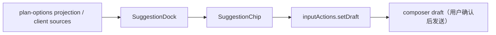

## Context

DSH Web 已有 composer dock（`conversation.input.dock`）和 session standard kit（`useProjection`、`inputActions`）。`inputActions.setDraft` 是唯一的公开草稿写入路径，所有 mutation 都走 input machine 事件，因此“点击建议填入输入框”可以安全地复用该路径，不绕过发送确认。

Plan mode 的 `plan-options` projection 已定义多方案候选（`PlanOption`），但 Web UI 尚未渲染。本 change 将该 projection 作为第一个建议来源，并保留通用 `NextStepSuggestionV1` 契约，便于后续接入 CLI structured actions 与领域插件建议。

## Goals / Non-Goals

**Goals:**

- 让 DSH Web 把“下一步建议”显示为可点击 chips。
- 点击 chip 只写入 composer draft，不发送、不执行。
- 支持多个方案、多选、并行组合提示词。
- 保持 DSH 的 append-only session log 与 owner 边界。

**Non-Goals:**

- 不直接执行 suggestion，不调用 `submit()`。
- 不解析任意 CLI 文本中的“推荐下一步”。
- 不实现 host 侧跨插件 registry/projection（retain-next）。
- 不修改 `client/deepseek-harness` 核心。
- 不创建第二个 plan scheduler 或 task ledger。

## Decisions

### 1. 使用 `conversation.input.dock` 渲染建议区

- V1 固定在输入框上方 dock；不占用助手消息动作条。
- 无建议时组件返回 `null`，零布局成本。

### 2. 点击只写草稿，不提交

- 空草稿：`setDraft(suggestion.prompt)`。
- 非空草稿：默认 `setDraft(current + "\n" + suggestion.prompt)`，可后续增加“替换”设置。
- 不调用 `submit()`，不调用 `command.execute()`，不调用 `session.prompt()`。

### 3. 多选与并行组合是纯函数

`suggestion-composer.ts` 提供：

- `appendPrompt(current, prompt)`：追加。
- `applySelected(current, suggestions)`：按选中顺序追加。
- `composeParallelPrompt(suggestions)`：生成“请并行执行以下方案”的组合文本。

并行组合只影响用户将发送的文本；真正并行执行由 Plan 的 `dag` 模式或 agent-loop owner 决定。

### 4. plan-options 来源

- 读取 `useProjection('plan-options')`。
- 每个 `PlanOption` 转为一个 `NextStepSuggestionV1`：
  - `id = plan-option:<planId>:<optionId>`
  - `label = option.title`（推荐时加“推荐”徽标）
  - `prompt = /plan-select {"optionId":"<optionId>"}`
  - `parallelSafe = true`
- 若 `plan-options` 投影缺失（未组合 plan-mode），建议区隐藏。

### 5. client 侧 source 扩展点

- `registerSource(source)` 允许其他 client 插件在同一页面贡献 `NextStepSuggestionV1[]`。
- V1 不实现 host 跨进程 registry；后续需要跨插件/跨 profile 建议时再引入 host service + projection。

### 6. 安全与可访问性

- 只展示 `label`/`prompt`/来源/排序/parallelSafe；不传 raw path、secret、provider payload。
- chips 使用 `role="group"`、`aria-pressed`、`aria-label`，支持 Enter/Space。
- 多选应用后焦点返回 textarea。

## Test Specification

| 层 | 场景 | 命令 | 证据 |
| --- | --- | --- | --- |
| unit | append/replace/parallel-combine | `pnpm --filter @yeisme/dsh-client-ui-next-step-suggestions run test` | Vitest result |
| unit | source 合并/去重/排序 | `pnpm --filter @yeisme/dsh-client-ui-next-step-suggestions run test` | Vitest result |
| component | chip 点击写入 draft 且不 submit | `pnpm --filter @yeisme/dsh-client-ui-next-step-suggestions run test` | Vitest result |
| component | 多选/并行/禁用 parallelSafe | `pnpm --filter @yeisme/dsh-client-ui-next-step-suggestions run test` | Vitest result |
| build | typecheck/build | `pnpm --filter @yeisme/dsh-client-ui-next-step-suggestions run typecheck && pnpm --filter @yeisme/dsh-client-ui-next-step-suggestions run build` | exit 0 |
| bundle | source independence / no-op host | `pnpm --filter @yeisme/dsh-next-step-suggestions run test` | Vitest result |

## Risks / Trade-offs

- [plan-options projection 未在发布版 DSH 提供] → 插件通过 string key 读取，缺失时隐藏；后续 DSH 发布后自动生效。
- [用户误解“点击=执行”] → UI 文案明确“点击填入输入框”，不自动发送。
- [并行组合只是提示词] → 文档明确真正并行调度由 Plan/agent owner 决定，避免过度承诺。
- [client source 扩展点不是 host registry] → 当前足够支持同页面插件；跨 profile/进程建议留后续。

## Migration Plan

1. 发布 `@yeisme/dsh-client-ui-next-step-suggestions` 与 `@yeisme/dsh-next-step-suggestions` 为 `0.1.0-rc.1`。
2. 用户通过 `dsh plugin add` 安装 bundle。
3. Rollback：移除 bundle row；无数据迁移。

## Open Questions

- 是否需要在助手消息尾部（`conversation.chat.turnTail`）也显示建议，而不是只在 composer dock？
- 是否引入 host 侧 `ctx.nextStepSuggestions` registry 以支持跨 profile/跨进程贡献？
- 单 chip 点击在非空草稿时默认“追加”还是“替换”是否需要用户可配置？
