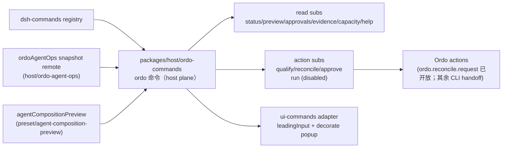
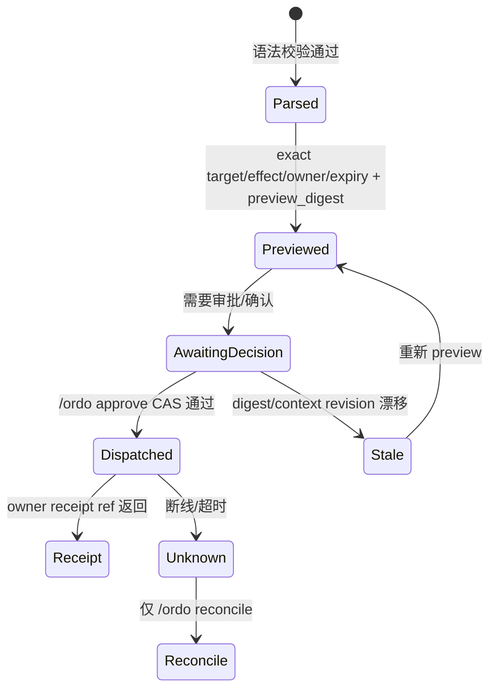

## Context

- `dsh-commands`：单名注册（`[a-z][a-z0-9_-]*`）、description、`input.hint`、`recordInput`、abortable handler 返回 `success|error` text（+`sourceEventSeq`）；`command/run|done` 生命周期事件直接落会话（不进 turn、不进模型）；`commands/change` 通知发现层；结果由 UI adapter 直接渲染。
- `dsh-client-ui-commands`：`command.list` 会话级目录、fuzzy 发现、三态 dispatch（`execute` / `popupSelect` / `leadingInput`）、`CommandUiContract.register/decorate`、`command/executed` 本地事件（仅提交浏览器侧）。
- 既有 `packages/host/ordo-agent-ops` 提供 `ordoAgentOps` snapshot remote（`needs_contract` / owner-gated）；`packages/preset/agent-composition-preview`（本仓新 change）提供组合投影。
- 状态词汇表与 reason codes 由 `ordo-dsh-plugin-visualization-v1` 冻结（`fresh|stale|offline`、`ready|running|attention_required|approval_required|reconcile_required|permission_denied|contract_mismatch`）。

## Goals / Non-Goals

**Goals:** 单一 `ordo` 命令面的语法/read/action/UX 合同；preview-before-mutate；诚实分期（未开放的远端动作一律 `not_available`）；不进入模型。

**Non-Goals:** 不做模型工具；不重实现 Ordo 风险/成熟度；不开放 V2 launch/cancel。

## Decisions

### 1. 单一 `ordo` 命令 + 插件自有子命令语法

registry 只接受单名，因此 `/ordo <sub> [args...]` 的解析归命令插件（与 `/permission <preset>` 同模式）：

```text
/ordo [<sub> [args...]]
  sub ∈ { status, preview, approvals, evidence, capacity, qualify, reconcile, approve, help, run }
  preset-id  ^[a-z0-9][a-z0-9-]*$
  run-ref / evidence-ref / decision-ref  非空、无空白、不含 / .. http:// file:// 等 scheme 或路径片段
```

- 未知 sub、多余 token、非法 ref：typed error + 可用子命令列表；绝不把 rawInput 交给 shell/URL/模型。
- `command/run` 只记录合法命令的原始输入（`recordInput=true`；args 已被语法限制为安全 ref，与 `/permission` 记录 rawInput 同等级）。

### 2. 注册归属：新 `packages/host/ordo-commands`，双数据源可选



- 至少一个数据源 mount 才注册命令（无源不注册，避免永远不可用的噪音命令）。
- 两个源都走 `ctx.get(...)` 可选读取；缺失时对应子命令返回 typed `capability_unavailable`。

### 3. Read 子命令：摘要 + freshness + 一个 next action

每个 read 结果固定四段式：`结论 · freshness/状态 · 关键 refs 安全摘要 · 下一个动作`。示例：

```text
/ordo                  → "workspace w7 · run manga-12 running · attention 2 · fresh
                           next: /ordo status"
/ordo status           → "run manga-12 · 18/24 tasks · verifier wait · fresh
                           next: /ordo approvals"
/ordo status run_9     → "run_9 · candidate_frozen · lease retained · fresh
                           next: open Agent Ops panel"
/ordo preview minimal  → "preset minimal · 2 tools · workspace-write · mount_ok ·
                           drift none · runtime_qualification not_qualified
                           next: /ordo qualify minimal"
/ordo capacity         → "policy 20 · observed 4 · qualified 1 · reservation not_supported
                           next: 面板查看 qualification 来源"
```

- owner 源不可用：`needs_contract` + reason，不显示任何伪造事实。
- 状态词只用冻结词汇表；stale/offline 时 mutation 类子命令禁用。

### 4. Action 子命令：preview → decision-ref CAS → receipt



- `/ordo qualify <preset-id>`：V1 返回 preview（组合 digest、health、风险/成熟度若 Ordo 投影可用）+ 精确 owner CLI 行作为 next action；远端 `ordo.agent_qualify.request` 开放前不伪造调用。
- `/ordo reconcile <run-ref>`：仅当 authoritative 投影显示 `reconcile_required` 时可用；复用 `ordo.reconcile.request`；unknown 不自动重试。
- `/ordo approve <decision-ref>`：decision-ref 是 server-minted id；CAS 绑定 preview_digest + context_revision + tenant/workspace；不匹配返回 stale，要求重新 preview。
- `/ordo run launch|cancel|redispatch`：注册为禁用态，一律 typed `not_available` + 原因，不隐藏命令。

### 5. UX：leadingInput + decorate popup + 面板联动

- host 命令带 `input: { hint: '<subcommand> [args]' }` → `leadingInput` dispatch；fuzzy 发现按名字匹配（`ordo` 唯一）。
- `CommandUiContract.decorate('ordo', spec)`：裸 `/ordo` 打开 popup 菜单（子命令清单，静态选项；动态 refs 由 handler 的 help/error 文本引导），`onSelect` 提交 `/ordo <sub>` 行。
- `command/executed(sessionId, 'ordo', result)`：`ui-ordo-agent-ops` 监听并打开/聚焦 Agent Ops 面板（如 `/ordo status` 后面板聚焦该 run）；仅导航，不自动 mutate。
- 面板内「以命令运行」popup 用 `popupSelect` 提交精确行（如 `/ordo reconcile run_9`），refs 只来自 safe snapshot。
- 结果行 a11y：键盘可达、focus 回归、screen reader 状态播报、reduced motion；错误行含 reason code + safe 解释 + 下一步。

### 6. 结果安全与事件

- 结果文本：安全摘要 + refs + 一个 next action；不含 raw prompt/payload/private args/token/absolute path/URL 正文（面板深链是 UI 动作，不是文本）。
- 生命周期只产生 `command/run|done`；无新 SessionEventMap 成员（避免 required-on-read 兼容面）。
- 本切片不注册模型可见工具；若后续增加，需独立 spec + session event（model-visible ⟺ logged）。

## Failure Registry

| 失败 | Rescue |
| --- | --- |
| 未知 sub / 非法 ref / 多余 token | typed error + 可用子命令；不执行 |
| owner 源不可用 | `needs_contract` + reason |
| preview 后 digest/context 漂移 | approve 拒绝为 stale，重新 preview |
| 非 reconcile_required 时调用 reconcile | typed `not_available` + 原因 |
| V2 launch/cancel/redispatch | 一律 `not_available`（durable reservation 未验收） |
| 断线/unknown | 只提示 reconcile，不自动重试 |
| permission_denied | 不泄露资源存在性 |
| contract_mismatch | 提示升级/回滚，禁用 mutation |

## Risks / Trade-offs

- [命令名冲突] → `ordo` 全局唯一；注册重复即失败（registry 行为）。
- [结果文本信息密度] → 四段式固定格式；详情走面板/Workbench，不在输入行堆数据。
- [decision-ref 被重放] → CAS + expiry + 单次；重放返回 stale/已使用。
- [popup 选项与真实状态不同步] → popup 只放静态子命令；动态事实一律由 handler 现场投影。

## Open Questions

1. `decision-ref` 的 mint 与有效期策略：建议与 `harness.action.v1alpha1` 的 idempotency/expiry 对齐，由 host 命令持有内存态、receipt 由 Ordo 确认。
2. 裸 `/ordo` 是摘要还是 popup 菜单：建议 popup 菜单优先（`decorate`），菜单含「查看摘要」项。
3. `qualify` 的远端动作面开放后，`/ordo qualify` 是否直接 dispatch：建议开放后走同一 preview→approve→receipt 流，命令语法不变。
