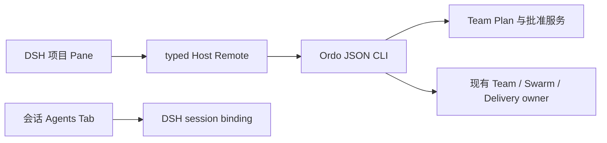

## 目标和 owner

本变更落实会话中已批准的 Ordo × DSH 项目指挥方案。项目 Pane 固定项目，会话 Agents Tab 跟随其所属会话；不同会话与任务只按明确引用关联。Task DAG、任务分配和会话父子树分别表达。

## 接口与实现

新增 project-ops CLI 与独立 ordo.project_ops.snapshot.v1；不扩展旧严格 Team snapshot。项目目录通过应用服务注册到用户级配置，客户端只收到项目引用和标题。Host 异步执行 CLI，不使用 shell，不将用户 payload 写进 argv。

快照包含真实任务依赖、执行者、已记录尝试、运行事件和证据引用。事件使用来源流序号和有界窗口；项目 digest 是快照版本，不冒充全局事件序号。事件变化后重读快照，断线保留最后确认内容并暂停操作。未知结果在 owner 留下回执，重复 request id 不再派发；已存在不确定操作时新请求也不能绕过保护。

计划修改仅生成新版本；依赖与模型、预算在 owner 重新校验，旧批准不沿用。新任务和写入范围由主 Agent 经 Team Plan owner 提案。启动、停止和对账继续使用既有 Ordo 资格与租约检查；既有只读 scope 不提升为可写。用户要求的两次返工与最终人工验收必须经真实 owner 路径验证，不以模拟或状态标志证明完成。

## UI Contract

- Surface classification: adopted；图 renderer 为 embed。
- Surface kind: workspace + inspector。
- First / second / third visual priority: 待处理事项；当前任务与下一动作；技术引用与用量。
- Existing components reused: ui-surface、ui-visual-kit、官方 Button/Input、React Flow、Subagent Monitor、Side Chat。
- Cards that earn existence: 无额外指标卡片；任务为可选择行。
- Primary scroll owner: 主区域；宽度足够时详情独立滚动。
- Cross-host Semantics: Ordo 是 action/receipt owner；关闭 Pane 不停止执行；并排会话使用 DSH binding，不改变主会话选择。
- State Matrix: loading 展示读取状态；empty 区分无项目与无任务；offline/stale 保留最后确认内容并禁用提交；unknown 提供对账；success 展示真实回执；能力缺失显示原因。
- Responsive: <=420px 单列；421–720px 列表与详情切换；>720px 最多主内容与详情两列。
- Accessibility: 图有列表等价入口，控件有可见标签和键盘路径；200% zoom、焦点恢复、reduced motion、coarse pointer。
- Visual Exceptions: 任务图节点位置与画布尺寸属于必要几何，样式使用统一 token。

## 兼容与回滚

保留旧 Agent Ops/Subagent/Side Chat 和 /ordo；旧严格读取 schema 不变。禁用新 Pane 或不使用新增命令即可回退，保留已有会话、项目注册与 owner 回执。注册、locale、订阅和控制器必须随卸载对称释放。

## 验证

复用既有 Bun/Vitest/Testing Library/Playwright。覆盖依赖、跨项目、双栏、迟到响应、重复提交、停止未知、断线、重开和计划修订。性能样本 300 个任务、30 个执行者。编码、资料分析、内容候选共用相同 owner 状态模型；无真实证据的场景标记探索。

集成证据由应用脚本写入本项目 temp/integration-test-runs/<run-id>/，包含 summary.json、command.txt、stdout.log、stderr.log、env.json 和 artifacts/。本地协议验证不能关闭真实 Agent 使用任务。

