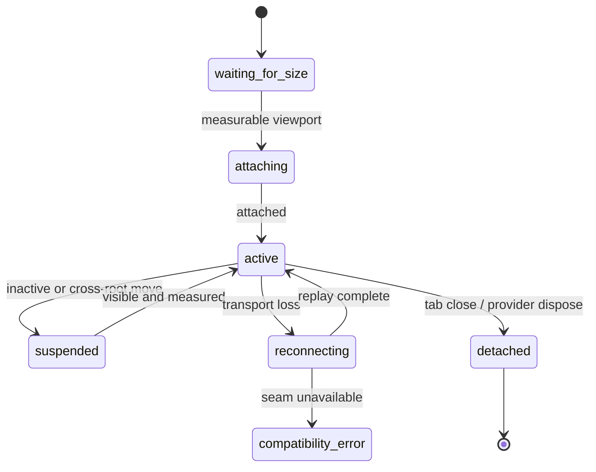

## Context

### Existing implementation

`@yeisme/dsh-client-ui-pane-workbench` already has the correct V2 state foundation:

- `PaneWorkbenchController` is the external store shared by Right/Bottom slot roots.
- `PaneViewSpecV1` already carries `resourceKey`、`preview`、`pinned`、`dirty`、`singleton`、`metadata` and target group information.
- reducer already supports open/activate/pin/dirty/close/reorder/move/split/move-group/lock/resize/maximize/restore/reset/undo.
- split depth、visible group count and minimum Pane size are bounded.
- registration only accepts local component factories and safe typed descriptors.

The main gaps are above the reducer and below the terminal placeholder:

- `region-chrome.ts` is a single large component with a fixed portal picker, first-letter rail icons, text controls and manual menus.
- inactive tabs are not rendered through the existing lifecycle abstraction, so keep-alive semantics are incomplete for terminal/media views.
- `dsh-file-document` renders a module landing page and one tree/preview surface rather than navigator + resource content views.
- `FileEntryV1` 只区分少量 kind，当前 renderer 直接分支 image/PDF/text；没有统一 MIME sniff、Open With、partial/stale、range/window、large-file与active-content策略。
- `dsh-rich-media` 已有安全 `MediaRefV1` 和原生 image/audio/video card，但仍通过 `sidebar.footer.action` 挂载第二套 Workbench，缺少 Pane resource lifecycle、媒体库 virtualization、图片工具、波形、HLS、字幕与compare。
- DSH 已有 `MarkdownText`、`CodeBlock`/Shiki、`JsonTree`、`DiffBlock`、ImageGallery/Lightbox 与 `@tanstack/react-virtual` 使用样例，这些应成为 preview baseline，而不是重复引入平行renderer。
- `dsh-terminal-host` exposes only a placeholder `TerminalHostV1`; `dsh-terminal` renders a fake console.
- the current Web profile can register terminal providers but cannot establish a real DSH PTY attachment.

This design implements only Harness Plugins ownership. DSH/domain prerequisites are external dependencies defined by the contract change `dsh-workspace-productivity-ui-v3` (same repo): additive owner-scoped preview inspect/rendition/range/window/version/release services, plus interactive terminal service、exact-Agent authority、input lease、raw VT output、resize and authenticated duplex transport.

## Goals / Non-Goals

**Goals:**

- Refactor Pane Chrome into testable components with stable semantic icons and DSH-native popup/Tooltip primitives.
- Make every Pane group independently manageable without adding another sidebar or global overlay.
- Turn files/documents/structured data/media/terminals into resource-keyed views using the existing open reducer contract.
- Establish one owner-neutral preview registry and lifecycle so new formats add providers/renderers without modifying Pane Chrome or persisting domain content.
- Deliver production first-support for text/code/Markdown/JSON/YAML/TOML/CSV/TSV/PDF/image/audio/video and honest fallback for HTML/SVG/archive/Office/unknown binary.
- Replace the duplicate Rich Media sidebar with Media Library and resource-keyed media Pane providers.
- Replace placeholder terminal UI with xterm.js and official addons over a typed DSH adapter.
- Preserve existing public `registerView()` / `openView()` callers and V2 workspace persistence.
- Keep terminal output out of React state and Pane persistence while still retaining inactive terminal views safely.
- Keep preview bytes, signed URLs, object URLs, decoded media, PDF/Monaco workers and conversion artifacts out of Pane persistence, with bounded cache and symmetric disposal.

**Non-Goals:**

- Do not implement PTY process ownership, filesystem/media storage authority, MIME canonicalization, Office conversion/transcoding, browser token auth or server transport logic in this repository.
- Do not add a third-party docking runtime, general command framework or remote component loader.
- Do not execute untrusted HTML/SVG/PDF JavaScript, Office macros, archive extraction, DRM, cloud document viewers or arbitrary provider URLs in the browser.
- Do not make Monaco/PDF.js/WaveSurfer/hls.js/3D part of the base Pane chunk; heavy renderers remain lazy and independently recoverable.
- Do not expose arbitrary shell argv/environment/cwd paths from a view provider.
- Do not make WebGL, shell integration decorations, process restart recovery or floating terminals V3 acceptance gates.
- Do not reuse the deprecated Desktop overlay or duplicate `SessionSidebar`.

## Decisions

### 1. Refactor Chrome by responsibility, keep one controller

The implementation should split the current `region-chrome.ts` responsibilities without creating new state owners:

```text
PaneRegionChrome
├── ActivityRail                  (Right only)
├── PaneQuickPick                 (shared controller state, one open instance)
└── PaneSplitTree
    ├── PaneSplitBranch
    └── PaneGroupChrome
        ├── PaneTabStrip
        ├── PaneGroupToolbar
        ├── PaneViewHost
        └── PaneContextMenu
```

All mutations continue through `PaneWorkbenchController.dispatch()` or `openView()`. Component-local state is limited to popup open/anchor, hover/focus, temporary resize preview and terminal view widget state. There is no second React store for the rail, picker or group toolbar.

The refactor must also remove the duplicate second branch render currently present in `SplitBranch`; regression tests assert one DOM branch per split node.

### 2. Add local presentation metadata without breaking Pane descriptors

`PaneViewDescriptorV1` remains the stable protocol descriptor. `PaneViewRegistrationV1` gains an optional local-only presentation block:

```ts
type WorkbenchIconName =
  | 'add' | 'close' | 'more' | 'maximize' | 'restore'
  | 'split-horizontal' | 'split-vertical' | 'move'
  | 'files' | 'folder' | 'document' | 'search' | 'history'
  | 'media' | 'notifications' | 'plan' | 'terminal'
  | 'pin' | 'lock' | 'trash' | 'refresh' | 'warning' | 'error'

interface PaneViewPresentationV1 {
  readonly icon: WorkbenchIconName
  readonly category?: 'recommended' | 'navigation' | 'content' | 'utility'
  readonly keywords?: readonly string[]
  readonly shortcut?: string
  readonly description?: string
}
```

`parsePaneViewRegistration()` validates lengths/enums and continues to reject remote code/URL fields. Existing registration objects without `presentation` receive a role-based fallback. The wire/projection descriptor does not gain icon class names.

`WorkbenchIcon` normalizes icons from `@deepseek-ai/dsh-client-ui-primitives` and `@vscode/codicons` behind this semantic enum. Consumers never render arbitrary classes. Codicons CSS is loaded exactly once by the Pane bundle, and a third-party notice is added.

### 3. Use DSH primitives before adding another popup dependency

`Tooltip` and `Menu` from `@deepseek-ai/dsh-client-ui-primitives` become the baseline for icon controls and context menus. Quick Pick reuses DSH anchored-position/dismiss primitives or a small local composition around them. `Modal` is reserved for destructive confirmation and narrow-screen Sheet projection.

No Radix, Floating UI or headless menu dependency is introduced unless a focused implementation spike proves DSH primitives cannot satisfy collision, keyboard and focus restore acceptance. This keeps one interaction vocabulary and avoids redundant portal/focus stacks.

### 4. Pane group actions become explicit and atomic

The current reducer remains canonical and gains only the additive intents needed for complete group management:

- `set_view_title` and safe `set_view_presentation` for local title/icon/color metadata.
- `close_others`、`close_to_right` and `close_group` with a preflight close-policy result.
- optional `open_view` placement hint or controller composition for “new terminal in split”; existing request fields remain valid.

Bulk close must preflight every target. If any dirty/confirm/deny view blocks the action, no view is partially closed; the UI shows the blocking resources and obtains a decision before one atomic commit. Group close never kills a terminal implicitly—the terminal provider’s close hook only detaches.

Group toolbar order is stable:

```text
[tabs................................] [split] [move] [maximize/restore] [more]
```

Close Tab is inside the active/hovered Tab. Close Group lives in More because it is less frequent and can affect multiple resources. Destructive domain actions such as Kill Terminal use an icon plus text menu label and a separate confirmation state.

### 5. Activity Rail reflects providers and opened resources, not seven permanent module tabs

The Right rail remains 44px and contains:

1. primary Open/New button;
2. provider categories enabled in the current profile;
3. opened view status/badges where meaningful.

Rail items are provider/category launchers, not one button per every duplicated resource tab. Clicking Explorer focuses/opens its navigator view; clicking Terminal focuses the last terminal or opens the terminal Quick Pick. Active state reflects the focused view kind. Multiple terminals/documents remain visible in the Tab strip.

This avoids the current problem where every opened view becomes a first-letter button and the rail grows without bound.

### 6. Quick Pick is one reusable state machine

`PaneQuickPick` takes registrations, optional query, preferred region and anchor. It derives groups and fuzzy matches locally over labels/keywords; no network query runs per keystroke. It supports:

- `recommended/open/available` groups;
- local icon、label、description、shortcut and region hint;
- Arrow/Home/End、Enter、Esc and type-ahead;
- selected option scroll-into-view and `aria-activedescendant`;
- anchored desktop popup and narrow-screen Sheet projection;
- focus restore to the invoking button.

Selecting a singleton opens `resourceKey: view:<kind>`. Resource-specific providers may expose a launcher callback that first obtains an owner-issued ref, then calls existing `openView()`.

### 7. File/document is separated into navigator and content providers

`dsh-file-document` registers at least:

- `workspace.explorer`: singleton navigator, preferred Right, retention keep-alive.
- `workspace.document`: non-singleton resource content view, preferred Right/either.

Optional specialized kinds (`workspace.image`, `workspace.pdf`) can share the same resource lifecycle if renderer isolation is needed, but the first implementation should prefer one document provider selected by safe media type.

The content provider delegates format selection to the shared Resource Preview Registry. It does not keep its own `if image/pdf/text` switch; image/audio/video may resolve to media providers while preserving the same resourceKey and preview/pin rules.

The Explorer row contract:

- 28px row, 16px type icon, 16px disclosure, 8px horizontal gap.
- single click selects and previews; double click/Enter pins.
- ArrowRight expands/loads, ArrowLeft collapses/parents, Up/Down navigates visible nodes.
- inline loading/error under the directory row; retry does not reset the whole tree.
- selected and keyboard focus are visually distinct.
- row metadata is secondary and hidden at narrow width rather than wrapping to a second tall line.

The Document view contract:

- compact breadcrumb/title toolbar; actions for Pin、Copy safe ref/path label、Download/Open externally when owner allows、More.
- content fills the Pane; no duplicated `DOCUMENT VIEWER / 文档预览` marketing header.
- mode bar only appears for real alternatives such as Rendered/Source/Split or Tree/Raw; text/Markdown/data/PDF/media are resolved through registered safe renderers.
- optional outline/page thumbnails/column navigator occupies a secondary column only when width permits; it collapses into a toggle/Sheet on narrow panes.
- empty/error/loading states remain within the content viewport and expose one primary recovery action.

### 8. Terminal host evolves to V2 and keeps V1 as one-RC compatibility export

`@yeisme/dsh-terminal-host` gains an explicit interactive contract instead of extending promise methods into ad-hoc callbacks:

```ts
interface TerminalHostV2 {
  readonly version: '0.2.0-rc.1'
  readonly capability: 'terminal-host.interactive.v1'
  listProfiles(): Promise<readonly TerminalProfileV1[]>
  listTerminals(): Promise<readonly TerminalSessionV2[]>
  openTerminal(request: TerminalOpenRequestV1): Promise<TerminalSessionV2>
  attach(request: TerminalAttachRequestV1): Promise<TerminalAttachmentV1>
  killTerminal(terminalId: string, reason: string): Promise<TerminalMutationReceiptV2>
}

interface TerminalAttachmentV1 {
  readonly terminalId: string
  getSnapshot(): TerminalAttachmentSnapshotV1
  subscribe(listener: () => void): () => void
  write(data: string): Promise<TerminalMutationReceiptV2>
  resize(cols: number, rows: number): Promise<TerminalMutationReceiptV2>
  signal(signal: TerminalSignalV1): Promise<TerminalMutationReceiptV2>
  requestControl(mode?: 'normal' | 'takeover'): Promise<TerminalMutationReceiptV2>
  releaseControl(): Promise<void>
  detach(reason: string): Promise<void>
}
```

The exact adapter maps a DSH client service, not a raw node-pty handle. It must not construct bearer tokens or absolute WebSocket URLs itself when DSH exposes an official client transport. `TerminalHostV1` remains exported with `@deprecated` for one RC; production provider requires V2 and no longer instantiates `createTerminalHostPlaceholder()`.

Terminal state includes at least connecting/connected/reconnecting/exited/compatibility-error, observe/controller/busy lease state, epoch/sequence, replay truncation and safe profile/title facts.

### 9. One terminal resource owns one xterm instance and one attachment

`TerminalPaneView` receives a Pane view with `resourceKey: terminal:<opaque-id>`. It creates:

- one `Terminal` from `@xterm/xterm`;
- Fit、Search、WebLinks、Unicode11、Serialize addons;
- one `TerminalAttachmentV1`;
- `ResizeObserver` and rAF-coalesced fit/resize pipeline;
- optional lazy WebGL addon with fallback.

Output flows directly from attachment subscription into `terminal.write()` or a small queue; it never enters React component state. React state holds only coarse connection/lease/exit/error UI. xterm data events write only when attachment snapshot says controller; otherwise the view is read-only and shows an observe banner/action.

Lifecycle:



`suspended` stops render work and resize observer churn but retains the xterm model and PTY attachment when feasible. Cross-root move serializes activation so only one writable view host exists. Tab close calls detach; explicit Kill calls DSH kill and then closes the Tab after receipt/exit.

### 10. Resize is measured, coalesced and generation-aware

The sequence is:

1. Pane view becomes visible and has non-zero client rect.
2. Fit addon proposes cols/rows.
3. Values clamp to minimum/maximum and compare with last sent size.
4. one rAF commit calls attachment resize with a measurement generation.
5. stale receipt from an earlier generation cannot overwrite current status.

Hidden or zero-sized containers do not call `fit()` or send `0×0`. Font load/theme change triggers one refit. Pane splitter preview may resize xterm locally, but network resize is coalesced and the final pointerup/keyboard commit is always sent.

### 11. Terminal commands compose generic Pane actions and terminal-specific actions

The provider contributes local commands/menu entries:

- New Terminal / Select Profile.
- Split Terminal (spawn a new PTY then place in a new split).
- Rename、Change Icon、Change Color.
- Find、Copy Selection、Paste、Select All、Clear Viewport.
- Move Right/Bottom、Maximize/Restore via generic Pane controller.
- Interrupt/Signal when allowed.
- Close/Detach.
- Kill Terminal with explicit confirmation.

Keyboard defaults follow familiar VS Code conventions where they do not conflict with browser/DSH shortcuts, and are exposed through labels rather than hard-coded as the only path. The terminal must capture printable/raw keys only when focused; workbench-level commands use chord handlers outside xterm or `attachCustomKeyEventHandler` with explicit pass-through.

Multiline paste confirmation is required when text contains line breaks or risky control characters. Confirmation does not append Enter. Links are parsed by WebLinks addon but handed to a policy callback: `http/https` uses safe external open; file-like candidates go to DSH resolver and `paneWorkbench.openView()`.

### 12. Persistence remains V2 and excludes runtime terminal state

No new persistence envelope is needed if safe icon/color/title metadata fits the existing JSON metadata bound. The serializer allowlist is extended only for:

- semantic icon name;
- bounded color token/id, not arbitrary CSS;
- user-visible title;
- opaque terminal/file/media resource key;
- normalized renderer preference keyed by MIME/family, never by raw resource ref.

It continues to reject output、xterm serialization、cursor、control lease、find query、selection、absolute path、preview/access URL、object URL、media current bytes、decoded waveform、PDF/Monaco model、token and raw owner payload. Reload reattaches terminal resources if DSH still lists them; file/media views re-inspect their safe refs and become stale/orphaned/unsupported honestly when the owner no longer resolves them.

### 13. Dependency and bundle strategy

Suggested ownership:

| Package | Dependency |
| --- | --- |
| `ui-pane-workbench` | `@deepseek-ai/dsh-client-ui-primitives`, `@vscode/codicons` |
| `dsh-terminal` | `@xterm/xterm`, fit/search/web-links/serialize/unicode11; WebGL optional dynamic import |
| shared preview host/registry | no renderer dependencies; safe descriptors、selection、access handle lifecycle与tests |
| `dsh-file-document` | DSH Markdown/Shiki/JsonTree/Diff primitives、Pane provider API、TanStack Virtual/Table；Monaco/PDF.js dynamic import |
| `dsh-rich-media` | existing `MediaRefV1` adapters；WaveSurfer/hls.js dynamic import；native image/audio/video baseline |
| `dsh-terminal-host` | no xterm/node-pty; pure typed adapter and tests |

All packages pin versions through pnpm lockfile and update `THIRD_PARTY_NOTICES.md`. `node-pty` remains only in DeepSeek Harness. No package in Harness Plugins may add it transitively. Monaco、PDF.js、WaveSurfer、hls.js and future model-viewer must not be imported from registry/core/chrome entry points.

### 14. Resource Preview Host 是统一安全适配层

新增一个 headless、renderer-free 的预览合同；具体 package 可以在实施时落到现有 host/client 边界内，但不得把它做成 Pane store 的第二 owner：

```ts
interface PreviewResourceV1 {
  readonly owner: string
  readonly ref: string
  readonly version: string
  readonly title: string
  readonly mediaType: string
  readonly family: 'text' | 'document' | 'table' | 'image' | 'audio' | 'video' | 'archive' | 'binary'
  readonly size?: number
  readonly modifiedAt?: string
  readonly width?: number
  readonly height?: number
  readonly duration?: number
  readonly capabilities: readonly PreviewCapabilityV1[]
  readonly renditions: readonly PreviewRenditionDescriptorV1[]
}

interface ResourcePreviewHostV1 {
  inspect(ref: PreviewResourceRefV1, signal?: AbortSignal): Promise<PreviewResourceV1>
  openRendition(request: PreviewRenditionRequestV1, signal?: AbortSignal): Promise<PreviewAccessHandleV1>
  subscribeVersion(ref: PreviewResourceRefV1, listener: () => void): () => void
}

interface PreviewAccessHandleV1 {
  getSnapshot(): PreviewAccessSnapshotV1
  subscribe(listener: () => void): () => void
  readTextWindow?(request: TextWindowRequestV1): Promise<TextWindowV1>
  readTablePage?(request: TablePageRequestV1): Promise<TablePageV1>
  readByteRange?(request: ByteRangeRequestV1): Promise<Uint8Array>
  resolvePlaybackSource?(): Promise<PreviewPlaybackSourceV1>
  release(reason: string): Promise<void>
}
```

Exact field names may follow repository conventions, but invariants are fixed:

- descriptor contains no raw path、provider URL、credential、unbounded body、custom HTML or component id;
- access handle is ephemeral, abortable and releasable; URL/object URL/stream details never enter Pane state;
- `FileEntryV1` and `MediaRefV1` keep their public validators; adapter only adds owner/version/rendition context when the owning seam can prove it;
- unknown capability/rendition/state fails closed; optional unknown metadata is ignored within bounds;
- a `PreviewResourceRefV1` is usable only through the host instance that resolved it—ref text itself is not authority.

### 15. Preview Registry resolves local renderers and owns view lifecycle

```ts
interface PreviewRendererRegistrationV1 {
  readonly id: string
  readonly label: string
  readonly icon: WorkbenchIconName
  readonly mediaPatterns: readonly string[]
  readonly families?: readonly PreviewResourceV1['family'][]
  readonly modes: readonly ('preview' | 'source' | 'tree' | 'table' | 'compare')[]
  readonly priority?: number
  readonly load: () => Promise<PreviewRendererModuleV1>
}
```

- registration parser accepts only local dynamic import factory + bounded metadata; no URL、package specifier from projection or arbitrary React element.
- resolver order: valid user Open With preference → exact MIME → structured suffix → family → binary fallback. One failed renderer import may fall back only to a declared compatible renderer; it must not MIME-probe by execution.
- only one renderer instance may own one active view host. Switching mode/renderer suspends and disposes the prior worker/access handle before activating the next unless both share an explicit controller.
- visible lifecycle state is `resolving | loading | ready | partial | stale | unsupported | error | offline`; async abort is internal and must not flash an error after intentional navigation.
- resource version subscription moves ready/partial views to stale. Refresh re-inspects; Compare may retain the old loaded rendition in memory under a separate version key.
- cache uses owner/ref/version/rendition key, count + byte LRU bounds and session/provider fences. It never uses localStorage/IndexedDB for content.
- Open With preference stores normalized MIME/family + renderer id in bounded UI settings. When registration disappears, preference is ignored without corrupting the Tab.

### 16. File/document/data renderers reuse DSH primitives before heavy libraries

The content chrome is format-aware but stable:

```text
PaneGroupChrome / resource Tab
└── DocumentToolbar: breadcrumb · mode · find · pin · actions
    ├── optional Outline/Page/Columns navigator
    ├── active RendererViewport
    └── PreviewStatusBar: encoding/line/page/row/version/partial
```

Implementation matrix:

| Family | Baseline | Lazy enhancement | Required behavior |
| --- | --- | --- | --- |
| text/code/log | virtualized line reader + existing DSH `CodeBlock`/Shiki for bounded selections | raw `monaco-editor` read-only/diff on desktop for explicit advanced mode | Go to Line、Find、line wrap、copy、encoding/truncation；opaque Monaco URI/model disposal |
| Markdown | existing `MarkdownText` + Source CodeBlock | split rendered/source only when width permits | outline、safe file mentions、raw HTML disabled、remote image resolver policy |
| JSON | existing `JsonTree` + raw view | optional schema diagnostics from owner | copy value/path、search、parse error location；bounded parse/tree nodes |
| YAML/TOML | Source required | Tree only from owner-safe parsed projection | never execute tags/constructors or treat anchors as code |
| CSV/TSV | cursor rows + `@tanstack/react-table` + `@tanstack/react-virtual` | owner-side global sort/filter/search when capability exists | sticky header、column resize/hide、copy cell/row、loaded/total；no formula execution |
| PDF | metadata fallback | `pdfjs-dist` worker renderer | page thumbnails/outline/search/text layer/zoom/fit/rotate；scripting、attachment auto-open、form submit、unsafe links disabled |
| HTML/SVG | Source/metadata | owner-sanitized or rasterized rendition | never inject raw active content into DSH origin; no same-origin+scripts iframe |
| archive | owner entry list | preview selected entry through a new safe ref | no client decompression; entry/expanded-byte/depth caps visible |
| Office/EPUB/notebook | metadata/download/open external | owner converted PDF/HTML/text/cells | no cloud viewer、macro or browser-side office parser baseline |
| binary | metadata + bounded hex/ASCII window | none | byte offset、copy sample、download；honest unsupported status |

Monaco and PDF.js are separate chunks. A component test mocks their module boundary; real workers/rendering belong to browser evidence. On 390px/coarse/mobile, Monaco may fall back to the virtualized source viewer because Monaco does not promise full mobile-browser support.

### 17. Rich Media becomes Media Library + resource views

`@yeisme/dsh-rich-media` keeps `MediaRefV1` and chat card compatibility but removes its production `sidebar.footer.action` Workbench contribution. It registers:

- `workspace.media-library`: singleton navigator, Right/keep-alive;
- `workspace.media`: non-singleton image/audio/video content view, Right/either;
- optional `workspace.resource-inspector`: metadata/transcript view using the same safe ref.

Media Library uses a virtualized grid/list with local filtering over loaded descriptors and owner capability for remote search/pagination. Thumbnail cards show kind icon、title、duration/dimensions、owner/status; multi-select actions produce typed attach/compare/download intents, never bytes or URLs.

Renderer contracts:

- **Image:** native ``/ImageBitmap where appropriate; Fit/Fill/Actual、zoom/pan、rotate、checker/solid background、metadata. SVG stays non-inline. Compare first-support offers side-by-side、swipe and opacity overlay in a dedicated compare view.
- **Audio:** native audio element remains the accessible playback source; lazy WaveSurfer adds waveform、Timeline and Regions. Long resources require owner-provided pre-decoded peaks; without peaks the native player still works. Transcript/captions are owner renditions and keyboard reachable.
- **Video:** native video handles progressive sources and native HLS. hls.js loads only for authorized HLS on MSE browsers without usable native HLS. Controls include captions、chapters、speed、quality/track status、frame step while paused and fit mode; autoplay、DRM、PiP/browser fullscreen are outside V3.
- **Animated image:** respects reduced-motion and exposes Pause/Restart when animation is not already controlled by browser settings.
- **3D:** `@google/model-viewer` remains retain-next behind separate owner/GPU/CSP/size acceptance.

Inactive media pauses playback and decode/repaint, retains bounded currentTime/zoom in component memory, and releases access when eviction/dispose occurs. Background audio is not a hidden default. Cross-root move serializes old suspend → new activate so duplicate playback never occurs.

### 18. Preview UI states, responsive layout, security and performance are explicit

Desktop hierarchy is content-first: resource title/type first, active content second, contextual controls third. Cards are used only for actual selectable thumbnails/entries; no repeated marketing headers or decorative empty containers.

Responsive behavior:

- Right `>=720px`: outline/thumbnail navigator may remain visible beside content.
- Right `360–719px`: navigator/inspector collapses behind toolbar toggle; mode bar scrolls; title wins over metadata.
- Bottom shallow mode: code/table/terminal remain primary; audio/video controls use one horizontal row and metadata moves to More.
- 390px Sheet: one active renderer, no persistent secondary column, 44px coarse-pointer targets, group management remains available without covering DSH sidebar.

Security/performance rules:

- owner MIME sniff/result is authoritative; extension-only type selection is forbidden.
- PDF/HTML/SVG/Office/archive content never executes active code; all external/file links route through owner policy.
- every dynamic renderer boundary has CSP/worker/load failure state and symmetric dispose.
- React stores only coarse status/controls; text rows, PDF pages, waveform peaks and media frames stay in renderer/worker caches.
- thumbnail grid、text、table and page navigator virtualize; decoded pixel/page/row/cache budgets come from owner/deployment caps and are surfaced when exceeded.
- media and PDF requests use AbortController; expired access handles re-resolve without logging the URL or resetting current page/time when safe.

Accessibility rules:

- tree/grid/table/toolbar/tab/slider/dialog semantics match the interaction; focus returns deterministically after close/move/renderer switch.
- waveform and buffering have text/time controls; captions/transcripts are reachable; image alt uses owner description or an explicit “no description” state.
- partial、stale、selected、compare difference and errors are not color-only; live announcements are throttled to avoid audio spam.
- reduced motion pauses non-essential animation and removes ornamental transitions.

### 19. Test architecture

**Pure tests:**

- presentation parser/icon fallback;
- Quick Pick grouping/filter/keyboard reducer;
- bulk close preflight and atomicity;
- PreviewResource/FileEntry/MediaRef adapters、validator forbidden fields；
- renderer registry resolution、Open With、import failure fallback、version/stale/cache eviction；
- file preview/pin/resource dedupe；text/table windows、MIME mismatch、link/active-content policy；
- media pause/move/peaks/HLS capability policy；
- TerminalHostV2 fake attachment state and receipt mapping;
- paste/link/size policy.

**Component tests:**

- rail/picker/tab/group toolbar ARIA and focus restore;
- every icon control has accessible name and Tooltip;
- dirty/preview/pinned/orphaned states;
- resolving/loading/partial/stale/unsupported/error/offline states；
- Markdown/JSON/CSV/PDF/image/audio/video components with mocked access handles and lazy renderer modules；
- Media Library virtualization、image compare、waveform textual controls、caption navigation；
- xterm component with mocked `Terminal`/addons and fake attachment;
- inactive/suspend/move/dispose leaves one preview/media/terminal host、one attachment and no stale object URL/worker/observer.

**Integration:**

- use DSH test seam/owner fixtures for range、partial、version change、PDF worker、large text/table、precomputed peaks、HLS fallback，and real local profile to spawn node-pty、stream VT、type、resize、run alternate-buffer fixture、detach/reconnect and kill;
- write evidence to `temp/integration-test-runs/<run-id>/` with required summary/log/env/artifacts;
- real browser `dsh --profile web --port 3802` covers Right/Bottom/split/max/Details/refresh/390px Sheet、Markdown/JSON/CSV/PDF/image/audio/video/HLS/binary fallback and ARIA/performance snapshots.

## Risks / Trade-offs

- [Refactoring one large Chrome component can change drag behavior] → preserve controller/coordinator, add interaction tests before visual rewrite, land structural refactor before styling changes.
- [DSH primitive Menu may not cover Quick Pick listbox semantics] → compose anchored positioning/dismiss hooks rather than forcing Menu role; only add a dependency after a documented spike.
- [Codicons CSS may leak global styles] → load only required base CSS once, wrap all classes, namespace local sizing/color styles.
- [Preview registry can become a speculative framework] → keep contract limited to identity、renderer selection、bounded access、state、release and handoff；format-specific behavior stays in providers.
- [Monaco/PDF.js significantly increase installed/bundle size] → never import from base entry；dynamic chunks、worker/CSP tests、lightweight source/metadata fallback and optional prefetch only after explicit intent.
- [MIME mismatch or raw HTML/SVG/PDF active content can bypass safety] → owner sniffing is authoritative；no renderer trial execution；PDF scripting/forms、HTML/SVG inline execution and cloud viewers remain disabled.
- [WaveSurfer decodes long audio into memory] → require owner pre-decoded peaks above the owner budget；fall back to native player instead of blocking or full decode.
- [HLS/codec/range support varies by browser] → native capability first、hls.js only when supported、typed unsupported/retry states and real browser matrix.
- [Old sidebar Rich Media and new Pane providers could double-load media] → V3 profile removes the sidebar contribution；provider/dispose tests assert one registration and one playback instance.
- [xterm in jsdom is incomplete] → mock xterm for component tests and use real browser for renderer/selection/fit evidence.
- [Tab close vs PTY kill remains confusing] → distinct icons, menu groups, wording, Tooltip and confirmation; close hook only detaches.
- [keep-alive across two React roots can double attach] → lifecycle registry serializes activation and asserts one live host per view id.
- [terminal output throughput can starve React] → direct xterm write queue, frame batching, no per-output React state, performance test with bounded fixture.

## Migration Plan

1. Add presentation contracts、icon wrapper and structural Chrome tests; preserve current reducer behavior.
2. Add PreviewResource/Host/Registry contracts、FileEntry/MediaRef adapters and fake access handles; land lightweight text/Markdown/JSON/binary renderer tests.
3. Refactor Rail、Quick Pick、Tab strip、Group toolbar and context menu; add atomic bulk actions and preview lifecycle host.
4. Split file/document navigator and resource providers；add virtualized text/table、PDF.js and safe HTML/SVG/archive/Office fallbacks；migrate singleton launchers to `openView()` resources.
5. Migrate `dsh-rich-media` from sidebar workbench to Media Library/Media providers；add image tools/compare、WaveSurfer、hls.js、captions and media lifecycle.
6. Add `TerminalHostV2` and fake attachment tests while retaining deprecated V1 export；after DSH capability arrives, replace production placeholder with xterm view.
7. Integrate DSH/domain preview seams、typed cross-Pane intents、persistence/cache/disposal and compatibility checks.
8. Add integration runner/evidence，update README/implementation docs/profile/third-party notice，run focused then full gates and strict OpenSpec validation.
9. Verify Web profile，then remove production placeholder、deprecated Desktop/Rich Media sidebar registrations；keep fakes/stories only where tests explicitly request them.

Rollback can independently disable heavy preview/media/terminal providers while retaining Chrome and lightweight file views. V3 must never reactivate Desktop overlay、duplicate Rich Media sidebar、arbitrary iframe preview or fake terminal as a production fallback.

## Open Questions

- Whether the DSH client exposes `ctx.terminalInteractive` directly or a connection factory consumed by `dsh-terminal-host`; use the official additive seam once its Agent Note freezes the name.
- Whether Rename mutates DSH terminal session name or remains local presentation metadata in the first slice; local rename is sufficient for V3 UI, owner rename can follow receipt support.
- Whether `@vscode/codicons` is bundled as font CSS or selected SVG sprite. Start with the officially supported CSS path and verify CSP/font loading in the real Web profile.
- PreviewResource/Host types最终放在独立headless package还是由 `dsh-file-document`/`dsh-rich-media`共享内部package；选择必须避免renderer依赖倒灌到host/core。
- DSH/领域owner最终提供stream、range endpoint还是client-mediated access handle；无论实现方式都必须abort/release且不投影provider URL/token。
- 各owner的text/table/page/decoded-pixel/cache默认预算与precomputed waveform threshold；先用边界fixture和browser profiling冻结。
- Office/EPUB/notebook conversion由哪个owner首发；V3 Harness只消费converted rendition，不自行选择LibreOffice/云viewer等执行runtime。
- Monaco只作为read-only/diff first-support还是连同编辑一起进入后续slice；本change不把代码编辑/保存作为验收门槛。


## Lane 重切（2026-08-20）：差异化聚焦
2026-08-20 差异化决策：DSH 通用侧边栏工作台（chrome、文件/文档/数据 renderer、xterm 终端、Git/浏览器面板）已被 DSH-better-sidebar 生态交付，且官方大概率原生吸收，自研重建属商品区投入，本轮 park；本 change 收敛为差异区实施——Resource Preview 平台的 media/data 路径与安全合同、Media Library 与媒体 Resource Views。被 park 的能力不改写 V1/V2 历史，未来由 better-sidebar 生态或官方 slot 承接；官方 slot 落地后，保留 lane 的模块经官方 slot 分发。任务级标注见 tasks.md「Lane 分类」。
