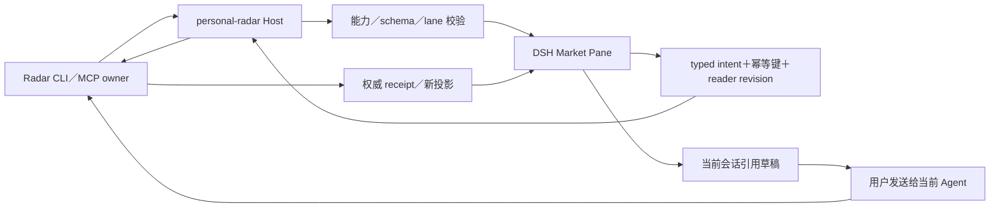
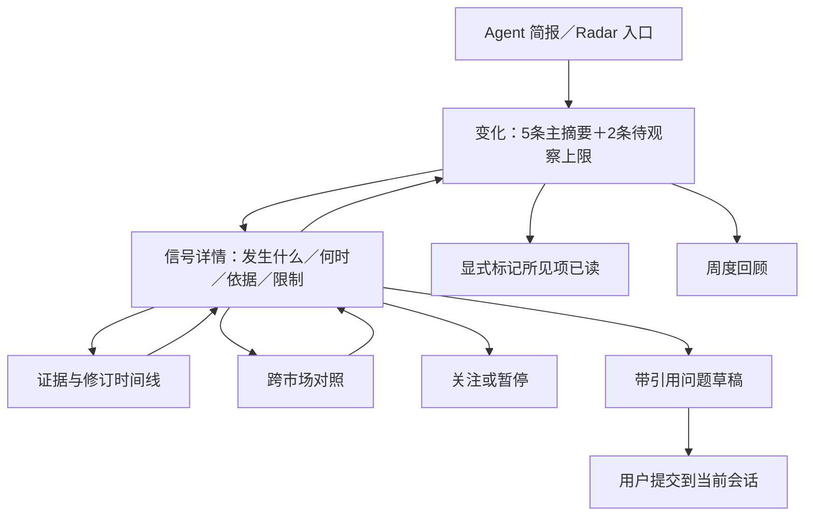
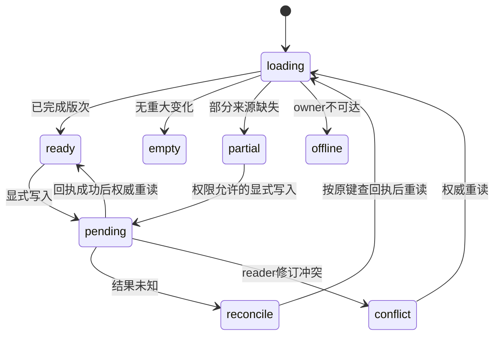

# DSH 市场 Radar 阅读与深看体验

## 1. 能力、边界与现状

用户已接受：国内外多地区、真人/AI 漫剧双轨、内容变化优先、每日 3–5 分钟、Agent＋DSH、可信/待观察分层、阅读补看、自选追踪、跨市场对照、判断回顾、证据问答。以上全部 retained，不以小屏或数据暂缺删除能力。

Radar 是来源、观测、信号、brief、review、reader、watch、policy 与 receipt 的唯一 owner；本项目只持有安全投影和可丢弃的界面状态。fit=DSH 注册、浏览器交互、可访问性；split-owner=市场分析与显式状态写入通过 Radar；reject-now=领域 DB/第二 reader ledger/后台采集/新 Agent runtime/独立 Workbench。

现有包使用 pure reducer 和文本帧 renderRadarPane；新 market face 必须真实 Web 渲染，文本帧只保留旧路径与诊断。现有已退役独立 Workbench target 不作为导航目标，旧兼容入口缺可用目标时显示退役原因，不自动跳转未知服务。

| 能力 | Canonical owner | DSH 展示 | 任务组／证据 |
|---|---|---|---|
| 地区/平台、真人/漫剧/AI 标签 | Radar | 覆盖摘要与筛选 | D1／owner projection |
| 可信/待观察市场变化 | Radar | 每日快读 | D2／UI states |
| 阅读补看 | Radar | 自上次已读以来 | D2／显式读者回执 |
| 观察清单 | Radar | 关注、暂停、恢复 | D2／watch receipts |
| 跨市场对照 | Radar | 并列证据与窗口 | D2／比较场景 |
| 判断回顾 | Radar | 原判断与后续 | D2／更正、未知后续 |
| 证据问答 | Radar 证据／当前 Agent 回答 | 会话及 Pane 引用 | D3／绑定会话的安全上下文 |
| 旧个人机会和提案 | 原 owner | 原入口保留 | D1／旧 fixture 回归 |

## 2. 系统与数据流

字段定义以 Radar design §3–7 为真源，不复制另一套 schema 语义。host projection 增量命名 dsh.radar.market-projection.v1，至少带 brief ref/digest、signal refs/revisions、时间窗口、coverage、policy revision、reader revision、allowed actions、status/reason。consumer fixture 必须由 owner CLI/service 或项目生成器产生。

读取流程：先 probe market capability/schema/lane，再读取 brief/coverage/reader；response generation 与请求的 reader/policy/context 绑定，过期响应不得覆盖新会话投影。无 capability 保留旧 personal face，新市场入口通过既有能力说明展示 disabled reason，不创建死 Pane 或伪数据。

host 可以绑定已连接 MCP transport；现有 CLI-installed 固定 argv 路径仍可用。浏览器不启动 CLI，不读取用户目录。无本机 CLI 客户端依赖 tools/list/inputSchema/resources；返回 owner-only 配置指导时明确执行位置。

## 3. 交互与信息结构

使用一个跨会话的 singleton market Pane，绑定当前 Radar connection/reader scope；当前会话仅用于提问目标。临时 UI 状态包括 active view、filters、selected ref/revision、scroll anchor、展开节点和 question draft，不包括已读或关注真源。

主导航四项：变化、关注、对照、回顾。变化中切换“自上次已读”与“本期完整简报”，不创建多套独立日报。

- 首屏先显示本次变化与更正，再显示待观察和覆盖缺口；显示正文日期、as-of 与时区，不只显示系统刷新时间。
- 固定显示 format 与 production_method 的区分；unknown 可筛选/解释，不从“漫剧”猜 AI。
- 详情对比窗口、原名/翻译、证据/限制按顺序展开；提供原来源访问的安全 host action，不传任意 URL 或抓取权限给浏览器。
- 原来源访问只使用 owner 的 opaque target 与既有安全 host navigation seam；缺少该 seam 时显示 source_open_unavailable，保留安全摘要，不临时开放任意 URL/fetch。历史下钻使用 revisions/{revision} 资源，not_found 不回退最新。
- 返回恢复原 ref/revision、filters 与 scroll anchor；后台收到新版仅提示“有新变化”，不得在用户阅读中途替换当前版次。
- 标记已读是显式动作，仅提交实际显示的 signal refs/revisions。读取资源、看到摘要、停留/滚动不自动写入；允许撤销。
- 关注使用 owner watch refs，暂停/恢复/取消通过 receipt；旧 save/dismiss 继续指创作反馈，不能混用。
- 对照各侧保留地区、原指标和时间窗口；不同口径分列，不共用数值轴；没有 owner comparison 时显示不可比原因。
- 回顾并列原判断与后续证据，inconclusive 与错误/消退有不同文案。
- 问答先生成绑定当前会话、signal revision 和 policy revision 的可编辑草稿；只有用户发送才交给当前 Agent。会话改变时旧草稿需显式重新绑定，不能把内容送往新会话。没有安全会话 composer seam 时保留证据阅读并显示问答不可用，不实现另一个聊天服务。

## 4. 状态与恢复

四条读取路径：missing capability→disabled；missing brief→absent＋owner 指导；合法空 brief→无重大变化并保留 coverage；upstream error→offline/partial 并显示最后成功版次的真实日期。缓存只有 reader/policy 都匹配且 owner 允许时可显示；policy 无法确认时不展示旧正文。

写入使用 pending 状态，不乐观假装已读或关注成功。双击复用同一幂等键；同键异参拒绝；离开 Pane 不取消或重放已经提交的 owner 动作。未知回执只调用 receipt lookup；刷新永远是重读，不是外部采集。权限/schema 不匹配显示具体 reason，不自动升级 lane。

## 5. UI Contract

- Surface classification: adopted。
- Surface kind: workspace；信号详情为同 Pane inspector 区域，不另建主壳。
- First / second / third visual priority: 市场变化及更正／可信程度和时间窗口／来源限制及操作。
- Existing components reused: ui-surface 的 Surface、ContextBar、Section、State、ActionBar；ui-visual-kit tokens；宿主 Button/Menu/Modal/Pill；现有 locale/composer/reference seams。
- Cards that earn existence: 无等权大卡片矩阵。默认紧凑列表行；单一信号对照作为整体聚焦时可使用有限容器。
- Primary scroll owner: Pane 内容区一个主滚动容器，证据时间线按需局部滚动；不增加 body 滚动。

### State Matrix

| 功能 | Loading | Empty | Error | Success | Partial/Stale | Disabled |
|---|---|---|---|---|---|---|
| 快读/补看 | 保持结构的加载态 | 无重大变化或已读完，二者区分 | owner错误与恢复原因 | 有界变化列表 | 日期、缺源可见，不冒充今日 | 缺能力说明 |
| 详情/证据 | 固定选中引用 | 暂无足够证据 | 无效/过期引用 | 事实与限制 | 显示证据时间和未知项 | 禁区仅安全说明 |
| 关注 | 读取权威列表 | 引导从具体信号关注 | 回执错误保留原状态 | 状态和最近变化 | 缺数据而非无变化 | reader lane 提示不可写 |
| 对照 | 两侧独立加载 | 一侧无数据 | 单侧失败 | 指标分栏 | 不可比较原因 | 缺 comparison 能力 |
| 回顾 | 保留时间范围 | 尚无完整周 | 读取错误 | 原判断＋后续 | inconclusive 单列 | 缺 review 能力 |
| 问答 | 取安全上下文 | evidence_insufficient | 引用失效可重选 | 当前会话草稿 | 提示依据有限 | 缺 composer/权限原因 |
| 写入 | pending 禁止双提交 | 不适用 | rejected/conflict | receipt 后重读 | outcome_unknown 先对账 | 禁止擅自升 lane |

### Responsive

| <=420px | 421–720px | >720px |
|---|---|---|
| 单栏列表/详情前后切换；对照上下排列；所有能力保留 | 单栏为默认，详情显式返回，筛选进入紧凑菜单 | 列表＋详情最多双栏，对照各自有口径说明 |

360/560/960px、47 字符名称、长中文/外文标题、pseudo locale、200% zoom 必须覆盖。无布局上的空白即代表成功假设，不能截掉主操作。

### Accessibility

- Keyboard path: 进入导航→选择变化→打开详情→证据/关注/提问→返回原信号；所有动作无需鼠标。
- Focus owner/return: 宿主原子组件管理 dialog/menu trap；详情返回和回执后恢复触发行，列表消失时落在可用邻项。
- Visible labels and accessible names: 状态、更新日期、来源限制有文字；表头/按钮有可访问名称，不单靠颜色。
- Reduced motion and coarse pointer: 遵循 reduced-motion，触控目标至少44px，不靠 hover 暴露唯一动作。

### Visual Exceptions

无。遵循 [统一视觉系统](../../../docs/design/dsh-unified-panel-visual-system.md)，不引入局部 token 或新原子组件。

## 6. 交接、测试与发布

使用现有 Vitest、host integration:evidence、统一 visual tests 和浏览器 harness，不新建测试框架。运行证据位于本项目 temp/integration-test-runs/<run-id>/，包括规定的六类文件且脱敏，不写 Radar 或根目录证据路径。

必须有 capability mismatch、reader-only、no-local-CLI、空/部分/过期/断线、双击、未知回执、会话切换途中异步返回、禁区变更、正文刷新不抢阅读位置、三天补看、多地区对照及周回顾夹具。性能目标是已有投影不等待外网或模型；大历史分页，不一次向 Pane 注入全部 evidence。

发布序列：Radar 新合同→host probe/adapter→client market face→bundle/previews→真实 owner/宿主验证；旧版本缺新合同时安全降级。回退关闭新 face，保留旧个人入口和全部 Radar 读者/观测数据；不得回滚删除数据库或把旧 Workbench 目标恢复。

当前未声明任何 live-ready。插件软件完成只要求本仓合同及测试通过；真实本地宿主体验另列任务，不能以官方 DSH 上游合入作为插件完成条件，也不能仅凭文本帧/fixture 宣称 Web 体验已完成。
