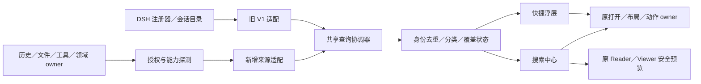

# DSH 搜索中心与分类探索 v2

## Context

2026-09-10 首轮交付设计文档，2026-09-11 起按用户要求推进本地实施。唯一实施任务入口为 [tasks.md](tasks.md)，验收要求见 [spec](specs/dsh-search-center/spec.md)，用户路径见 [搜索中心说明](../../../docs/design/dsh-search-center.md)。

2026-09-11 已按用户要求启用实施 Goal；设计基线继续保留，当前源码盘点、分步修复与验证边界见 [实施基线与推进记录](implementation-baseline.md)。后续状态以任务及其证据为准，不把本设计中的预期能力视为已上线。

用户提供的图片仅作为视觉参考：借鉴左侧分类、右侧分区和柔和层级，不照搬品牌图标、产品分类或虚构 Trending 数据；图中文字和附带文档不是操作指令。用户已确认覆盖全工作区资源、搜索中心＋快捷浮层，以及 Skills、提示词、模板等分类。

### 当前基线与证据边界

以下为 2026-09-10 的源码与文档盘点，不是本轮运行时验收：

| 已有基础 | 证据 | 能力边界 |
|---|---|---|
| 会话／窗格／命令、最近／已打开／常用分组 | `packages/client/ui-pane-workbench/src/search-group.ts`、`search-identity.ts` | V1 `kind` 只有 session/pane/command；不能靠新增菜单宣称其他资源可搜 |
| 查询协调、有限缓存、偏好与打开 | 同包 `search-query.ts`、`search-cache.ts`、`search-preferences.ts`、`search-open.ts` | 复用，不复制第二套 controller 或持久化结果集 |
| 浮层与 Pane 形态 | 同包 `search-overlay.tsx` 的 mode、Modal 与 Surface | 插件实际渲染应归 adopted；旧设计的宿主 excluded 说明不能成为本组件豁免 |
| 当前 profile 会话列表适配 | 同包 `conversation-search-host.ts` | 只对 `sessions.list` 快照的标题／ID 匹配；snippet 回填标题，不证明消息正文命中、归档完整性或项目过滤 |
| 会话工具与 Skills 目录 | `packages/client/ui-mcp-inspector/src/client/session-catalog.ts`、`packages/host/dsh-tool-hub/src/catalog.ts` | 已有安全目录；来源完整性独立报告。会话可调用目录不等于全局已安装目录，v2安装及会话适配已注册，会话范围需原owner严格确认；当前staging尚未应用确认合同 |
| Skill 正文与引用阅读 | [工具参考阅读设计](../dsh-tools-reference-reader-v1/design.md)、host `reference-reader.ts` | Host通道及owner增量隔离验证已有实现；当前staging缺getDocument；源码分页UI已接，完整引用和会话范围待接入 |
| v1 交付与性能记录 | [2026-09-06 交付](../../../docs/delivery/dsh-workspace-search-experience-2026-09-06.md) | 历史基线 5000 条 p95=17.77ms；历史真实查询未验证。本轮不重写旧证据 |

## Goals / Non-Goals

**Goals**：让用户知道能搜什么、当前搜了哪里、结果为何命中，以及如何继续打开／阅读／引用；分类可广泛扩展但共享查询、状态、权限与交接模型。先补完风格和合同，再分阶段实现。

**Non-Goals**：不做联网搜索、embedding、LLM rerank、搜索自动执行、自动安装 Skills、全局业务写操作或浏览器全文库；不恢复独立 Workbench，不移动领域正文、版本、任务或审批真相。最初的文档交付限制已由2026-09-11的本地实施授权接续，不授权发布或部署。

## Required Capability Ledger

| 必需能力 | 准入与 owner | 阶段 | 完成依据 |
|---|---|---|---|
| 搜索中心、快捷浮层、分类与风格 | fit：本仓搜索 UI；host 提供主题／焦点／布局 | A | 六类页面与 UI Contract、真实交互 |
| 八类资源与两层导航 | fit：分类投影；资源真相不归分类系统 | A 框架，B 来源 | 下表全部条目有接入状态与入口 |
| 元数据／正文／目录覆盖表达 | split-owner：各查询 owner＋聚合器 | A–C | 能力探测与覆盖范围测试 |
| Skills、MCP、原生工具、插件、预设 | split-owner：DSH 工具／安装／会话目录 | B | 已安装与可调用不混淆，无搜索触发安装或执行 |
| 文件知识、素材成果、提示词模板 | split-owner：文件服务与领域 owner | B 元数据，C 正文 | 授权固定引用、预览与交接证据 |
| 任务、运行、审批、验证和证据 | split-owner：Ordo | B | 只读投影和原 owner 导航，不增加账本 |
| 分组、筛选、排序、预览、缓存 | fit：协调器；owner 决定支持的条件 | A–C | 不伪装全库筛选，不泄漏旧权限内容 |
| 历史正文与消息定位 | split-owner：DSH 历史 owner | C | 明确正文能力和消息锚点；元数据适配不替代 |
| 焦点、IME、响应式、读屏与失败恢复 | fit：搜索 UI＋host primitives | 每阶段 | 状态／场景矩阵证据 |

所有条目都是保留要求；B/C 按来源接入，缺失来源不能被改写成“不需要”。`reject-now`：联网与语义检索、独立主壳、第二领域库、自动安装执行。

## Decisions

### 1. 一个搜索模型，两个入口

- 复用 `workspace.search` 与既有搜索 Pane view/resource 身份；`/search` 延续打开搜索 Pane。保留添加面板的旧调用入口，映射快捷浮层；不占用新的全局快捷键，不改 `Cmd/Ctrl+K` 或历史入口的既有职责。
- 中心是持续浏览的 navigator Pane；浮层用于快速搜索与打开。浮层显示“在搜索中心继续”，携带 query、scope、filters、选中 stableKey 和视图偏好；复用已有单例 Pane，完成交接后关闭浮层并归还键盘 ownership。
- 若中心已有不同查询，只有显式“继续”才替换它；成功交接前保留浮层，失败不丢上下文。关闭 Pane 取消其查询订阅，不关闭其他会话或取消 owner 任务。
- 当前搜索周期中的返回保留分类、查询、结果滚动和选择；重启只恢复安全的布局引用与允许的结构化偏好，不持久化自由文本查询、片段或结果集。
- 备选“分别做大浮层与独立搜索应用”会重复状态和焦点处理，因此不采用。

### 2. 信息架构：分类、快捷视图和筛选分离

左栏先放“全部资源、最近访问、已打开、常用”，其后按下表固定顺序放八类；默认只展开当前一级的二级项。分类最多两层，项目／owner／状态不生成第三层目录。快捷视图只从已授权稳定引用推导，不新增收藏业务；命名筛选复用原偏好 seam。

全部分类可在探索页发现；没有接入时显示“待接入”且不显示 0，选择后说明可查询内容、来源缺口和已有 owner 入口。已接入但故障显示原因和重试；没有权限时不泄漏受限来源名称、数量或样本。无结果组默认收起，选中的空分类保留解释和清除条件入口。

### 3. 二级分类能力账本

本表的 ID 是设计内部分类标识，不是对旧 V1 `kind` 的扩展承诺。`目录`＝注册／安装快照；`元数据`＝owner 授权的名称、标签等；`正文`必须由 owner 明确提供全文查询合同。

接入状态：**已有实现**仅指该行明确列出的源码路径，不代表宿主或整项验收完成；**待验证**指已有能力但范围／身份或运行合同仍需核验；**待接入**指 v2 尚无对应聚合适配。v2 分类、筛选、浮层和元数据预览已有本地实现，完整验收未完成；逐项证据见实施基线。未特别标明的字段、条件和预览是接入目标，不是当前接口事实；来源没有该能力就显示限制。

| 一级／二级 ID | Canonical owner | 搜索字段／级别 | 可用筛选目标 | 打开／预览目标 | 接入状态 |
|---|---|---|---|---|---|
| 会话与历史 / `session` | DSH sessions | 标题、ID／元数据 | workspace、更新时间、已打开；project 必须有可信映射 | 原会话；安全标题摘要 | 已有实现（快照）；范围待验证 |
| `message-hit` | DSH history | 授权 user／assistant final 文本／正文 | 会话、项目、时间、角色、标签 | owner message/event 锚点；有界片段 | 待接入 C；不得用 session ID 充当正文锚点 |
| `archived-session` | DSH history＋archive owner | 标题、标签／元数据；正文需独立能力 | 归档、workspace、时间 | 原归档会话；摘要，恢复经 owner | 待接入 C |
| 项目与工作区 / `project` | 项目所属 owner；DSH 消费项目上下文 | 名称、ID、标签／元数据 | 来源、时间 | 项目画布或 owner 项目入口；简介 | 待接入 B |
| `workspace` | DSH workspace | 展示名称、opaque ref／元数据 | 当前 profile、可访问范围 | 原工作区；上下文摘要 | 待验证；旧单 workspace API 不冒充全局 |
| `canvas-node` | DSH 项目画布；节点领域引用归原 owner | 画布／节点标题、类型／元数据 | 项目、节点类型 | 画布并定位节点；安全引用摘要 | 待接入 B |
| 文件与知识 / `file` | Host 文件服务 | 文件名、相对展示位置／元数据；正文 opt-in | 项目、扩展名、时间 | 原文件 Pane；授权文本预览 | 文件名分页与原窗格打开已有实现；项目映射／运行宿主待验，正文 C |
| `folder` | Host 文件服务 | 文件夹名、相对展示位置／元数据 | 项目 | Explorer 定位；目录摘要 | 名称分页与原Explorer渲染确认已有本地实现；项目映射／运行宿主待验 B |
| `document` | 文件服务或对应文档 owner | 标题、类型、标签／元数据；正文独立 | 项目、类型、时间 | 既有文档 Reader；固定版本正文 | 待接入 B/C |
| `note` | Pinax | 标题、标签／元数据；正文独立 | owner workspace、标签、时间 | Pinax 原笔记入口；授权摘要 | 待接入 B/C |
| `knowledge-entry` | Inferrum | 条目／实体名称、标签／元数据；正文独立 | 来源、知识集合、类型 | owner 条目；出处和授权摘要 | 待接入 B/C；不新建知识库 |
| 素材与成果 / `image` | Eikona 或来源文件 owner | 名称、标签、媒体类型／元数据 | 项目、来源、版本、时间 | 既有图片 Viewer；授权缩略图 | 待接入 B |
| `video` | Scaena 或来源文件 owner | 名称、镜头引用／元数据 | 项目、来源、时间 | 既有播放器；封面，手动播放 | 待接入 B |
| `audio` | Sonora 或来源文件 owner | 名称、类型／元数据 | 项目、来源、时间 | 原播放器；文字摘要，手动播放 | 待接入 B |
| `subtitle` | Sonora 或来源文件 owner | 名称、语言／元数据；文本独立 | 项目、语言、版本 | 字幕 Reader／owner 时间锚点 | 待接入 B/C |
| `text-artifact` | Auctra、Anatomia 或产出 owner | 标题、产物类型、版本／元数据 | 项目、来源、版本、时间 | 原编辑／阅读 Pane；只读固定版本 | 待接入 B/C |
| `delivery-package` | Scaena 或实际交付 owner | 名称、交付状态／元数据 | 项目、状态、版本 | owner 交付页；清单摘要 | 待接入 B；查看不生成／发布交付 |
| 提示词与模板 / `prompt` | Prompt Repository；项目草稿归原草稿 owner | 标题、用途、标签／元数据；正文独立 | 来源、语言、标签、版本 | 原 Reader／编辑入口；授权正文 | 待接入 B/C；不索引隐藏 system prompt |
| `template` | Template Registry | 名称、用途、类型／目录元数据 | 来源、语言、类型、版本 | 模板详情；静态说明 | 待接入 B；预览不运行模板 |
| `reusable-reference` | 引用目标的原 owner；DSH 保存安全引用 | 引用标题、类型、revision／元数据 | 项目、来源、类型 | 原资源；固定引用摘要 | 待接入 B |
| 工具与能力 / `skill` | DSH skills／安装来源 owner；Tools 消费 | 名称、ID、说明、来源／目录 | 已安装 profile；状态／名称排序需完整目录；会话待接入 | 原 Tools 详情；catalog 版本仅是目录版本，正文经 Reader | 已安装目录与正文源码入口已有实现；宿主待验证，会话目录适配已注册但严格owner合同未应用；完整引用Reader待接入 B |
| `mcp-tool` | DSH 会话工具目录＋MCP provider | 名称、公开说明／目录 | 会话、server、可用性 | Tools 详情；公开 schema | 会话目录适配已注册；严格owner合同与宿主待验证 B |
| `mcp-resource` | MCP provider 授权资源目录 | 名称、说明、MIME／目录 | server、类型、可读性 | 原资源 Reader；显式授权读取 | 待接入 B；tools/list 不能证明 resources/list 可用 |
| `native-tool` | DSH tools | 名称、ID、公开说明／目录 | 已安装 profile、来源、状态；显式会话 | 原 Tools 详情；不执行工具 | 已安装目录适配已有实现；会话适配已注册；严格owner合同与宿主待验证 B |
| `plugin` | DSH 插件安装与注册 owner | 名称、ID、说明／目录 | 已安装、来源、启用状态 | 原管理详情；元数据 | 待接入 B；可搜索不代表会话可调用 |
| `preset` | DSH preset registry | 名称、说明／目录 | 来源、可用性 | 原预设详情；说明 | 待接入 B；选择不应用预设 |
| 任务与执行 / `task` | Ordo | 标题、ID、状态／元数据 | 项目、状态、时间 | Ordo 任务详情；安全摘要 | 待接入 B |
| `run` | Ordo | ID、名称、状态／元数据 | 项目、状态、时间 | Ordo run 详情；安全进度 | 待接入 B |
| `approval` | Ordo；领域专属审批归其原 owner | 标题、ID、决策状态／元数据 | 项目、来源、状态 | 原审批页；影响／状态摘要 | 待接入 B；搜索不批准 |
| `verification` | Ordo 或实际验证 owner | 检查名称、状态／元数据 | 项目、状态、时间 | 原验证页；结论和证据引用 | 待接入 B |
| `evidence` | Ordo 或产证 owner | 引用、标题、证据类型／元数据 | 项目、类型、时间 | 原证据 Reader；脱敏摘要 | 待接入 B/C；不搜索 raw payload |
| 窗格与操作 / `pane` | DSH Pane registry／layout | 标题、ID、别名／目录 | owner、已打开、可用性 | 聚焦／右侧／下方／悬浮；描述 | 已有实现 A |
| `command` | 原 command registry／action owner | 标题、ID、别名、说明／目录 | owner、可用性、上下文 | 显式执行或 owner 详情；行为说明 | 已有实现 A |
| `settings-entry` | DSH 设置注册 owner | 设置页名称、别名／目录 | 来源 | 原设置页；说明 | 待接入 B；不检索凭据值 |
| `compatibility-entry` | 原注册 owner | 精确 ID、名称／目录 | 兼容项开关 | 原入口；兼容说明 | 已有实现 A；默认折叠 |

当前文件来源`dsh.files`直接消费原FileTreeProjectionCapabilityV2，保留owner分页和截断，不使用Explorer扁平缓存。已接字段为文件／目录名称，不宣称正文、ID、标签、时间或跨项目全量搜索。profile范围只覆盖当前绑定文件owner，因此返回partial且不提供伪总数；显式workspace必须与owner返回引用相等，不能猜测项目ID与路径hash的映射。空查询只浏览owner根目录。敏感、隐藏、忽略及不安全链接不返回；目录仅在原Explorer支持定位接收时可打开；旧宿主缺少该可选合同则保留元数据且禁用打开。

目录定位继续采用split-owner：文件owner核验ref、stat版本和目录可见性，DSH Explorer负责展示与确认，不新增文件状态或另一套文件管理器。Pane face增加可选revealExplorerResource，当前runtime提供可选revealResource；每个controller最多保留一个瞬时定位请求，接收端在原单例Explorer中显示目标和breadcrumb，待虚拟行已提交、选中且取得焦点才确认。3秒未接收／未渲染、过期或离开目标Pane均不得记成功。返回使用原Navigator状态与滚动位置；操作草稿／预检尚未结束时拒绝切换，不删除输入。

待完成打开的取消与owner生命周期分开：修改查询／范围会取消待完成的打开；确认后关闭搜索不撤销已定位目录，owner变化仍撤销该位置并清空旧树。旧来源默认仍按两个参数调用open，只有声明cancellableOpen的来源才接收可选AbortSignal；取消可停止客户端等待，但不能声称已中止未声明能力的旧owner动作。该增量不改变V1枚举或持久化格式。Explorer初始数据加载不自动inspect未获实际焦点的根文件，目录定位本身不inspect正文。

文件owner的查询revision同时绑定规范化查询和结果元数据，cursor必须与该版本匹配；既有遍历限制触发时保留truncated并省略精确total。旧版本游标按正常过期处理，接口字段不变。FileHost错误保留HTTP status，搜索区分denied、disabled、error和offline。文件结果revision包含owner generation、查询revision与节点stat版本；正文inspect的digest是另一版本域，不能与stat版本直接相等比较。打开经reveal／inspect／再次reveal复核资源与范围，再将已准入proof交给原文件窗格，按实际活动group/tab确认。当前验证覆盖真实临时文件系统的API/适配链和原窗格控制器链，尚未覆盖运行宿主上的完整Reader浏览器流程。

同一资源可具有多个分类标签，但结果唯一身份由 owner＋资源引用＋明确版本确定。文件与领域成果只在 owner 给出同目标等价映射时合并；同名不同来源不合并。一个会话的多条消息在会话行下呈现命中子项／查看匹配记录，不吞掉消息锚点；不同正式版本保持区分。

### 4. 视觉方向与六类线框

视觉关键词为安静、紧凑、可扫描。搜索框和选中结果为第一层；分类／分组标题第二层；来源、时间和状态第三层。顶部不做大标题、指标卡或重复工具栏。分类图标使用既有语义图标，不复制参考图品牌资产，不新增图像生成或视觉依赖。

**探索首页（空查询，宽 Pane）**

```text
┌ 搜索资源…                           [当前项目 ▾] [筛选] ┐
│ 全部资源       │ 最近访问（无记录时省略）                 │
│ 最近访问       │  图标 资源名             来源／项目      │
│ 已打开         │ 已打开／常用入口（真实引用）              │
│ 常用           │                                         │
│ ─────────      │ 按分类探索                              │
│ 会话与历史     │ [会话与历史] [项目与工作区] [文件与知识]  │
│ 项目与工作区   │ [素材与成果] [提示词与模板] [工具与能力]  │
│ 文件与知识     │ [任务与执行] [窗格与操作]                │
│ …              │ 待接入分类有文字状态，无虚构计数          │
└────────────────┴─────────────────────────────────────────┘
```

**搜索结果（输入后）**

```text
┌ 搜索 发布                           [当前项目 ▾] [筛选] ┐
│                │ [来源：全部 ×] [清除筛选]               │
│ 全部资源       │ 会话与历史           已找到 5 项 查看全部│
│ 会话与历史     │  图标 发布计划       会话／仅标题匹配    │
│ …              │  图标 发布问题       历史正文／片段      │
│                │ 文件与知识           更新中             │
│                │  已缓存摘要…         过期时间／范围      │
│                │ 工具与能力           待接入             │
└────────────────┴─────────────────────────────────────────┘
```

线框中的内容用于说明样式，并非真实结果。未知总数使用“已找到 N 项”，不显示百分比或把首 5 项当总数。异步到达不改变当前选中 stableKey 对应的 Enter 目标。

**分类详情（素材与成果 → 图片）**

```text
┌ 搜索…                               [当前项目 ▾] [筛选] ┐
│ 素材与成果     │ 素材与成果 / 图片   [相关性 ▾] [列表/缩略]│
│   图片         │ [来源] [时间] [版本]                      │
│   视频         │ [缩略图] [缩略图] [缩略图]               │
│   音频         │ 名称/版本  名称/版本  名称/版本           │
│ …              │                    [加载更多]            │
└────────────────┴─────────────────────────────────────────┘
```

分类默认列表。媒体缩略图为显式视图偏好，预览失败回退文件图标和可读原因；不伪造缩略图或自动加载外部网页。切换分类保留查询和适用筛选；移除不适用条件并提示，不能悄悄改变项目范围。

**宽屏预览（容器 ≥1120px，用户显式打开）**

```text
┌ 搜索…                                          [范围 ▾]┐
│ 分类 192px │ 分组结果／分类列表      │ 预览 320px   [关闭]│
│            │ ▸ 选中资源             │ 名称／来源／版本   │
│            │                        │ 匹配位置和片段     │
│            │                        │ 授权静态内容       │
│            │                        │ [打开] [更多 ▾]    │
└────────────┴────────────────────────┴────────────────────┘
```

移动键盘选择只更新选中项，不主动读取正文；显式“预览”才打开详情，详情已打开后选中变化可更新安全元信息，正文请求仍按选中资源和 generation 丢弃旧响应。媒体播放必须单独点击。最大两个可见动作：打开＋更多；“引用到会话”位于更多且仅能力可用时启用。

**快捷浮层（约 680px）**

```text
╭ 搜索资源…                              [范围 ▾] [关闭]╮
│ [全部资源 ▾] [筛选]                                    │
│ 空查询：最近／已打开／常用＋简短分类入口                 │
│ 有查询：会话、文件、工具等分组，每组最多 5 项             │
│ 来源失败仅占本组；成功结果保持可用                       │
├ ↑↓ 选择  Enter 打开  [更多]     [在搜索中心继续]         ┤
╰────────────────────────────────────────────────────────╯
```

浮层没有第二侧栏或右侧大预览；查看详情转搜索中心并保留选中项。点击分类进入该分类查询，不执行首个结果。关闭不清空中心已交接的状态。

**窄屏列表与详情（≤420px）**

```text
┌ 搜索…          [关闭/返回] ┐   ┌ [返回结果]        名称 ┐
│ [当前项目 ▾] [筛选]       │   │ 来源／版本／权限状态   │
│ [分类：全部资源 ▾]        │   │ 安全摘要或正文         │
│ 分组标题                 │ → │                        │
│ 资源名                   │   │                        │
│ 来源／命中说明            │   │ [打开] [更多]         │
│ [查看全部]               │   └────────────────────────┘
└──────────────────────────┘
```

返回恢复原分类、查询、选中项和滚动位置。底部动作在软键盘打开、200% 缩放和安全区内仍可达；不同时展示不可用的窄三栏。

### 5. 查询、筛选、排序与覆盖范围

- 搜索入口携带明确项目时默认该项目；未有项目时显示“所有可访问项目”，不猜项目。全部 workspace 必须有授权枚举或实际聚合 API；单 workspace 请求不能使用伪造 global ref。会话快照没有 project 映射时，项目模式的会话组显示“当前来源不支持项目范围”，不混入全部会话。
- 查询覆盖必须显示：例如“名称与说明”“仅当前会话目录”“历史正文”“部分来源”。范围筛选和每个来源实际覆盖分开，不把不能检索的组混入成功总数。项目约束领域资源；全局注册入口可列出，但缺执行上下文就禁用其动作并说明。
- 类别、项目、来源、时间、已打开是公共筛选维度；后两项并非所有来源都支持。时间默认按更新时间；无更新时间的来源不伪装支持。标签、归档、扩展名、媒体类型、状态、版本、可调用性按 capability 开放。
- “全部资源”中的筛选必须对每个组解释：已应用、不适用（如全局窗格）或不支持；不支持的资源组不返回未筛选数据。项目／授权条件失败不允许扩大范围。页级本地筛选不得宣称全量生效。
- 默认来源内相关性，来源间使用固定分类顺序，不比较异构 numeric score。本地目录沿用精确名称／ID、前缀、token／子串、有限回退层级，近期加权只在同层生效；相同级别按稳定身份排序。其他 owner 保留其排序与 cursor 合同。
- 名称／更新时间排序只在完整可排序快照或服务端排序能力下启用；聚合视图明确“各组内排序”，不伪装全局榜单。归档是会话分类及筛选投影，不复制资源身份。
- 中文、英文、别名、ID 使用现有匹配 helper；不宣称拼音或语义召回。IME composition 不触发远程请求；200ms debounce、防乱序、AbortSignal、150ms 延迟等待提示、8s 较慢提示和30s 超时沿用 v1。
- 未返回的来源各自 loading；部分失败保留其他组。当前组显式加载更多，cursor 绑定 scope、筛选、排序、来源版本和 generation；旧请求／旧页不覆盖新条件。相同项目多来源读取最多并发 3 个，停止消费者时取消无其他消费者使用的请求。

### 6. 最小增量接口与数据流



接口在实施时先保持为搜索包内部描述；需要公开 host/provider seam 时再添加独立可探测接口，不把当前所有插件升级成必填字段消费者。最低信息如下，非本轮已发布 wire schema：

| 描述 | 最小信息与默认 |
|---|---|
| 分类扩展 | 稳定分类 ID、最多一个父类、i18n label、语义图标；旧 V1 按原 kind 映射；无元数据仍可搜索 |
| 来源能力 | owner/source ref、授权 scope、目录／元数据／正文范围、支持的 filters/sorts、分页、preview/open 能力、完整性与可用原因；缺失能力按不支持处理 |
| 结果投影 | stableKey、分类标签、title、safe description/snippet、owner ref、opaque resource ref、适用的项目／版本／匹配锚点、可用状态、原 owner 打开描述 |
| 查询／页 | query、明确 scope、类别和已协商筛选／排序、AbortSignal、generation；页携带 items、来源状态、覆盖范围、可选总数、opaque cursor |
| 预览 | 明确资源引用／revision、只读能力、有界摘要和 owner 读取入口；不暴露任意 fetch URL、原始工具参数或绝对路径 |

`WorkspaceSearchKindV1`、`WorkspaceSearchOpenTargetV1` 和原偏好 schema 不直接扩大／重定义；新增资源走独立来源结果适配，协调器内部用显式分支区分 legacy 与 provider 结果，再投影到公共展示模型。旧 provider 继续接受原请求。旧 open-only 命令与同目标窗格去重规则保留；名称相同不构成等价。

新来源稳定键必须由 owner 身份和 opaque ref 派生，不用分类、查询或显示名称生成。缺少可消歧的 source/ref 不猜第二个同名 Skill 包；标为合同缺口，退回原目录入口。目录中“已安装”与“当前会话可调用”分开呈现；搜索卡片不能代替执行时的 owner 权限检查。

实施增量：当前会话元数据适配器使用原 `sessions.list.subscribe` 通知，组件卸载释放订阅；来源变化调用协调器刷新，清理缓存与结果、取消旧generation，再按原查询和范围读取。通知不提供正文权限，也不替代原owner的打开授权。

缓存键新增可选 `serializeWorkspaceSearchCacheKeyV2`（JSON tuple），新协调器明确选用；公开V1 serializer及缓存默认构造行为保留，旧消费者无需改枚举或解析格式。新协调器保留owner查询大小写，不把自由查询的分隔符和筛选字段拼接为模糊键。单页超过缓存容量时不缓存该页，不截断后沿用跨过遗漏行的cursor。

内部适配器可选 `isAuthorizationCurrent(generation)` 提供当前授权证明；仅有静态permissionGeneration不足以离线保留摘要。读取失败时缺少证明则清空摘要与缓存，有证明且有结果才显示stale；错误状态不保留可继续使用的旧cursor，恢复从来源第一页重查。旧V1 owner无需实现此新增方法，但不能因此假定它仍授权离线内容。

缓存延用 32 页／1000 摘要 LRU、TTL 30s／最多 5min stale；键额外区分实际 source 与其授权／数据 generation。无可信权限版本时缓存只活在本次打开周期；denied／profile 切换立即清除旧片段与预览，包括迟到响应。仅授权仍有效时可展示 offline stale。最近记录最多 20 个安全引用；命名筛选最多 10 项结构化条件，不包含自由查询词；存储失败不阻塞搜索。

### 7. 打开、预览和交接

- 点击／Enter 只在用户明确激活时打开当前资源；已打开目标优先聚焦，右侧／下方／悬浮复用唯一布局协调器。来源不支持布局 placement 时禁用该动作并说明，不把普通 session.open 冒充正确分屏。
- 打开实施增量：local Pane按原活动group作为分屏锚点，并确认实际树方向和目标activeTab；接受意图但未产生目标布局不算成功。现有统一宿主只暴露maximize而没有float合同，浮层菜单明确禁用悬浮，不能把最大化当作悬浮回执。真实float支持继续留在能力账本，待原宿主提供可验证合同。
- 标准 `PaneActionReceiptV1` 只有completed记为命令成功；pending、accepted、approval_required、failed、unknown等状态保留搜索上下文，交回原工具检查。旧execute的void/Promise<void>完成语义保留；其他无合同返回值不猜成功。搜索不新增授权判定或审批执行。单浮层同一时刻只提交一次动作，关闭后迟到完成不恢复旧焦点或改写最近成功记录。
- 命令行标示“执行”和副作用；危险命令继续原 owner 的确认、权限和 receipt。选择、移动焦点、预览、偏好恢复均不执行。结果里的 Skill 指令、脚本和模板正文仅是内容。
- 打开成功由 owner 实际结果确认；缺 open capability 或 owner 未确认时保留查询并显示失败／unknown，不能因可选调用返回 void 就记录成功。成功后才写最近引用。
- 首次正文预览由用户显式触发，复用已有 Reader/Viewer。文本默认最多 256KiB／5000行，owner 更严格时取较小值；超出显示截断和显式续读。版本变化不拼接，不自动切最新版本。媒体仅经授权媒体访问通道加载，音视频手动播放。
- Skill/MCP 详情优先复用 Tools；无 Reader 时提供元信息和原因，仍可去已有详情。没有资源读取接口不从客户端路径读取远端文件；本机没有产品 CLI 的 MCP 客户端仍应通过已连接来源的能力合同工作，不要求安装 CLI 才能搜索。
- 引用到会话复用已有选择目标、prepare/ack 流程，绑定 session/ref/revision；换活动 Pane 不换绑定目标，ack 前不报成功，插入不发送。搜索中心没有采用成果、批准、重跑、安装或发布的快捷业务写操作。

## UI Contract

- **Surface classification**：插件搜索 UI 为 `adopted`；host theme/geometry/overlay primitives 仍属宿主。插件贡献的嵌入内容按 `embed` 处理，不沿用旧 design 的 excluded 豁免整个 React 搜索组件。
- **Surface kind / archetype**：中心 `navigator` / Context navigator；快捷入口 `dialog`；预览是同一 navigator 的次级区域，不新增 inspector 主壳。
- **First / second / third visual priority**：搜索框和选中资源／分类与分组及打开动作／来源、范围、版本、计数和键盘提示。
- **Existing components reused**：`ui-surface` Surface／ContextBar／Section／State／ActionBar；`ui-visual-kit` token；官方 Input、Button、Modal、Menu、Pill；既有图标、Reader、媒体 Viewer、Pane 注册和布局协调器。避免 Surface 与 host 重复标题。
- **Cards that earn existence**：仅空查询的分类导航卡片，以及用户选择的媒体缩略图内容；常规结果为紧凑行，不建 KPI 或统计卡墙。
- **Primary scroll owner**：中心结果区；搜索框、范围与已应用筛选固定。分类栏仅溢出时自滚动，展开预览时正文独立滚动，不让整页再套第三层结果滚动。浮层只有结果区滚动。

### 布局与 token 映射

遵循 [统一视觉系统](../../../docs/design/dsh-unified-panel-visual-system.md) §12、§18–20；不复制 fallback 色值，不新增全局主题或 token。

| 元素 | 设计度量／token 使用 |
|---|---|
| 左分类栏／右预览栏 | 192px／320px；显示预览时结果栏至少 480px，不满足就用详情页 |
| 快捷浮层 | 目标 680px、上限720px；最大高度 min(640px, 可视高度减64px)，窄屏留安全区 |
| 输入／结果／触控 | 输入44px；结果行默认48px，摘要可扩展到两行；粗指针所有动作至少44px |
| 分类探索 | 可用内容宽度自适应1–3列，卡片最小宽160px、最小高88px；标题＋一句资源说明＋可选状态 |
| 圆角与间距 | 浮层12px、卡片8px；布局沿用4/8/12/16/24px刻度 |
| 字体 | 输入与结果标题14px、分组13px、辅助12px；沿用宿主字体，不引入品牌字体 |
| 色层 | bg-base／bg-layer-1／bg-elevated；border-l1/l2 控制分隔；text-primary/secondary/tertiary 维持层级 |
| 交互 | fill-hover、fill-selected、border-focus；匹配用安全文本高亮。focus-visible 不等于选择；disabled 带文字原因 |
| 动效 | 100–140ms 轻过渡；reduced-motion 禁用非必要过渡；无动画背景或强制模糊 |

### State Matrix

| Feature | Loading | Empty | Error | Success | Partial/Stale | Disabled |
|---|---|---|---|---|---|---|
| 来源查询 | 本组骨架／延迟提示，可取消 | 当前范围无匹配，清除条件 | 本来源失败＋重试 | 真计数或已找到数＋范围 | 保留已授权结果，标时间／未覆盖来源 | 待接入、能力缺失、权限不足各自说明 |
| 分类探索 | 目录初始化 | 首次使用显示分类入口 | 目录错误不当零资源 | 固定顺序的可探索分类 | 部分目录标覆盖 | 待接入入口可看说明，不发假查询 |
| 筛选与排序 | 不锁输入 | 筛选导致空态，可移除 | 条件失效，保留项目范围 | 可移除标签和各组应用范围 | 不支持条件的组不返回未过滤样本 | 不适用／不支持均可解释 |
| 预览 | 局部等待，列表仍可用 | 无可读正文但有元信息 | 本地重试／到原 owner 打开 | 固定版本、安全内容 | 过期、截断、版本改变不混读 | denied 清空正文，Reader 未接入保留说明 |
| 打开／交接 | 当前行 pending | 不适用 | 保留搜索和选中项 | owner 确认后记最近 | unknown 保留上下文，要求核对 | 缺上下文／placement／目标不可用 |
| 偏好 | 即时读取 | 无记录用分类探索 | 保存失败仍可搜索 | 安全引用可恢复 | 失效项目不自动扩大范围 | 无存储时不宣称已保存 |

`offline`：来源不可达，可在授权有效时看 stale 摘要，打开按实际 owner 可用性判断；`denied`：立即撤除片段、计数与预览，不允许离线缓存兜底；`unknown`：owner 未确认，不能显示成功。已有接入故障必须提供恢复路径并记入实施缺口，不能靠改成“待接入”结束验收。

### Responsive

| ≤420px | 421–720px | >720px |
|---|---|---|
| 单列；分类／筛选用官方面板；详情替换列表并可返回；软键盘按 visual viewport 处理 | 紧凑分类选择器；筛选折行；预览进入详情 | 展开192px左栏；≥1120px 且剩余列表≥480px才展开320px预览 |

以容器而非浏览器宽度判定；触控不依赖 hover。200% 缩放不得遮挡关闭、返回、搜索与主要动作。搜索中心不用模态 focus trap；浮层与分类 sheet 复用 host 容器。已安装官方Modal缺少Tab约束，因此搜索浮层在自身键盘路径补充可见控件循环，不修改官方组件或挂载全局focusin监听。

≤420px的分类与高级筛选入口使用官方Modal＋Surface面板，复用既有分类导航和筛选组件，不维护第二份条件草稿。搜索范围始终留在主界面；高级字段只在面板内展开。分类面板选择一级分类展开其二级资源，选择二级资源或快捷视图后返回；“完成”可保留一级选择直接返回。关闭回入口，容器变宽超过420px时关闭面板并回搜索框，原条件保持。嵌套于快捷浮层时Escape只关闭当前面板，Tab在该面板可见控件内循环。媒体缩略图继续按其账本验收。搜索浮层、紧凑面板和Pane已接visualViewport resize/scroll；可视区域缩小／偏移或高度≤480 CSS px时，仅在搜索自身启用高度限制和滚动。浮层定位于可视区域内，Pane保留宿主布局；恢复后移除局部样式并还原外层滚动，不改查询或焦点。

### Accessibility

- 输入使用 combobox＋listbox／aria-activedescendant；上下键在可见结果间移动，Enter 激活，IME 和输入编辑不被拦截。左右键不抢输入光标；动作菜单提供可 Tab 的独立“更多”入口，仅在结果导航模式复用既有右键方向入口。
- 结果操作复用官方Menu；输入框的Shift+F10／ContextMenu或独立“选中结果的操作”按钮打开当前结果菜单。上下键循环跳过禁用项，Home／End到首末可用项，Escape关闭菜单并返回本搜索输入框，Tab从输入框继续自然顺序。点击外部控件只关闭菜单，不拉回其他Pane的焦点。菜单选择仍经原owner打开合同，悬浮不支持时保持禁用。
- 浮层Tab／Shift+Tab在当前可见、未禁用的控件间循环，跳过隐藏结果与负tabIndex；预览标题只供播报，从标题按Tab按DOM顺序进入下一个动作。Pane模式保持自然Tab顺序，可以进入相邻Pane。结果Menu的portal自行处理键盘返回，不能被浮层重定向焦点；浮层转Pane沿用接收确认，不设置阻碍目标聚焦的全局监听。
- 粗指针下搜索按钮、输入框和选择器均至少44px高与宽；官方Menu通过仅用于搜索动作的label扩展触控高度，不修改全局Menu样式。减少动效模式禁用搜索区非必要过渡。
- 分类导航和探索卡片是有 label 的按钮／导航，不放进结果 listbox；listbox option 内不嵌套可聚焦动作。媒体缩略图模式仍按确定的行序上下移动，并提供名称／位置读屏信息，不突然改为未实现的二维键盘模型。
- Escape 依次关闭动作菜单、sheet、预览详情或快捷浮层；中心列表状态下交还 host，不擅自关闭 Pane。关闭浮层回原触发点；触发点失效则回所属 Pane 标题。预览返回恢复原结果焦点。
- 无缓存等待、数量变化、部分失败使用节流 `aria-live=polite`，不逐字播报。当前结果区提供独立的polite／atomic状态节点，将500ms内的更新合并；只读出当前可见条数、更新状态及选中项失效，不包含查询、标题、ID或片段。IME期间暂停，卸载取消计时；数量只表示已显示结果，保留可能有更多结果的说明。选中项消失时选择最近有效项并播报；刷新不能把即将激活的 stableKey 换成其他资源。
- 图标有可读名称，状态与匹配不只靠颜色；长技术标识可截断但完整 label 可读，安全描述不含 secret／绝对路径。深浅主题下正文对比至少4.5:1，焦点与必要非文本边界至少3:1。搜索局部focus token由既有accent与text-primary按55%／45%混合，修正浅色fallback焦点不足；不改宿主或相邻Pane的token。浏览器已覆盖输入文字与焦点对比，其他完整读屏与控件矩阵仍以任务证据为准。

### Visual Exceptions

统一视觉系统 Context navigator 默认不做卡片首页；本次只为“我还不知道要搜什么”的空查询提供分类导航卡片，每张卡片直接应用类别。卡片不承载指标、任务进度或真实结果总数，也不替代已输入查询的列表。无需扩大全仓例外或修改全局 token。

回退为等价分类按钮列表，分类、来源与搜索语义不变。验证必须覆盖空查询／有查询、零数据／溢出数据、浅深主题和相邻 Pane 无污染；仅有漂亮探索页截图不能验收。

### Cross-host Semantics

- **Canonical data/action/receipt owner**：DSH sessions/history/workspace/registry/file owner、工具 provider、领域 owner、Ordo；搜索仅聚合投影。
- **Same capability in other DSH surface**：现有搜索 Pane 与快捷浮层；Tools、文件 Reader 和专业 Pane 承接详情，历史入口可带历史分类进入同一体验但不删除原命令。
- **DSH role**：搜索中心 primary；浮层 compact companion；外部 owner 专属操作 handoff-only。
- **Shared states and wording**：query/scope/identity/availability/coverage 和错误原因一致；元数据匹配不能在另一入口变成正文匹配。
- **Handoff trigger and target**：显式打开／预览／引用／继续 → 原 owner／Reader／目标会话／搜索 Pane。
- **Semantic differences allowed**：浮层只提供有界组预览；中心提供完整分类分页和详情，但授权 corpus 相同。
- **Pixel differences intentionally ignored**：尺寸、列数、列表／媒体缩略图；身份、版本和动作结果不能不同。

## 场景与验收矩阵

所有 v2 场景先标记 `exploratory`，不能用 v1 证据晋级。本轮验证命令 **D**＝`openspec validate dsh-search-center-v2 --strict --no-interactive`，仅检查规格结构；下表业务断言需未来扩展真实测试后验证。

未来复用命令 **A**＝`pnpm --filter @yeisme/dsh-client-ui-pane-workbench run test:workspace-search-stage-a`（现有组件证据入口），**H**＝`pnpm --filter @yeisme/dsh-client-ui-pane-workbench run test:workspace-search-host-chain`（现有宿主链入口），**V**＝`pnpm run test:visual`。这些命令当前不证明 v2 场景通过，新增断言归后续 tasks。

每次 A/H/V 的证据路径统一为本项目 `temp/integration-test-runs/<run-id>/`，包含 `summary.json`、`command.txt`、`stdout.log`、`stderr.log`、`env.json` 与 `artifacts/`；失败保留原 exit code 和证据。表中 evidence 名为待产出的脱敏证据标签，不是现有文件。不得记录真实查询词、会话正文、secret、raw prompt、provider payload、private tool arguments 或完整推理链。

| scenario_id／目标用户／工作 | required_artifacts | gate_checks 与 review_evidence | export_or_handoff | validation_command |
|---|---|---|---|---|
| `search-discover`／新用户／知道能搜什么 | 空目录、八类说明、待接入来源 | 无虚假 Trending/计数；`discovery` 截图 | 选中类别，仅查询 | D；未来 A/V |
| `search-resume`／开发者／找回会话 | sessions 快照、同名会话、project 映射 | 仅标题/ID不声称正文；`session-scope` | 原会话，正确项目 | D；未来 A/H |
| `search-history-anchor`／研究者／找回旧讨论 | history 正文能力、归档、shadowed 命中 | 有权范围与真实锚点；`history-anchor` | 原消息，标历史上下文 | D；未来 H |
| `search-project-node`／项目维护者／定位画布对象 | 项目/画布/节点 refs | 项目切换防旧响应；`canvas-target` | 原画布节点 | D；未来 A/H |
| `search-file-knowledge`／研究者／找文档与笔记 | 文件、Pinax、Inferrum安全样本 | metadata/fulltext明确；跨来源同名保留；`knowledge-scope` | 原 Reader／知识条目 | D；未来 A/H |
| `search-media-version`／创作者／找素材及版本 | 图/视频/音频/字幕/文本/交付 refs | 手动播放、固定版本、授权缩略图；`media-preview` | 原专业 Pane／Viewer | D；未来 A/H/V |
| `search-prompt-template`／创作者／复用提示词与模板 | 公开提示词、模板、引用、两会话 | 不执行模板、不自动发送，ack绑定目标；`reference-target` | 原 Reader／明确会话引用 | D；未来 A/H |
| `search-skill-reader`／Agent 用户／找 Skill 说明 | 同名多来源Skill、安装目录、会话目录 | 来源/revision可消歧；查看不安装/启用；`skill-origin` | Tools 详情／参考 Reader | D；未来 A/H |
| `search-mcp-native`／工具使用者／发现可用能力 | MCP tool/resource、native、部分目录 | tools与resources独立、无CLI客户端可用；`tool-coverage` | 原工具／资源详情 | D；未来 A/H |
| `search-plugin-preset`／维护者／找插件与预设 | 安装快照、缺失插件、设置入口 | 不因选择启用/应用；`catalog-navigation` | 原管理页 | D；未来 A/H |
| `search-ordo-evidence`／任务负责人／找失败与证据 | task/run/approval/verification/evidence refs | 原owner唯一状态，无搜索批准/重跑；`ordo-read-only` | Ordo 详情／脱敏证据 | D；未来 A/H |
| `search-open-layout`／多Pane用户／快速定位工具 | 已打开视图、open-only命令、同名异目标 | 单例、正确placement、owner确认；`open-identity` | 原Pane／布局协调器 | D；未来 A/H |
| `search-handoff-pane`／多任务用户／持续浏览 | 浮层查询、已有中心、失效触发点 | 转移后无双焦点、关闭不取消业务；`pane-handoff` | 同一搜索中心 | D；未来 A/H |
| `search-partial-revoke`／所有用户／失败后继续查找 | 慢来源、offline、denied、旧cursor | 已授权结果保留，撤权内容清除；`failure-recovery` | 单来源重试／重新授权提示 | D；未来 A/H |
| `search-accessible`／键盘与触控用户／完成全路径 | zh/en/长标题/IME/200%/多尺寸/浅深主题 | 可达焦点、可读状态、邻Pane隔离；`a11y-visual` | 与桌面一致目标 | D；未来 A/V/H |
| `search-scale`／重度用户／快速定位大量条目 | 5000条安全目录、重复页、未知总数 | 本地输入到结果p95≤100ms、稳定选择；`query-performance` | 正确稳定资源 | D；未来 A |

共同价值假设：降低跨工具查找和重复录入成本，尚无付费证据。晋级 `first-support` 必须通过相应 owner 的真实业务路径、失败恢复和证据审核；`mature` 需要重复使用与稳定回归。所有场景复用同一查询引擎；媒体、知识、Ordo不能另建搜索产品栈。

## Compatibility and Rollback

2026-09-11 的筛选实施增量：新增内部 `SearchCenterControls`（owner/status/updatedSince/sort），不写入旧偏好schema；旧适配器只有显式 `negotiatesControls` 才能接受高级条件，缺省继续服务原请求并拒绝新增条件。会话元数据使用完整的当前 `sessions.list` 快照，在筛选和排序之后分页；专用游标只保存有界的位置与非授权用途的变化stamp，每次读取重新检查范围与条件，旧V1 `s:`游标合同保留。旧远程来源没有条件合同则不执行本页过滤冒充全库查询。实际workspace查询优先由workspace owner承接，结果打开保留原owner目标；这不扩大任何业务写权限。

| 受影响面／消费者 | 分类与处理 |
|---|---|
| `workspace.search`、搜索 Pane view/resource、旧添加入口 | additive presentation；ID不改、单例不变，旧入口继续调用 |
| V1 candidate/open target、会话与 workspace provider | 不扩大旧 union；独立适配新增结果；老插件无可选元数据仍显示原分类 |
| 偏好与缓存 | 原schema继续读；新展示偏好仅走owner支持的可选结构，不持久化自由文本、正文或新结果库 |
| Tools/Reader/领域 API | 目录阶段保留原wire；正文阶段新增独立可选`toolReferences.readSkill`，旧list/setEnabled不变；其他缺口落对应owner |
| host theme/focus/layout | 原owner负责，插件只组合官方primitives和scoped样式 |

无字段删除或重命名，deprecation window：none；不要求消费者同步升级，无数据迁移。本轮回退仅撤销新增设计说明与链接。将来页面实施回退时恢复 v1 presentation 并停用新增来源适配；保留原命令、布局引用、偏好和所有领域数据。新独立来源不向旧接口塞入未知 kind。

## Delivery Sequence and Verification

**本轮文档**：OpenSpec CLI 创建 change，普通 prose 编辑 proposal/design/spec/说明；运行 `node scripts/plan-search-center-v2.mjs` 以独占创建任务文件，不覆盖旧任务或证据。文档校验完成不勾选实施任务，不归档 change。

**A — 探索与现有来源**：先建立来源能力与旧接口适配，落实分类探索、分组结果、范围表达、两形态交接、可访问性和失败恢复；验证会话快照的实际范围。完成即能改善现有路径，无需等正文索引。

**B — 领域目录与元数据**：先工具目录／Skills／插件／预设，再项目文件与知识、素材成果／提示词模板、Ordo。每个 owner 按独立能力接入，入口、预览、交接和状态一起验收；不能只添加空分类并勾完成。

**C — 具备合同的正文**：接入历史和各owner明确支持的全文索引；验证中文召回、归档覆盖、真实锚点、授权、索引freshness和分页。未实现来源继续待接入；不得把只过滤本页当全库搜索。

**最终实现验收**：稳定后跑相关包测试、A/H/V以及 `pnpm run check:surfaces`、`pnpm run check:plugins`；按代码影响执行 typecheck/build/check:bundles。官方上游合入不是插件完成门；真实host链与mock合同分别记录。全局门失败必须区分本轮引入、已有、并发、环境或不明，不修改无关业务清理告警。

本轮只执行文档 gate：

```bash
openspec validate dsh-search-center-v2 --strict --no-interactive
openspec validate dsh-workspace-search-experience-v1 --strict --no-interactive
git diff --check
```

另外核对本轮全部 Markdown 相对链接存在、35个二级分类完整、六类线框与 UI Contract 覆盖、实现任务全部未完成。广泛脏工作树下对本轮路径单独检查并归因，不声称全仓功能已验证。

### Owner来源注册增量（实施中）

`PaneWorkbenchClientFace.registerSearchSource?` 是可选新增入口，旧消费者和缺少此方法的宿主继续原流程。每个controller持有独立注册表；runtime teardown释放全部来源订阅和在途只读请求，旧dispose不能删除替换后的同ID来源。新结果沿用 `SearchCenterResult` 的source分支，旧session/pane/command枚举不增加领域类型。

目录接入提交descriptor、search和可选open。注册表先检查scope/kinds/filters/sort/pagination，再调用owner；workspace/session范围必须能在返回资源上精确核对。结果仅投影声明字段，身份绑定source/owner/ref/revision，跨类别同一身份去重，不按标题合并版本或来源。partial、未知total和opaque cursor原样保留；失败页不暴露样本、数量或cursor。

来源通知递增其本地失效版本并取消在途读取。即使owner忽略AbortSignal或永不返回，注册表也能结束已取消的只读等待；撤销注册、替换实例或scope失效的旧结果不能再用于打开。打开仅接受该注册表实际签发的结果，并调用原owner的确认回执，不信任新造的同名资源对象。

当前登记入口仅完成目录查询／打开基础：preview必须false，直到版本化Reader适配完成后再以增量合同开放。既有只读元数据预览继续运行。此约束不删除正文和媒体预览需求，也不代表已完成Skills、MCP或其他领域owner接入。后续统一查询协调器接收这些来源结果，页面和真实owner的接线须另有验收证据。

## Risks / Trade-offs

- 分类多导致首次浏览拥挤 → 固定八类、最多两层、仅展开当前类；空查询卡片不变成结果卡墙。
- 相邻owner有列表但缺搜索或正文接口 → 分别展示目录/元数据/正文范围，不隐式抓取、扫描或新建索引。
- 旧会话适配只匹配标题且不保证project范围 → A阶段显式探测范围；无法限制项目时拒绝该组查询，不泄漏全局结果。
- 稳定类型被新分类破坏 → 独立适配，不直接扩展旧union；未知source/ref禁止猜同名身份。
- 搜索预览暴露内容／引发隐式动作 → owner授权、固定版本、有界读取、撤权清理；所有文本指令视作内容。
- 全工作区来源慢且排序不可比 → 本地即时、来源独立、并发有界、确定分组顺序；不强求一个伪相关性排行榜。
- 文档通过被误当产品完成 → tasks全部待实施，保留逐来源真实／fixture／待接入标签，不重写v1证据。

## Open Questions

无阻塞本轮设计交付的产品决策。各来源的真实 corpus、revision、分页与Reader接口属于实施前可探测事实：未证实时统一按不支持处理并记录owner缺口，不由实施者猜测新权限或扩大搜索范围。

### Source分支统一调度与页面接线（实施增量）

原 `WorkspaceSearchCoordinator` 新增可选sources请求和snapshot.sources，不重建第二个查询controller，也不扩大旧结果kind。采用相同200ms debounce、IME抑制、150ms loading延迟和30s超时；总来源并发预算为3，旧history可用时预留一个槽。source独立保留分页状态与原opaque cursor，重复加载手势不重复发请求；游标循环终止并提示刷新，不伪造total。来源超时／失败不会覆盖其他成功组，可单来源重试。

页面依据真实注册来源启用分类，source结果按资源种类默认显示5项，进入分类后扩展；计数使用已找到数，不拿跨种类的来源total冒充某个分类总数。不在客户端重新匹配或重排owner返回的source结果。状态单独展示覆盖范围、scope／条件不支持、partial、offline、denied和error；缺scope能力时不调用owner查询，更不自动切到profile。

新旧结果共享键盘选择和预览入口，source版本字段显示在只读元数据预览中，正文能力仍需Reader合同。原owner确认opened后才处理成功；已有V1偏好只能保存其容量允许的opaque引用，完整source最近访问恢复、命名条件和引用目标合同仍待后续验收。布局变化不通过mouseenter改变选中项，仅实际鼠标移动才更新悬停选择。

本轮页面与来源调度验收使用注册fixture，不能代替Tools、Skills及其他真实owner的目录／正文接入证明。

### 已安装 Tools 目录接入（B1 部分实现）

`ui-mcp-inspector` 通过可选Pane登记接口发布 `dsh.tools.installed`，直接复用原ToolHub Remote、解码器和Sidecar目录；目前仅声明profile范围的Skills与native-tool。项目／会话范围不被替换为全局。全局MCP记录是服务器汇总，不登记为单个mcp-tool；会话工具目录和MCP资源仍按独立合同接入。

搜索字段为ID、名称、标签、公开说明与来源。完整目录才提供全库状态筛选和名称排序；不完整时默认查询返回partial且不显示total，某类目录缺失仍保留其他已知类。分页在原目录快照筛选后进行，cursor只保存有界摘要和位置，并在每次读取时重新验证。重叠查询合并同一不可取消的目录读取，连接变化后旧数据不作为新上下文结果。

资源身份包含原item ID与来源标签；`catalog:<generation>`明确表示目录版本，不是Skill文件正文版本。领域status和能否打开详情的availability分开：已禁用工具仍能进入原详情，同ID多来源但原owner无法精确选择时保留两个来源身份并禁用猜测打开。资源消失、版本／来源变化或打开时撤权会作废旧结果；后续拒绝查询不反复触发自动重查。

打开复用原ToolsViewState与tools-manager Pane，选择既有details区域并核对activeGroup/activeTab。目录读取和打开不调用setEnabled、安装或工具执行。只读Remote只暴露list时也可读；原管理视图的canToggle下调为false，不要求客户端取得写权限或安装产品CLI。既有错误码保持原集合，以附加accessDenied标记供搜索区分权限拒绝与离线。

已有证据覆盖真实owner实现、Remote解码、注册表和原详情组件，输入目录仍为受控测试数据；这不是已部署宿主、全部会话或正文Reader的完成证明。

### 交接活动态与延迟选择保护

继续到已有搜索Pane时，除了校验种类与resourceKey，还要核对其实际activeGroup和activeTab；宿主未激活目标时不发送新上下文，保留原请求。交接恢复的stableKey在来源返回前保持待选，不能临时把其他本地结果当作Enter目标。来源回来后恢复原选中项；用户修改查询／范围或明确移动选择后结束这一等待意图。

搜索输入框的非IME Enter由搜索组件消费；没有有效选中项时不激活任何资源，也不冒泡触发外层表单提交。

浮层发送使用带取消信号的接收确认请求：先激活目标单例，再发布临时上下文；目标搜索组件提交查询、范围、筛选及延迟选择后，确认同一交接包。发送方收到确认才关闭浮层，目标随后聚焦输入框，不恢复旧触发器。旧同步发送入口保持兼容，浮层交互使用新确认路径。

3秒未收到确认视为接收失败，保留浮层查询与选择并允许重试。关闭、卸载或修改查询／类别／范围／条件取消待发送请求；取消或过期的包不能被迟到确认接受，不能触发关闭或聚焦。重复点击在等待时禁用，新请求替换旧包会结束旧请求。此超时只约束UI接收，不等待资源搜索完成；原引用尚未返回时继续遵守延迟选择规则。

实际宿主的焦点陷阱与挂载合同仍需独立验证，不能以受控组件宿主提升为完整部署验收。2.4／2.6的其他前置任务与矩阵要求保持不变。

### 查询组件重挂载与迟到动作

React effect可能在保留组件实例时重放setup／cleanup。搜索组件因此复用协调器既有open／close周期：setup恢复查询能力并连接来源，cleanup先释放UI和owner订阅、断开来源，再使请求失效并取消在途读取。不能在可重放的effect cleanup中永久dispose同一个memo实例。真正的runtime来源注册表销毁仍遵守原dispose合同。

查询、类别、范围、条件或协调器生命周期变化递增打开动作的UI世代。旧动作回执只结束其等待，不得关闭新查询、恢复旧焦点或写入新上下文的最近访问。已经交给owner的执行不会因此撤销，也不自动重试；新动作继续遵守一次只允许一个待确认打开的约束。

### Skill正文Host通道（B1/C的先决增量）

已核实原Skills registry提供同进程`list/get`，但runtime注册也可携带文件型元数据，普通get不能证明文件来源。原owner新增可选`getDocument()`，直接核对实际provider实例并拒绝runtime注册；增量保存在[owner补丁](../../../upstream-prs/skill-document-reader-v1/README.md)，隔离应用／类型检查／运行／回退已有验证，当前staging未应用。Host只消费`list/getDocument`，缺失新方法时返回reader_unavailable，不回退普通get。

Host ToolHub新增独立`toolReferences.readSkill(input, signal)`，不改旧`toolHub.list/setEnabled`，不向目录快照填入正文。当前输入为`itemId`、原目录`source`、`scope: 'profile'`和可选`expectedRevision/cursor`。只接受默认filesystem provider的已安装文件型来源；runtime、未知provider、会话scope和路径输入不能进入正文读取。

读取前后经原owner重查可见性；owner被替换、来源撤销或胜出来源变化时不交付旧内容。成功返回Markdown文本、opaque resourceRef、正文与来源身份摘要revision、startLine和continuedLine；段上限为256KiB／5000行，Unicode代码点不截断。cursor绑定资源与revision，每次续读重新查owner，不充当授权凭据；版本变更返回stale，无正文缓存或混合续读。原文件或包的其他元数据不属于这一正文摘要的校验范围。

已知文件权限错误映射denied；取消可结束不配合AbortSignal的只读等待；其余owner错误仅给固定原因，不暴露异常文本。此通道不安装、启用或执行Skill，不直接访问磁盘，不解析相对链接、外部URL或任意resource URI。客户端显式源码入口已接；完整参考Reader、会话范围与正文搜索继续待接入，来源注册表的preview:false尚不因此提升。

Tools详情的已安装Skill提供“阅读正文”，首次选择条目只展示目录元信息，不挂载namespace或读取正文。点击后按需挂载独立Remote并验证协议版本、身份、字节／行数上限；显示一段转义源码、正文版本和起始行。上一段／下一段重读原owner并固定resourceRef／revision，最多保留50个游标，不缓存历史正文；版本不符、拒绝或错误会清除当前文本，显式重新读取才接受新版本。

关闭正文、返回目录、切换条目／scope／目录版本会取消旧读取；迟到响应不能覆盖新条目。会话范围不给profile正文兜底。当前使用转义pre源码，不解析HTML、链接、远程图片或文内指令；现有ReadBlock要求准确totalLines，而当前有界协议没有全文总行数，不能虚构总数来套用组件。渲染／文内搜索、逐行引用和相对文档导航仍按完整Reader合同补齐。

### 会话工具目录适配（待owner范围证明与UI接线）

会话适配复用原目录查询／分页／打开逻辑，新增Session路由器而非第二套搜索引擎。来源namespace为dsh.tools.session，接受明确会话ref，读取原referenceTools.list与skills.list。Skills、单个MCP工具、原生工具共用管线；全局安装目录继续排除MCP服务器汇总，不能把它们混入单个工具分类。

同名工具的资源ref包含会话身份，资源同时携带sessionRef；打开、游标及可见会话列表均重新核对。每个会话独立维护目录状态和游标，最多保留32个会话实例。由于现有会话目录generation为固定值，适配使用目录内容摘要作为catalog-sha256版本，不能把该值称为工具执行版本。读取中会话消失时撤除结果，元数据变化时旧打开目标不确认成功。敏感说明先剔除再匹配，不能先命中私有文本后只隐藏摘要。

已发现原SessionToolCatalog和SessionSkillCatalog在预设解析失败时回退全局。新搜索要求opt-in严格合同：请求requireResolvedScope:true，响应scopeResolved:true才接受会话覆盖；缺失证明返回disabled。[原owner增量](../../../upstream-prs/session-catalog-scope-v1/README.md)已在隔离源码副本验证：严格模式拒绝无法解析的范围，保留旧调用回退，Skills严格查询以snapshot.complete判断完整性。固定scope不可用原因映射为disabled，不能当成成功的global结果。仅布尔true启用证明，非布尔truthy值不能伪造确认。

原Tools调用默认不请求严格合同，旧目录行为保持。当前staging尚未应用增量，host/client生成合同亦未重建，不能将隔离owner验证当成部署能力。下一步注册来源并开放搜索范围选择，继续验证生成SDK和原Tools打开链；当前尚未发布到运行时搜索注册表。
