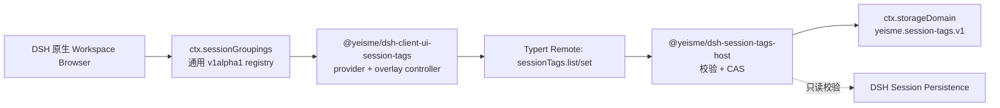

## Context

DSH 当前的 Workspace Browser 同时拥有视图菜单、搜索、Workspace/Session 行、排序、归档和对话打开；`sidebar.workspaces` 是 `single` slot，唯一子 slot 仅服务目录选择。因此“零 DSH 改动”的 tags 插件只能复制并替换整块浏览器，短期可见但会把上游 UI、交互状态和兼容成本转嫁给社区插件。

DSH 已有两条足够成熟的公开基础设施：Host `ctx.storageDomain` 明确支持 Session sidecar；Typert Remote 支持插件自有 Host/Client 合同。缺失的唯一能力是原生侧栏消费第三方分组投影的通用 seam。

## Goals / Non-Goals

**Goals:**

- 保留 DSH 原生会话侧栏，只增加一个 tags 无关的 additive 扩展合同。
- 让 tags 的 canonical state、验证、并发和生命周期完全归 Harness Plugins。
- 用参考 tags 插件验证社区 provider 的注册、分组、搜索、动作、卸载和兼容路径。
- 支持一个会话同时进入多个标签组，并提供“未标记”兜底组。
- 所有集成均走发布 surface、capability probe 和 owner receipt。

**Non-Goals:**

- 不维护或恢复 `client/deepseek-harness` fork，不直接把 patch 留在 DSH 工作树。
- 不替换 `sidebar.workspaces`、不使用 DOM selector/CSS 注入、不复制 Workspace Browser。
- 不把 tags 写入 SessionEvent、模型上下文、Workspace registry 或 Session projection cache。
- V1 不支持颜色、层级、全局重命名、共享/同步、自动打标签或“新建即带标签”。
- 不承诺跨 Host 进程实时同步；V1 以连接重置、窗口聚焦和自身 mutation 刷新为边界。

## Decisions

### 1. Owner 划分为 split-owner



- DSH 只拥有分组展示的通用机制和原生 UI 一致性。
- Harness Plugins 拥有 tag 值、持久化、错误码、编辑器和 Remote receipt。
- 该分割保留了用户体验的一体化，同时不把领域状态藏进 Client 或 DSH core。

### 2. DSH seam 使用 Cordis registry，不新增第二侧栏 slot

上游 `ui-workspace` 增加 `ctx.sessionGroupings` 服务；社区插件注册纯投影 provider，浏览器继续统一渲染 Session 行。选择 registry 而不是 list slot，是因为 slot component 会迫使每个插件复制分组容器、行、拖拽和搜索；registry 让第三方只提供数据和 typed action。

建议公开合同：

```ts
export interface SessionGroupingProviderV1Alpha1 {
  readonly id: string
  readonly label: string | (() => string)
  readonly order?: number
  getSnapshot(): SessionGroupingSnapshotV1Alpha1
  subscribe(listener: () => void): () => void
  readonly sessionActions?: readonly SessionGroupingActionV1Alpha1[]
}

export interface SessionGroupingSnapshotV1Alpha1 {
  readonly revision: string | number
  readonly groups: readonly {
    readonly id: string
    readonly label: string
    readonly sessionIds: readonly SessionId[]
  }[]
  readonly searchTermsBySession?: Readonly<Record<string, readonly string[]>>
}

export interface SessionGroupingActionV1Alpha1 {
  readonly id: string
  readonly label: string | (() => string)
  open(sessionId: SessionId): void
}
```

Registry 规则：provider id 全局唯一；注册/dispose 归调用 fiber；snapshot 通知前引用稳定；浏览器内部对 provider/group key 加命名空间。现有 `workspace`/`flat` 保持内建分支，external provider 只作为新增选择。

### 3. 浏览器拥有渲染、过滤和组内排序

- Provider 决定组顺序、标签和成员；浏览器过滤未知、归档、subagent-only 和不可见 blank Session。
- 一个 Session 可进入多个组；同组重复 id 去重，当前会话在每个副本上保持选中状态。
- `updated` 复用当前 recency 策略；`manual` 使用 `provider:<providerId>:<groupId>` 浏览器本地 order account，不写 Workspace order。
- 外部分组标题只提供展开/折叠，不显示 Workspace 的新建、重命名、删除或拖拽。
- Provider action 只负责打开插件 overlay；mutation 不穿过 DSH Browser。

### 4. Tags V1 采用每 Session 一行的最小 sidecar

Domain `yeisme.session-tags.v1` 的 `sessions` table 使用 SessionId 为 key：

```ts
interface SessionTagRowV1 {
  readonly session: { readonly createdAt: string; readonly cwd?: string }
  readonly tags: readonly string[]
  readonly version: string
  readonly updatedAt: number
}
```

不引入全局 tag catalog。可选标签列表由有效行实时去重派生；赋值即创建，最后一个引用移除后标签自然消失。这样每次写入只触碰一个 storage-domain record，符合当前“无跨表事务”的能力边界，也避免为颜色、重命名和层级预建 schema。

规范化固定为 trim + NFKC；大小写区分。单会话最多 12 个标签，单标签最多 64 UTF-8 bytes，拒绝 NUL/控制字符。空列表删除 sidecar 行。

### 5. Remote 使用全量目标值 + 行级 CAS

Host service key 为 `sessionTags`：

- `list(): SessionTagsListResultV1` 返回 `specVersion: '1.0'` 与当前有效行。
- `set({ sessionId, tags, ifVersion }): SessionTagsSetResultV1` 提交完整目标集合。
- 失败码固定为 `session-not-found`、`tags-invalid`、`version-conflict`、`storage-unavailable`。
- 版本匹配的 no-op 返回旧版本；材料变化生成新 opaque version；冲突返回当前权威行供 Client reconcile。

Host 在写前检查持久化 Session 和生命周期身份。sidecar 不创建/恢复 Session，不触发 Agent，不改变 Session recency。

### 6. Client 通过 provider + shell.overlay 组成体验

`@yeisme/dsh-client-ui-session-tags` 使用 generation-aware snapshot controller，在初次挂载、连接 reset、窗口 focus 和自身写入后刷新。provider id 固定为 `yeisme.session-tags`：

- 标签组按当前 locale 稳定排序，“未标记”最后；空标签组不显示。
- 多 tag Session 在每个对应组出现。
- `searchTermsBySession` 只包含标签文本。
- “管理标签”动作打开已有 `shell.overlay` 中的多选编辑器，支持选择、自由输入、删除、保存、取消、Escape 和 focus restore。
- CAS 冲突刷新权威值并提示重新确认，不自动覆盖。

### 7. 不维护 DSH fork，seam 只走 upstream PR staging

实现时在 `upstream-prs/session-grouping-provider/` 保存 `changes.patch`、`new-files/`、`apply.sh`、README 和必要的双语 Agent Note；在干净上游 checkout 应用并验证，然后提交 deepseek-ai/deepseek-harness。Harness bundle 先 capability-probe：seam 未发布时不渲染入口，禁止“临时”整侧栏替代。

### 8. 社区生态交付物

- 上游导出类型注释和最小 fake provider 测试，说明 snapshot 稳定性、唯一 id、dispose 和降级。
- Harness Plugins 提供 tags 参考实现及 cookbook：安装、provider 注册、Remote owner、错误处理、测试与回滚。
- Conformance 扫描禁止 DSH 私有 import、内部文件路径、DOM selector 和任意 iframe/fetch bridge。
- 后续收藏夹、状态、Agent、来源等分组插件复用同一 registry，不得向 DSH 添加各自的 domain enum。

## Test Specification

| 层 | 场景 | 验证命令 | 证据 |
| --- | --- | --- | --- |
| DSH unit/component | registry 唯一性、dispose、menu、fallback、搜索、external group 渲染 | 在 PR staging checkout 运行 `pnpm exec vitest run packages/client/ui-workspace/tests` | upstream test output |
| Host unit | 规范化、limits、Session identity、CAS、no-op、清空 | `pnpm --filter @yeisme/dsh-session-tags-host run test` | Vitest output |
| Client component | 多标签多组、未标记、排序、搜索、overlay、focus、冲突 | `pnpm --filter @yeisme/dsh-client-ui-session-tags run test` | Vitest + a11y assertions |
| Contract/build | Remote schema、公开 exports、typecheck/build、私有 import 扫描 | `pnpm --filter @yeisme/dsh-session-tags... run typecheck && pnpm --filter @yeisme/dsh-session-tags... run build` | exit 0 |
| Profile integration | 安装、标记、刷新、分组、卸载、重装恢复 | `pnpm --filter @yeisme/dsh-session-tags run test:integration` | `temp/integration-test-runs/<run-id>/` |
| OpenSpec | proposal/spec/design/tasks 完整且严格有效 | `openspec validate dsh-session-tags-grouping-v1 --strict --no-interactive` | valid |

集成测试 runner SHALL 按项目标准写入 `summary.json`、`command.txt`、`stdout.log`、`stderr.log`、`env.json` 和 `artifacts/`，失败保留同等证据并返回原 exit code。

## Risks / Trade-offs

- [上游 seam 未合并] → Bundle 不显示 Client 入口；Host sidecar 可保持未激活，绝不启用整侧栏 fallback。
- [外部分组增加 Workspace Browser 复杂度] → seam 只接收纯投影，由浏览器统一过滤、排序和渲染；不允许 provider React renderer。
- [跨进程/多标签页状态短暂陈旧] → V1 在 reset/focus/own-write 刷新；真正 push/cursor 另开 change。
- [SessionId 复用导致串标签] → sidecar 保存并校验 Session 生命周期身份，stale 行不可见。
- [标签数量增长导致 list 成本] → V1 面向本地单用户且行有界；用 focused benchmark 设定后续分页触发阈值，不预建索引系统。
- [experimental TS surface 未来演进] → 使用 `V1Alpha1` 命名和 additive 新版本；不原地改签名，旧 alpha 至少保留一个 RC 窗口。

## Migration Plan

1. 完成并严格验证本 OpenSpec，不修改 DSH 业务源码。
2. 在 `upstream-prs/session-grouping-provider/` 实现 additive seam，并在干净上游 checkout 跑 `ui-workspace` focused tests。
3. 实现 Host/Client/Bundle，先用 staging DSH artifact 做 disposable profile 集成测试。
4. 上游 seam 发布后，将 bundle peer range 锚定到首个支持版本，再进行候选发布。
5. Rollback：执行 `dsh plugin --profile web remove @yeisme/dsh-session-tags`；当前 provider 消失时 DSH 回退 `workspace`，sidecar 保留。

## Compatibility Classification

| Surface | 分类 | 兼容策略 |
| --- | --- | --- |
| DSH public TS API | additive experimental | 新增 `V1Alpha1` type-only export，不改旧 symbol；不上 value export |
| DSH view persistence | additive | 保留 `workspace`/`flat` 值；外部选择值固定 `provider:<id>` 前缀；未知/已卸载 provider 回退 `workspace`（持久化键 `dsh.workspace.view.v5` 不变） |
| Typert Remote | additive v1 | 新 service/method（`sessionTags.list/set`，`specVersion: '1.0'`）；字段不复用、不重命名 |
| storageDomain | additive | 新 domain `yeisme.session-tags.v1`（version 1）；无迁移、无既有数据写回 |
| Bundle/profile | additive | 新 package row（host + bundle 两行）；移除即回滚 |

### Alpha 兼容窗口（一个 RC）

`SessionGroupingProviderV1Alpha1` 及 `ctx.sessionGroupings` 标记 experimental：
**签名一经发布至少保持到下一个 RC 结束**（例如 0.1.x 系列内 0.1.0 → 0.1.1 两个
相邻 RC），期间只做 additive 演进（新可选字段、新可选方法），绝不原地改签名、
重命名或删除。引入 `V1Beta1`/`V1` 后旧 alpha 仍保留一个 RC 窗口供社区迁移，
删除旧 alpha 必须开独立迁移 OpenSpec。`sessionTags` Remote 的
`specVersion: '1.0'` 字段即为此窗口的运行时锚点：服务端拒绝不认识的
specVersion 而不是静默兼容。

### 回滚（rollback）

1. 用户侧回滚：`dsh plugin --profile web remove @yeisme/dsh-session-tags` ——
   bundle 行移除后 Client provider 消失，DSH 回退内建 `workspace` 分组；
   `yeisme.session-tags.v1` sidecar 数据原样保留，重装即恢复（卸载不清数据）。
2. seam 侧回滚：上游不合并该 PR 时，bundle 永远走 capability probe 降级
   （无“按标签”入口、无死按钮），Host sidecar 独立可加载；不启用任何
   整侧栏/DOM fallback。
3. 合同钉住：本仓合同测试 pin 既有 `workspace`/`flat` 行为边界——
   `packages/client/ui-session-tags/tests/compatibility.spec.ts` pin
   内建值集合与已发布 `@deepseek-ai/dsh-client-ui-workspace/client` 公开面
   连续性（apply/inject 原形、无 `sessionGroupings` 导出）；上游 staging
   (`upstream-prs/session-grouping-provider/`) 的 144 个测试（含既有 126）
   在干净 checkout 上 pin DSH 侧既有行为不回归。若任何实现需要重命名/删除
   既有 symbol，停止实现并新增迁移/弃用方案。

## Open Questions

无阻塞实现决策。颜色、层级、全局重命名、跨进程 push 和自动打标签明确留到独立后续 change，不得在 V1 实现中临时扩域。
