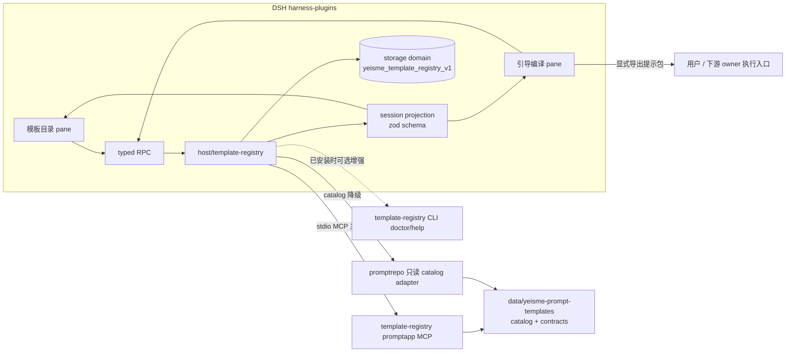

# DSH 模板仓库集成设计

## 决策

1. **独立三包插件**：新建 `dsh-template-registry`（host + client + bundle），不并入 `ui-pane-domain`。理由：模板仓库是跨领域公共消费面，并入领域 pane 会让每个领域 studio 重复接线；独立插件提供一次接线和两个通用 pane，垂直工作台后续只消费它的 projection。
2. **MCP 优先、CLI 可选**：host 侧以 template-registry 本地 stdio MCP 为主通道（`internal/promptapp` 消费闭环已获批），promptrepo 只读 catalog adapter 为目录降级路径；CLI 仅在已安装时提供 doctor/help 增强。符合 `docs/workflows/mcp-client-without-cli.md`：不把 planned/readonly 能力升级为可写，不虚构上传动作。
3. **本 change 不含执行**：编译 `provider_calls=0`；导出提示包后交给用户或下游 owner（Eikona/Scaena 等）的执行入口，pane 不触发真实生成、不产生费用。
4. **合同冻结零新依赖（1.2）**：safe projection zod schema、状态机与 storage domain 合同全部落在既有脚手架 `packages/host/template-registry/src/index.ts`，不新增运行时依赖；storage domain 以结构同形（structural mirror）声明，2.3 再绑定真实 `ctx.storageDomain`。真实工具面以 2026-09-14 stdio MCP 实测为准（见 `implementation-baseline.md`）：32 工具、信封 `spec_version 1.0`、readiness 五值词表、rights/permissions 双层模型。

## 边界

- Host 只向浏览器传 safe projection：exact ref、digest、标题/摘要、tags/capabilities、rights、maturity、contract 输入 schema、有界 preview 摘要、action；不传 token、cookie、文件绝对路径、raw prompt 全文、provider payload。
- 模板正文预览只经 owner 批准的 preview DTO；rights 不允许 preview 的条目 fail-closed（禁用 + 原因）。
- 投影是工具日志的折叠，不是第二份状态；unknown/stale 只禁 mutation 并要求 owner 对账，不自动 retry、不替换 writer。
- 不改 DSH core；所需 seam 缺失时先 probe，core 改动走 `upstream-prs/<slug>/` 通道。
- 不创建 scheduler、task ledger、approval ledger；编译会话状态用获批 storage seam（storage domain 拟 `yeisme_template_registry_v1`）。

## 编译会话状态机（1.2 定稿）

物质流：`filling → confirming → ready → compiled → exported`；叠加态：`stale`（模板/合同 digest 漂移）、`degraded`（MCP 断开）、`disabled`（rights/seam 拒绝，带原因）、`unknown`（投影无法归类）。事件集与完整转移表冻结在 `packages/host/template-registry/src/index.ts`（`TEMPLATE_SESSION_TRANSITIONS` + `advanceTemplateSession`），要点：

- registry readiness → DSH 状态折叠：`needs_input/needs_analysis → filling`、`needs_confirmation → confirming`、`ready_to_compile → ready`、`blocked → disabled`（`sessionStatusFromReadiness`）。
- 叠加态不毁进度：`degraded` 在 `transport_back` 时按会话携带的 readiness 重折叠物质状态（缺 readiness → `unknown`）；`stale/disabled` 只能经显式 `reset`（owner 重新 pin）回到 `filling`；非法转移一律 no-op，不抛错、不丢字段。
- `exported` 为该包终态（digest 漂移仍可标 `stale` 供审计；再次导出走新会话）。
- 编译armed条件（`canCompile`）：状态 ∈ {filling, confirming, ready} 且 `confirmed=true` 且全部必填字段非空——对应 registry 的 `session.confirm`（必带 host 侧 `decision_ref`，绝不自批）+ `expected_revision` CAS（`REVISION_CONFLICT` 时重读最新 revision，不覆盖不重试写）。
- 恢复合同：会话行携带 exact ref + `digest`/`contractDigest` + `confirmedKeys` 摘要 + `revision`/`readiness`，重开 pane 从投影恢复表单，不要求本机 CLI（MCP 面 `session.show` 为 readonly，`session.resume/session.next` 是 owner 刻意保留的 CLI-only 动作，DSH 不经 MCP 调用它们）。

## 集成合同冻结（1.2）

### Safe projection zod schema（`packages/host/template-registry/src/index.ts`）

| 合同 | 字段要点 | 真实来源（实测） |
|---|---|---|
| `TemplateSchema` | ref/digest/title/summary/tags/capabilities/maturity + 派生 `rights{preview,export}` + 1.2 增量 `rightsLevel`（internal \| free-evaluation \| external-attributed \| blocked \| prohibited）、`permissions[]`（preview \| export \| execute_requires_review \| deny \| blocked）、`compilerStatus`、`version` | browse 记录（20 字段）+ inspect；`rights` 布尔必须由合同 permissions fail-closed 派生，未知值按无权限 |
| `TemplateContractSchema` | `digest`、`inputs[]`（name/type/required/min_length/max_length/labels/descriptions，中英 i18n）、`license`、`permissions[]` | inspect 的 `contract` 块；引导表单唯一事实源 |
| `TemplateSessionSchema` | id/revision/status/fields/confirmed/`provider_calls=0` + `readiness`、`nextAction`、`confirmedKeys[]`、`contractDigest`、`decisionRef` | session_create/show 视图（id `s`+32hex、issues 带 step 前缀字段名） |
| `RegistryEnvelopeSchema` | `spec_version`、`status: success\|partial\|failed`、`facts`、`error{code,retryable}`、`actions[]` | 全工具统一信封；唯一 retryable 码 `SESSION_STORE_BUSY`（`REGISTRY_RETRYABLE_ERROR_CODES`） |

浏览器侧永不接收：token/cookie、绝对路径、raw 模板正文、provider payload、`template-registry://session/**` 私有资源（5 个资源模板均为私有域，owner 明示不入投影）。

### Storage domain（snake_case，camelCase 表名被真实 DSH 存储拒绝）

- 域名 `yeisme_template_registry_v1`（version 1），表 `compile_sessions`（唯一表；表名过 `^[a-z][a-z0-9_]*$`）。
- 行 `TemplateRegistryCompileRowSchema`：`specVersion:1`、`dshSessionRef`、`session`（上表会话投影）、可选 `exportReceipt{compileId,digest,outputRef,providerCalls:0,exportedAt}`（`outputRef` 为 owner 相对显示引用，非绝对路径）。
- 键 `templateRegistrySessionKey(dshSessionRef, registrySessionId)`：按 DSH 会话隔离，跨会话互不可见（1.2 验收的 session 隔离）；registry 会话本体仍在 workspace 项目 store（owner 权威），本域只存投影/恢复合同，不是第二份状态。
- 域 spec 以 `TemplateRegistryDomainSpecShape` 结构冻结，2.3 绑定真实 `ctx.storageDomain.open(...)`（模式对齐 `yeisme_scene_3d_graph_v1`/`yeisme_tool_hub_v1`：open→table port→close，单 owner 单写）。

### MCP 消费集（capability probe 目标）

`REQUIRED_TEMPLATE_REGISTRY_MCP_TOOLS`（9 个）：`list/search/inspect/session_create/session_show/session_update/session_confirm/compile/export`。`doctor` 与 `repository_list/show/doctor` 为已连接时的可选增强；`repository_*` 管理动作、`bundle_import`、`session_read`（落盘）不经浏览器触发；`report`（destructive）不消费。探针失败（连接失败/工具缺失/版本不符）→ 入口禁用+原因，目录降级 catalog.json 只读投影（13 维 BrowseDimensions 对齐），编译/导出/会话动作仅 MCP 可用（降级态禁用）。

### 兼容性（1.2 验收）

脚手架已提交导出（`TemplateStatus/TemplateSchema/TemplateSessionSchema/TemplateRegistryAdapter/createTemplateSession/canCompile/markStale`）名称与形状不变；1.2 仅追加带默认值/可选字段与新导出（旧数据继续可解析，`canCompile` 增认 `ready` 武装态）。client/bundle 脚手架 typecheck 通过即合同兼容；host 逻辑、pane 与 bundle manifest 实装留给 2.x/3.x。

## UI Contract（按 docs/design/dsh-unified-panel-visual-system.md §12）

### 模板目录 pane

- Surface classification: adopted
- Surface kind: navigator（左类别/标签树 + 右结果列表 + inspect 详情）
- First / second / third visual priority: 搜索结果列表 / 类别与 capability 过滤 / 详情与 preview
- Existing components reused: `Surface`、`SurfaceContextBar`、官方 Button/Input/Menu primitive、workspace-search 的 source-registry 模式
- Cards that earn existence: solution 卡片（标题、maturity 徽标、artifact/capability 标签、rights 状态——由 `rightsLevel`+合同 `permissions` fail-closed 派生，未知按无权限显示）
- Primary scroll owner: 结果列表

| Feature | Loading | Empty | Error | Success | Partial/Stale | Disabled |
|---|---|---|---|---|---|---|
| 目录加载 | 骨架列表 | 「无匹配模板」+ 清除过滤 | MCP 未连接 + 重试说明 | 列表渲染 | catalog 陈旧徽标 + 刷新 | rights 禁 preview 时 preview 按钮禁用+原因 |

### 引导编译 pane

- Surface classification: adopted
- Surface kind: workspace（contract 表单 + 确认区 + 导出结果）
- First / second / third visual priority: 当前待填字段与确认 / 已确认摘要 / 导出与 digest 信息
- Existing components reused: `Surface`、表单 primitive、eikona-preparation-form 的确认门模式
- Cards that earn existence: 编译结果卡（exact ref、digest、provider_calls=0 声明）
- Primary scroll owner: 表单区

| Feature | Loading | Empty | Error | Success | Partial/Stale | Disabled |
|---|---|---|---|---|---|---|
| 编译 | 编译中指示 | 未选模板时空表单说明 | 缺字段列表逐条可读 | 结果卡 + 导出 | digest 变化 stale 禁导出 | 未确认关键选择时编译禁用 |

### Responsive

| <=420px | 421–720px | >720px |
|---|---|---|
| 单栏，过滤收进抽屉 | 双栏，详情折叠为抽屉 | 三栏（导航/列表/详情） |

### Accessibility

- Keyboard path: 过滤框 → 结果列表（方向键）→ 详情 → 表单字段 → 确认/导出按钮，全程可达。
- Focus owner/return: 抽屉关闭焦点回触发控件；编译完成焦点移结果卡标题。
- Visible labels and accessible names: 所有过滤、字段、按钮有可见 label 与 accessible name。
- Reduced motion and coarse pointer: 骨架/过渡在 reduced-motion 下关闭；触控目标 ≥44px。

### Visual Exceptions

- None。

## 验证

- 本仓协议对接门：`pnpm run typecheck`、`pnpm run test`、`pnpm run build`、`pnpm run check:bundles`、`pnpm run check:surfaces`、`pnpm run test:visual`、`openspec validate <change-id> --strict --no-interactive`。
- 宿主测试覆盖：MCP 连接成功/断开/降级 catalog、缺字段编译拒绝、未确认禁编译、digest stale 禁导出、rights fail-closed preview、无 CLI 恢复合同。
- 集成证据写 `temp/integration-test-runs/<run-id>/`，脱敏 secret、raw prompt、provider payload 与绝对路径；编译演练 `provider_calls=0`。
- 官方 `dsh web` boot、真实 profile Playwright 与上游合入不是完成条件。

## 后续 change（不在本范围）

- recipe 运行器 pane 与项目画布节点衔接（依赖 `dsh-project-canvas-continuity-v1` 3.x）。
- 垂直工作台模板驱动改造（3D 资产工作台先行，内容侧 spec：`official-3d-model-templates-beta-v1`）。
- audio 类模板扩充（prompt-templates 仓内容任务）。
