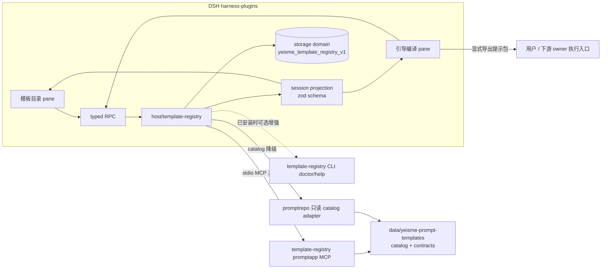

# DSH 模板仓库集成设计

## 决策

1. **独立三包插件**：新建 `dsh-template-registry`（host + client + bundle），不并入 `ui-pane-domain`。理由：模板仓库是跨领域公共消费面，并入领域 pane 会让每个领域 studio 重复接线；独立插件提供一次接线和两个通用 pane，垂直工作台后续只消费它的 projection。
2. **MCP 优先、CLI 可选**：host 侧以 template-registry 本地 stdio MCP 为主通道（`internal/promptapp` 消费闭环已获批），promptrepo 只读 catalog adapter 为目录降级路径；CLI 仅在已安装时提供 doctor/help 增强。符合 `docs/workflows/mcp-client-without-cli.md`：不把 planned/readonly 能力升级为可写，不虚构上传动作。
3. **本 change 不含执行**：编译 `provider_calls=0`；导出提示包后交给用户或下游 owner（Eikona/Scaena 等）的执行入口，pane 不触发真实生成、不产生费用。

## 边界

- Host 只向浏览器传 safe projection：exact ref、digest、标题/摘要、tags/capabilities、rights、maturity、contract 输入 schema、有界 preview 摘要、action；不传 token、cookie、文件绝对路径、raw prompt 全文、provider payload。
- 模板正文预览只经 owner 批准的 preview DTO；rights 不允许 preview 的条目 fail-closed（禁用 + 原因）。
- 投影是工具日志的折叠，不是第二份状态；unknown/stale 只禁 mutation 并要求 owner 对账，不自动 retry、不替换 writer。
- 不改 DSH core；所需 seam 缺失时先 probe，core 改动走 `upstream-prs/<slug>/` 通道。
- 不创建 scheduler、task ledger、approval ledger；编译会话状态用获批 storage seam（storage domain 拟 `yeisme_template_registry_v1`）。

## 编译会话状态机

`empty → filling → confirming → compiled → exported`；`stale`（模板 digest 变化）与 `degraded`（MCP 断开）只禁 mutation。恢复合同：会话投影携带 contract ref + digest + 已确认字段摘要，重开 pane 后从投影恢复，不要求本机 CLI。

## UI Contract（按 docs/design/dsh-unified-panel-visual-system.md §12）

### 模板目录 pane

- Surface classification: adopted
- Surface kind: navigator（左类别/标签树 + 右结果列表 + inspect 详情）
- First / second / third visual priority: 搜索结果列表 / 类别与 capability 过滤 / 详情与 preview
- Existing components reused: `Surface`、`SurfaceContextBar`、官方 Button/Input/Menu primitive、workspace-search 的 source-registry 模式
- Cards that earn existence: solution 卡片（标题、maturity 徽标、artifact/capability 标签、rights 状态）
- Primary scroll owner: 结果列表

| Feature | Loading | Empty | Error | Success | Partial/Stale | Disabled |
|---|---|---|---|---|---|---|
| 目录加载 | 骨架列表 | 「无匹配模板」+ 清除过滤 | MCP 未连接 + 重试说明 | 列表渲染 | catalog 陈旧徽标 + 刷新 | rights 禁 preview 时 preview 按钮禁用+原因 |

### 引导编译 pane

- Surface classification: adopted
- Surface kind: workspace（contract 表单 + 确认区 + 导出结果）
- First / second / third visual priority: 当前待填字段与确认 / 已确认摘要 / 导出与 digest 信息
- Existing components reused: `Surface`、表单 primitive、eikona-preparation-form 的确认门模式
- Cards that earn existence: 编译结果卡（exact ref、digest、provider_calls=0 声明）
- Primary scroll owner: 表单区

| Feature | Loading | Empty | Error | Success | Partial/Stale | Disabled |
|---|---|---|---|---|---|---|
| 编译 | 编译中指示 | 未选模板时空表单说明 | 缺字段列表逐条可读 | 结果卡 + 导出 | digest 变化 stale 禁导出 | 未确认关键选择时编译禁用 |

### Responsive

| <=420px | 421–720px | >720px |
|---|---|---|
| 单栏，过滤收进抽屉 | 双栏，详情折叠为抽屉 | 三栏（导航/列表/详情） |

### Accessibility

- Keyboard path: 过滤框 → 结果列表（方向键）→ 详情 → 表单字段 → 确认/导出按钮，全程可达。
- Focus owner/return: 抽屉关闭焦点回触发控件；编译完成焦点移结果卡标题。
- Visible labels and accessible names: 所有过滤、字段、按钮有可见 label 与 accessible name。
- Reduced motion and coarse pointer: 骨架/过渡在 reduced-motion 下关闭；触控目标 ≥44px。

### Visual Exceptions

- None。

## 验证

- 本仓协议对接门：`pnpm run typecheck`、`pnpm run test`、`pnpm run build`、`pnpm run check:bundles`、`pnpm run check:surfaces`、`pnpm run test:visual`、`openspec validate <change-id> --strict --no-interactive`。
- 宿主测试覆盖：MCP 连接成功/断开/降级 catalog、缺字段编译拒绝、未确认禁编译、digest stale 禁导出、rights fail-closed preview、无 CLI 恢复合同。
- 集成证据写 `temp/integration-test-runs/<run-id>/`，脱敏 secret、raw prompt、provider payload 与绝对路径；编译演练 `provider_calls=0`。
- 官方 `dsh web` boot、真实 profile Playwright 与上游合入不是完成条件。

## 后续 change（不在本范围）

- recipe 运行器 pane 与项目画布节点衔接（依赖 `dsh-project-canvas-continuity-v1` 3.x）。
- 垂直工作台模板驱动改造（3D 资产工作台先行，内容侧 spec：`official-3d-model-templates-beta-v1`）。
- audio 类模板扩充（prompt-templates 仓内容任务）。
