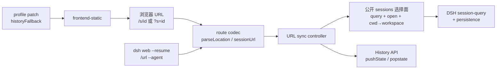

## Context

DSH Web 会话身份已经齐备：`SessionId`、title（`session-title`）、cwd、`created_at`，以及 prompt 内规范 URI `dsh-session:<id>`（`packages/context/session-reference`，mention 序列化为 `[label](dsh-session:<id>)`）。持久化走既有 `session-persistence-jsonl/sqlite` + `session-query`。Web 客户端两阶段 boot（等全部 fiber ACTIVE，无部分可用）；`runtime/src/client/sessions/` 持有会话导航状态；`ui-sidebar` 是导航 UI，`ui-conversation` 是主视图。地址栏目前不反映会话。

Host HTTP（`packages/host/webserver/`）提供 named-route 注册表 + **唯一 fallback 席位**，已被 `frontend-static/` 占用。frontend-static 语义锁定：非 GET/HEAD → 405；越界 → 403；index 只在 dist root 与配置的 index path 渲染，其余不存在路径 → 空 404。因此今天直接打开 `/s/<id>` 会 404。

CLI（`apps/cli/`）profile = 插件 bundle patch 层栈；已有 tui `--resume <id>` 先例、`dsh web --port` / `--no-open`、启动打印 URL 行。安全基线：默认 `127.0.0.1`，可显式 `0.0.0.0`；无 TLS/auth/origin 策略。

本设计把用户已核实的调研固化为可实施合同。Owner 是 `agent/harness-plugins`。官方 DSH 合入不是插件完成门。

## Goals / Non-Goals

**Goals:**

- 一个链接对应一个会话：稳定、可分享、可直开；浏览器历史、书签、终端、handoff、IM 都能恢复该会话视图。
- 路由以会话为中心；SessionId 在单个 `DSH_HOME` 内全局唯一；不把 workspace 编进 URL。
- `?s=` 永远是合法别名，P1 即可在纯上游 profile 与 Electron `file://` 上工作。
- `/s/<id>` 硬刷新通过 additive `historyFallback` 落到 SPA；不抢 webserver fallback 席位。
- URL 不含 secret；prefill 永不自动发送；缺失会话走 UI 内空态，不动 boot 协议。
- CLI `--resume`、打印 URL、`/url`、`--agent session.url` 与只读 handoff 共用同一 codec。

**Non-Goals:**

- 不改会话持久化 schema，不新建会话账本，不把 URL 当创建会话的权限。
- 不注册 OS 级 `dsh-session:` 协议 handler。
- 本切片不交付 `#msg-<seq>` 滚动、`@session` 点击内跳、`?prompt=` 预填（P4，能力账本 retain-next）。
- 不给 DSH 增加 TLS/auth/origin；`0.0.0.0` 只文档警示。
- 不替换 `ui-sidebar` / `ui-conversation`，不 DOM patch 地址栏。
- 不把官方合入、真实 `dsh web` Playwright 写成插件 SHALL 完成条件。
- 不在 URL、日志、证据、fixture 中写入凭证、raw prompt、provider payload 或完整思维链。

## Decisions

### 1. Owner 划分为 split-owner



- DSH 拥有 SessionId、cwd、workspace 注册、session-query、静态文件服务。
- Harness Plugins 拥有 codec、URL↔runtime 同步、空态、复制/打开入口、bundle/profile、CLI 接线与上游 patch 过渡。
- 不把领域状态藏进 Client localStorage，也不改 SessionEvent。

### 2. URL 契约（稳定 additive 面）

主形式与别名语义等价，解析优先级：path `/s/<id>` 优于 query `s`；二者同时出现且 id 不一致时以 path 为准，query 被忽略且不报错。

```
http://127.0.0.1:3080/s/<sessionId>     # canonical
http://127.0.0.1:3080/?s=<sessionId>    # alias, zero-server-change
http://127.0.0.1:3080/s/<id>#msg-<seq>  # P4 reserved
/s/<id>?prompt=<urlencoded>             # P4 reserved; never auto-submit
```

规则：

1. `sessionId` 使用既有 SessionId 字面量，不做二次编码变换；非法/空 id 视为未指定会话。
2. 不编码 workspace、cwd、title、host token。打开时由会话 cwd 反查已注册 workspace 并切换（对应 Codex `--all`）。
3. `dsh-session:<id>` 保持 prompt 内 mention 规范形式；Web 内点击在本切片不实现（P4），但 codec 必须能从该 URI 抽出 id，供后续内跳复用。
4. URL 生命周期仅承诺当前 Host 进程；随机端口下以启动打印行为为准。
5. `0.0.0.0` 绑定文档明示「持有链接即持有访问权」。

兼容分类：HTTP 路径与 query 别名为 **additive 新面**；既有 `/` 根路径、静态资源、named-route 不变。Rollback = 卸插件 + 关 `historyFallback`。

### 3. 包形态：Client + 薄 Bundle（形态 B）

对照 `docs/plugin-tab-development.md`：本能力有 React 空态/菜单，走仓内自研三包中的 Client + Bundle；无独立 Host 领域存储，故不建 `packages/host/`。

- `@yeisme/dsh-client-ui-url-session`：codec（纯函数、零 Cordis）、sync controller、空态、header/sidebar 入口。
- `@yeisme/dsh-url-session`：`cordis.patch.yml` insert 行，`./client` 转发 Client；host 半空 `apply`，避免重复 catalog。
- codec 单独导出，供 CLI 与测试 import，不依赖 DOM。

插件 slot 接入，不改上游 runtime 源码：

- boot 完成后读 `location`；有合法 `s` 则 `session-query` 解析 → 切 workspace → `sessions.open`。
- 侧栏/会话选择成功后 `history.pushState`（同 id 重复选择用 `replaceState`，避免历史垃圾）。
- `popstate` 反向选会话；程序化同步打 generation token，丢弃过期应答。
- 找不到会话：会话视图内空态「会话不存在或已被清理」+ 返回列表；不失败 boot。

缺 `sessions` / `session-query` seam 时 capability probe：不注册入口，不崩溃，不伪造 open。

### 4. `?s=` 是 P1 兼容硬门槛

无 `historyFallback` 时：

- 用户把 `?s=<id>` 贴进已打开的 SPA，或 Electron `file://` 带 search，codec 仍工作。
- 直接硬刷新 `/s/<id>` 仍 404——这是 P2，不得把 P1 验收绑到 path 深链。
- 纯上游 profile（未装本 bundle）地址栏不会自动同步；装上 bundle 后 `?s=` 全量通过。

测试夹具必须包含：无 patch 的 location 对象、`file://` origin、只含 query 不含 path。

### 5. SPA historyFallback 走 patch，不抢席位

`frontend-static` 已占唯一 fallback 席位。P2 给它加配置开关 `historyFallback`（默认 false，Yeisme web profile patch 设 true）：

- 条件：GET 或 HEAD；目标不是现有文件；路径无文件扩展名 **或** `Accept` 含 `text/html`。
- 命中则走既有 `renderIndex` + `tapIndex`，返回渲染后的 index。
- 不命中：保持 405（非 GET/HEAD）、403（越界）、404 octet-stream（带扩展名的不存在文件）。

实现通道：`upstream-prs/frontend-static-history-fallback/`。profile `cordis.patch.yml` 只改配置，不复制静态服务器。上游未合入时 staging apply；插件完成门是判定矩阵单测 + apply-check，不是官方 PR。

### 6. CLI 与跨工具入口复用 codec

- `dsh web --resume <session-id>`：复用 `--open`，目标 path 改为 `/s/<id>`（有 fallback）或 `/?s=<id>`（无 fallback 时的诚实降级）。`--no-open` 把完整 URL 打到属于 shell 的 URL 行。
- 会话内 `/url`：打印/复制当前会话链接。`--agent` 增加 **additive** 键 `session.url=<full-url>`，与地址栏一致；既有键不改名。
- Ordo/Workbench 安全 handoff descriptor **允许**只读字段携带 dsh 会话 URL；DSH 不把该 URL 当 mutation 授权。缺字段旧消费者忽略。

`--resume` 对 web 入口是新 flag（tui 已有先例）。若上游 web CLI 尚未暴露，通过 command contribution 或 staging patch 接线；不得静默改 tui 语义。

### 7. 安全与红线

- URL、clipboard、`--agent`、handoff、证据、截图只含 origin + path/query 中的 SessionId，不含 token、cookie、Authorization、草稿正文。
- `?prompt=` 本切片不解析为提交动作；若未来 P4 实现，MUST 只预填草稿并要求显式发送。
- 多标签页默认可同时打开同一会话；发送由既有 host 队列串行化。本切片不新做跨标签锁。

## UI Contract

- Surface classification: embed（空态与菜单入口挂在既有会话视图/侧栏；codec/controller 为 excluded 状态包）
- Surface kind: micro（头部/菜单动作）；空态 embed 进 conversation 主视图，不新开 pane
- First / second / third visual priority: 当前会话身份与主操作（返回列表）／原因说明／可复制的 SessionId（无 secret）
- Existing components reused: 官方 Button、Menu；`ui-visual-kit` token；既有会话空态/State 模式
- Cards that earn existence: 无新卡片；空态是单一 State，不是仪表盘
- Primary scroll owner: 沿用 conversation 主列；空态不引入第二滚动容器

### State Matrix

| Feature | Loading | Empty | Error | Success | Partial/Stale | Disabled |
|---|---|---|---|---|---|---|
| 深链打开 | boot 完成后查询中，沿用宿主会话切换等待 | 无 `s` 参数：不干预 | 会话不存在/已清理：视图内空态 | 打开目标会话且 URL 同步 | query 过期 generation 丢弃 | 缺 sessions seam：不注册入口 |
| 复制链接 | 短时 busy | 无当前会话：动作 disabled + 原因 | clipboard 失败：可见原因，不静默 | 写入 clipboard | 端口已变：复制当前 location | 非安全上下文：disabled + 原因 |
| History 同步 | popstate 处理中不闪空白 | 根路径无 `s`：保持现状 | 非法 id：视为无会话 | push/replace 与选择一致 | 同 id replaceState | file:// 无 History：仅内部状态 |

### Responsive

| <=420px | 421–720px | >720px |
|---|---|---|
| 空态全文可滚动，主按钮不被底栏遮挡；菜单项完整可点 | 空态居中，动作横排 | 空态约束最大宽度，不撑开侧栏 |

### Accessibility

- Keyboard path: 侧栏会话项菜单、头部动作、空态「返回列表」均可键盘到达；Escape 关菜单并还焦点。
- Focus owner/return: 打开菜单前记录触发者；关闭回到该按钮；空态出现后焦点落到主按钮，不抢 composer。
- Visible labels and accessible names: 「复制会话链接」「在新标签页打开」「会话不存在或已被清理」「返回列表」；中英 locale。
- Reduced motion and coarse pointer: 无入场动画依赖；触控不依赖 hover 才出现菜单。

### Visual Exceptions

- None。空态与菜单必须消费 `--vk-*` / host token，禁止硬编码色。

## Test Specification

| 层 | 场景 | 验证命令 | 证据 |
| --- | --- | --- | --- |
| Codec unit | path/query 优先级、非法 id、file://、dsh-session URI、sessionUrl 生成 | `pnpm --filter @yeisme/dsh-client-ui-url-session run test` | Vitest |
| Sync unit | boot 读 URL、push/replace、popstate、generation 丢弃、缺 seam | 同上 | Vitest |
| Fallback matrix | 方法 × 路径 × Accept × 扩展名 | `upstream-prs/...` focused test 或仓内判定纯函数 | 矩阵全覆盖 |
| Client component | 空态、复制、新标签、菜单、a11y | Client Vitest + Testing Library | 状态矩阵 |
| Bundle/contract | patch insert、declaration-lint、无私有 import | `pnpm run check:bundles && pnpm run check:plugins` | exit 0 |
| CLI | `--resume` 目标 path、`--no-open` URL 行、`--agent session.url` | focused CLI/command 测试 | 与 codec 一致 |
| Optional host | 真实 `dsh web` 深链/刷新/回退 | 现有 Playwright 入口 | `temp/integration-test-runs/<run-id>/`；**不阻塞** P1 完成 |
| OpenSpec | artifacts 完整 | `openspec validate dsh-url-session-v1 --strict --no-interactive` | valid |

集成证据 SHALL 含 `summary.json`、`command.txt`、`stdout.log`、`stderr.log`、`env.json`、`artifacts/`；失败保留同等证据。视觉门若触及 UI：`check:surfaces` + `test:visual` **指纹对比，不跑 update-snapshots**，除非人工确认差异。

## Migration Plan

1. P0：本 change 的 proposal/design/specs/tasks + `docs/protocols/dsh-url-session.md`。
2. P1：Client/Bundle 落地 `?s=`；web profile 安装 bundle。
3. P2：staging apply `historyFallback`；Yeisme web profile 打开开关；准备上游提案，不阻塞插件门。
4. P3：CLI `--resume`、`/url`、handoff 字段。
5. 回滚：`dsh plugin --profile web remove @yeisme/dsh-url-session`；关掉 `historyFallback`。无数据迁移，无 deprecation window（纯新增）。
6. 若必须删除 `session.url` 或改 path 语义：停止实现，另开 evolutionary-change 迁移。本切片禁止。

## Risks / Trade-offs

- [frontend-static fallback 席位被占、语义锁定] → 不抢席位，给自身加开关；同步 upstream-prs。
- [0.0.0.0 无鉴权] → URL 无 secret；文档警示；prefill 永不自动提交。
- [boot 等全量 roster] → 深链错误只做视图内空态，不改 boot。
- [Electron file://] → `?s=` + 内部导航；不依赖 origin。
- [随机端口 URL 失效] → 仅承诺当次进程；分享以当前打印为准。
- [sessions seam 形态与调研不完全一致] → 实现前 probe 公开 API；缺席则 disabled + 原因，禁止 DOM 选会话。
- [web `--resume` 上游未暴露] → command contribution 或 staging patch；不改 tui `--resume` 语义。

## Open Questions

无阻塞问题。以下按已定默认执行，不向用户提问：

- 同页 path 与 query 冲突：path 胜出。
- 无 fallback 时 `--resume` 打开 `/?s=<id>`。
- P4 锚点/mention/prefill 不进本 change 任务勾选。
- 官方 Playwright 为可选证据，失败或环境缺失不撤销 P1 协议完成。
