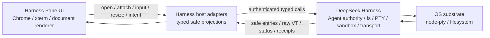
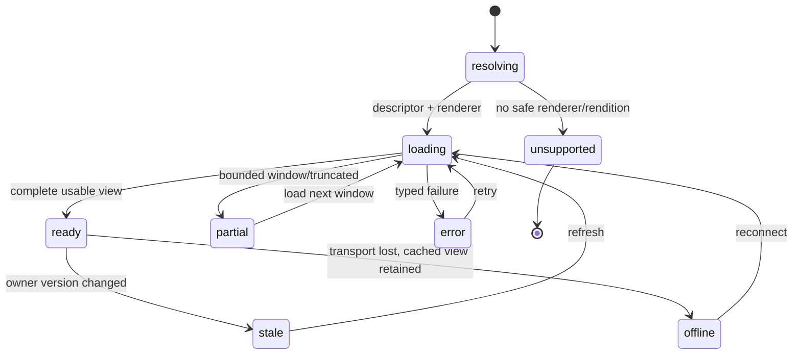
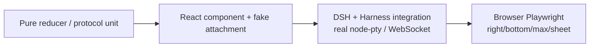

## Context

### 当前状态

`dsh-pane-workspace-docking-v2` 已完成最关键的结构修正：工作区通过 `shell.workspace.right` 与 `shell.workspace.bottom` 进入 DSH 正式布局，左侧会话栏不再被 overlay 遮挡，Pane reducer 也能表达 Tab、group、split、跨区域移动、resize 与 maximize。

当前剩余问题集中在体验与真实能力，而不是再次重做布局：

- `PaneRegionChrome` 仍以 `+`、`×`、`Maximize` 文本和视图首字母作为主要控件；Tab 没有图标、hover close、dirty/preview 视觉和 group actions。
- View Picker 使用 `position: fixed` 的大对话框，缺少搜索、分组、锚定、快捷键和碰撞处理。
- 文件/文档仍以 singleton 页面和大面积空状态为主，没有 resource-keyed preview/pinned Tab 语义；renderer 只按 `image/pdf/text` 分支，缺少 MIME sniffing、格式矩阵、partial/stale、Open With 与大型内容策略。
- `dsh-rich-media` 仍通过 `sidebar.footer.action` 打开第二套工作台，只提供原生 image/audio/video 与 PDF iframe 卡片；它与 canonical DSH sidebar、V2 Pane 布局和文件资源生命周期重复。
- 当前 `FileEntryV1`、`MediaRefV1` 与 DSH image attachment 各自安全但未形成统一 Preview Registry；URL/stream/range、缩略图、转换产物、版本变化与释放责任尚未冻结。
- Harness Plugins 的 `TerminalHostV1` 与 `TerminalPanel` 是明确的 placeholder。
- DSH `ctx.terminals` 已经是 exact-Agent owner-scoped PTY registry，且本地 provider 已使用 node-pty；但公共合同目前只提供模型侧 `startSend/read/signal/kill`，终端输出经过 sanitize/scrollback，没有 browser raw attachment、resize、duplex transport 或输入控制租约。
- DSH Web connection 的两个 WebSocket 是 downlink-only；任何客户端 message 都会以 policy violation 关闭，因此不能复用为终端上行通道。

### 产品准入与能力台账

| 能力 | 准入 | canonical owner | V3 交付位置 | 首切片状态 |
| --- | --- | --- | --- | --- |
| DSH 左侧会话栏与 root geometry | fit | DeepSeek Harness | 保持 V2 | 已有，必须回归 |
| Pane Chrome / Tab / group 管理 | fit | Harness Plugins | `dsh-pane-workspace-experience-v3` | first-support |
| 统一 Resource Preview contract/registry | split-owner | DSH/领域 owner + Harness adapter/renderer | 同上 + DSH Agent Note | first-support 前置 |
| 文件树与文档/数据 Pane | split-owner | DSH fs projection + Harness view | 同上 | first-support |
| 媒体库与 image/audio/video Pane | split-owner | DSH/领域 media owner + Harness view | 同上 | first-support |
| PDF browser renderer | fit | Harness Plugins | lazy PDF.js Pane renderer | first-support |
| Office/EPUB/复杂格式转换 | split-owner | DSH/领域 conversion owner | owner rendition + Harness fallback | retain-next adapter，首版诚实降级 |
| 媒体编辑、转码、DRM、后台播放 | reject-now | 领域 owner / 浏览器平台 | 不进入本 change | 明确排除 |
| PTY 生命周期与权限 | fit | DeepSeek Harness | DSH Agent Note + additive seam | first-support 前置 |
| xterm.js 浏览器渲染 | fit | Harness Plugins | interactive terminal Pane | first-support |
| shell process restart 恢复 | split-owner | DSH runtime | 后续独立 change | retain-next |
| shell integration command decorations | split-owner | DSH shell profile + Harness renderer | 后续增量 | retain-next |
| 浮动窗口 / 拖入左侧栏 | reject-now | 无 | 不实施 | 明确排除 |

### 外部生态研究

检索日期为 2026-08-20，优先使用官方仓库、官方文档与 npm registry。当前版本只是设计时兼容基线，实施时由 lockfile 固定并通过项目测试验证：

| 生态 | 设计时版本 | 采用结论 | 证据 |
| --- | --- | --- | --- |
| xterm.js | `@xterm/xterm` 6.0.0 | 浏览器终端 renderer；VS Code 同源 | [xterm.js 官方仓库](https://github.com/xtermjs/xterm.js) |
| xterm addons | fit/search/web-links/serialize/unicode11；WebGL 可选 | 使用官方 addons，不自研对应能力 | [官方 addon 指南](https://xtermjs.org/docs/guides/using-addons/) |
| node-pty | DSH 已 pin `1.2.0-beta.15` | 继续复用，不降级到 registry stable，也不本地重写 Rust PTY | [node-pty 官方仓库](https://github.com/microsoft/node-pty) |
| VS Code Codicons | `@vscode/codicons` `0.0.46-24` | 工作台语义图标源；通过 wrapper 使用 | [Codicons 官方仓库](https://github.com/microsoft/vscode-codicons) |
| VS Code terminal UX | 当前官方文档 | 信息架构参考，不复制私有实现 | [VS Code Terminal Basics](https://code.visualstudio.com/docs/terminal/basics) |
| Monaco Editor | `monaco-editor` 0.56.0 / MIT | VS Code 同源；仅 desktop advanced code/diff 按需加载，不作为所有文本默认 renderer | [Monaco 官方仓库](https://github.com/microsoft/monaco-editor) |
| PDF.js | `pdfjs-dist` 6.2.108 / Apache-2.0 | PDF worker、page/text/annotation layer；替代不一致且难控制的 PDF iframe | [PDF.js 官方仓库](https://github.com/mozilla/pdf.js) |
| WaveSurfer.js | `wavesurfer.js` 7.12.11 / BSD-3-Clause | 音频波形、Timeline/Regions；大型媒体要求 owner 预计算 peaks，避免浏览器全量解码 | [WaveSurfer 官方仓库](https://github.com/katspaugh/wavesurfer.js) |
| hls.js | `hls.js` 1.7.1 / Apache-2.0 | 非原生 HLS 浏览器的 MSE 播放、字幕与 adaptive stream；原生 HLS 优先 | [hls.js 官方仓库](https://github.com/video-dev/hls.js) |
| TanStack Virtual / Table | `@tanstack/react-virtual` 3.14.10、`@tanstack/react-table` 9.1.2 / MIT | 长文本、媒体库和 CSV/TSV 的 headless virtualization/table；与 DSH 已有 Virtual 使用方式对齐 | [TanStack Virtual](https://github.com/TanStack/virtual)、[TanStack Table](https://github.com/TanStack/table) |
| `<model-viewer>` | `@google/model-viewer` 4.3.1 / Apache-2.0 | glTF/GLB 3D retain-next；不进入首切片 bundle | [model-viewer 官方仓库](https://github.com/google/model-viewer) |

采用 TypeScript/Node 现有栈。node-pty 已经是经维护的 native package；本 change 没有测量证据支持 Go/Rust 重写，Rust 只保留为上游 node-pty 的实现细节。

### 当前设计审计

基于用户提供的窄屏截图与当前组件实现，设计基线评分如下：

| 维度 | 当前 | V3 目标 | 主要修正 |
| --- | ---: | ---: | --- |
| 层级与可读性 | 5/10 | 9/10 | 去掉重复大标题和大空卡，内容优先 |
| Pane 管理可发现性 | 4/10 | 9/10 | 每个 group 的 split/move/max/more/close |
| 图标与一致性 | 3/10 | 9/10 | Codicons + 语义 wrapper + Tooltip |
| 文件/文档任务流 | 4/10 | 9/10 | resource Tab、preview/pin、breadcrumb |
| 文件格式覆盖与诚实降级 | 3/10 | 9/10 | renderer registry、格式矩阵、partial/unsupported |
| 图片/音频/视频体验 | 3/10 | 9/10 | Media Library、zoom/waveform/HLS/captions |
| 预览安全与生命周期 | 4/10 | 9/10 | owner sniff/range、Abort/release、no active content |
| 终端真实性 | 2/10 | 9/10 | raw PTY、xterm、resize、TUI、reconnect |
| 响应式 | 6/10 | 9/10 | V2 solver + anchored popup/mobile Sheet |
| 无障碍 | 5/10 | 9/10 | toolbar/tab/menu pattern、focus、announcement |

## Goals / Non-Goals

**Goals:**

- 让右侧/底部工作区在视觉密度、Pane 管理和快捷操作上接近 VS Code，同时保持 DSH 自己的布局与产品语言。
- 让文件、文档、结构化数据、媒体和终端都成为可移动、可拆分、可最大化、可恢复的 resource-keyed Pane。
- 建立 owner-neutral Resource Preview Registry，使格式扩展不再修改 Pane shell，并让 FileEntry/MediaRef/ArtifactRef 通过安全适配共享版本、renderer、状态与 handoff。
- 交付 text/code/Markdown/JSON/YAML/TOML/CSV/TSV/PDF/image/audio/video 的生产级 first-support，并为 Office、archive、HTML/SVG、unknown binary 与 3D 给出明确安全降级或 retain-next seam。
- 让浏览器终端支持原始 VT、交互式按键、全屏 TUI、鼠标、bracketed paste、resize、查找、链接和有界重连。
- 保持 DSH exact-Agent authority、sandbox fence、process cleanup 与模型侧行式终端合同。
- 优先复用维护良好的社区库，限制自研范围为所有权、typed protocol、DSH 适配和产品交互。
- 为 implementation、component、integration 和真实浏览器验证提供可执行验收边界。

**Non-Goals:**

- 不复制 VS Code 源码、私有 terminal protocol、extension host 或完整 editor architecture。
- 不把 Harness Plugins 变成 PTY、文件系统、会话或权限 canonical owner。
- 不把浏览器变成 MIME、解压、Office 转换、媒体转码、DRM 或领域资产 metadata 的 canonical owner。
- 不执行不受信任 HTML/SVG/PDF JavaScript、Office macro、archive entry 或远端 provider URL；不接入 Google/Microsoft 在线文档 viewer 作为隐式数据外发通道。
- 不把 Monaco、PDF.js、WaveSurfer、hls.js 或 3D renderer 放进基础 Pane bundle；重 renderer 必须按格式和用户动作 lazy import。
- 不调用浏览器 Fullscreen API，不允许浮窗，不允许工作区覆盖 DSH 左侧栏。
- 不通过 HTTP 为每次 keypress 发请求，不复用 downlink-only event sockets，不采用无类型 `addon-attach` 作为 canonical transport。
- 不在 Pane persistence 中保存 terminal output、命令历史、绝对路径、文件正文、credential、raw prompt 或完整思维链。
- V3 first-support 不承诺 DSH 进程重启后恢复 PTY，也不承诺完整 VS Code shell integration decorations。

## Decisions

### 1. 维持三层所有权，而不是把终端或文件状态提升到 Workbench



Harness Plugins 只持有 presentation state、resource ref、selection、layout 与 attachment state。DSH 持有 terminal id、owner、process、input lease、scrollback/replay、path resolution、sandbox 和 kill。替代方案“浏览器 bundle 直接连接 node-pty 或读取工作区绝对路径”会绕过 Agent authority、remote execution world 与 cleanup，因此拒绝。

### 2. 工作区采用“Rail + Group Chrome + Content”，移除重复的全局大标题

```text
┌──────── 44px Rail ────────┬──────────── Pane Group ────────────┐
│ New/Open                  │ [icon] title •   …tab…  | split ⋯ │
│ Explorer                 ├─────────────────────────────────────┤
│ Search                   │                                     │
│ Media                    │              content                │
│ Terminal  ●              │                                     │
└──────────────────────────┴─────────────────────────────────────┘
```

- Right region 保留 44px Activity Rail；Bottom region 不复制 Rail。
- Region 不再常驻一个占空间的 `WORKSPACE / Maximize / ×` 大工具条。每个可见 group 自己拥有 34–36px header，左侧为 Tab，右侧为 group controls。
- icon button 视觉尺寸 28px、默认交互盒 32px；`<=600px` 或 coarse pointer 时提升到至少 44px hit target。
- Tab 高 34–36px、最大宽 220px；active 使用底部或内侧 2px accent，不使用大面积高饱和背景。
- 空 region 只显示安静的一行说明与“打开视图”动作；不再显示营销式标题、说明和 250px 以上虚线空卡。

该结构把高频对象（Tab/内容）放在第一视觉层，把低频管理动作收进 group controls 和 More menu，并避免 screenshot 中三层 header 互相竞争。

### 3. 图标采用 Codicons，但经本地语义层隔离

新增本地 `WorkbenchIconName` 与 `WorkbenchIcon`，例如：

```text
add, close, splitHorizontal, splitVertical, move, maximize, restore,
more, files, folder, folderOpen, document, search, history,
media, bell, plan, terminal, trash, pin, lock, refresh, error, warning
```

view provider 只能声明语义 icon name，不得把 `codicon-*` class、任意 SVG、URL 或 HTML 作为 host projection 下发。wrapper 负责尺寸、`aria-hidden`、fallback 和主题色。DSH 已有的基础 icon primitive 可继续服务 canonical DSH surface；Workbench 特有图标留在 Harness Plugins，避免把产品插件图标集强塞进 DSH core。

Codicons 的代码与图标许可必须进入第三方 notice。若某个 icon 缺失，先组合现有语义 icon；只有可复用的产品专属图标才新增本地 SVG component。

### 4. View Picker 采用锚定 Quick Pick，而不是 fixed modal

`+`、Command Palette 和空状态按钮打开同一个 Quick Pick state machine：

- 锚定触发按钮，宽 320–380px，最大高 480px，使用已有 DSH popup/menu primitive 完成碰撞与 focus restore。
- 顶部 autofocus 搜索；列表按“推荐 / 已打开 / 可用”分组，显示 icon、label、可选 shortcut 与目标区域提示。
- ArrowUp/ArrowDown 移动 active option，Enter 打开，Esc 关闭，Tab 不逃出 popup 的必要交互区。
- 窄屏或 sheet 模式投影为底部 Sheet；canonical picker state 不写入 Pane persistence。
- provider 可提供本地 presentation metadata，但不能注入 component URL、HTML 或远端图标。

### 5. 文件与文档使用 resource lifecycle，而不是单例预览模块

文件树是 navigator view，具体文件/文档是 content view：

1. 单击文件：以 `preview: true, pinned: false` 打开或替换当前 group 的 preview Tab。
2. 双击、Enter、编辑、显式 Pin：同一 resource Tab 转为 pinned。
3. 同一 owner resource ref 再次打开：激活既有 Tab；显式 duplicate 才创建第二个 view。
4. 文件树与 DSH 左侧栏 additive action 都调用同一个 `openView()` 路径。
5. terminal/file link 也生成同一个 typed open intent，禁止把绝对路径直接写入浏览器 URL 或 Pane persistence。

文档 Pane 使用内容优先布局：compact breadcrumb/toolbar + viewer。空状态限制为短文案和主动作；图片/PDF/文本 renderer 由 owner-authorized media type 与 opaque preview URL 决定。

### 6. 真实终端采用 DSH additive interactive attachment

保留现有 `TerminalBackendSession.startSend/read/signal/close`。DSH 新增可探测的 interactive capability，而不是改变模型侧方法语义：

```text
TerminalInteractiveCapabilityV1
  listProfiles(owner)
  spawn(owner, profileRef, cwdRef?, size)
  attach(owner, terminalId, cursor?, requestedControl)
  acquireControl(owner, terminalId, attachmentId)
  releaseControl(owner, terminalId, attachmentId)
  write(owner, terminalId, attachmentId, data)
  resize(owner, terminalId, attachmentId, cols, rows)
  signal(owner, terminalId, signal)
  detach(owner, terminalId, attachmentId)
  kill(owner, terminalId, reason)
```

具体 TypeScript 名称可在 DSH Agent Note 中按现有 service conventions 收敛，但语义必须保持：exact owner 检查、一个 terminal 一个 canonical process、attachment 可多观察者但只有一个输入 controller、detach 不 kill、kill awaited cleanup。

#### 输入控制租约

- 模型 `startSend` 与浏览器 raw input 不能并发写入同一个 PTY。
- 浏览器 attachment 可先以 `observe` 连接；获得 control lease 后才能输入、resize 或发送 signal。
- active model send 存在时，普通 acquire 返回 typed `busy`；“接管终端”必须显式展示影响，并通过 DSH owner 的 interrupt/release 流程等待旧 operation settle 后再授予 control。
- WebSocket 断开、Agent dispose、terminal exit 或 lease heartbeat 过期时，DSH 自动释放 control；其他观察者不继承控制。
- 模型在 browser control lease 存在时启动 send，得到 additive typed conflict，不得静默交错输入。

这比“默认允许人和 Agent 同时打字”多一个状态，但能避免命令拼接、误执行和不确定 receipt。

### 7. 终端使用独立 authenticated duplex WebSocket

现有 `/api/events.mux` 与 `/api/events.host` 保持 downlink-only。新增独立 endpoint（最终 path 由 DSH Agent Note 固化，逻辑名 `terminal.v1.connect`），复用 trusted-host、token auth 与 WebSocket upgrade gate，并协商 subprotocol `dsh.terminal.v1`。

一个 socket 绑定一个 attachment。控制 frame 使用严格 schema；输出按 8–16ms 或 64KiB 上限批送，避免每个字符一个 frame：

| 方向 | frame | 核心字段 |
| --- | --- | --- |
| client → server | `attach` | terminal ref/profile、last epoch/sequence、requested control、viewport |
| client → server | `input` | attachment ref、data、client sequence |
| client → server | `resize` | cols、rows、measurement generation |
| client → server | `signal` | allowed signal |
| client → server | `ack` | output epoch/sequence |
| client → server | `detach` | reason |
| server → client | `attached` | safe session snapshot、lease state、epoch、replay range |
| server → client | `output` | epoch、sequence、raw VT string、truncated flag |
| server → client | `control` | observe/controller/busy/revoked |
| server → client | `status` | running/exited/reconnecting、exit facts |
| server → client | `resync_required` | earliest sequence、reason |
| server → client | `error` | typed code、safe message、retryability |

限制：input frame 最大 16KiB，output frame 最大 64KiB，控制 JSON 最大 16KiB；超限或 malformed frame fail closed。server 维护 bounded raw replay ring 和 monotonically increasing `epoch + sequence`。cursor 在 ring 内时只 replay delta；超出时发送 bounded reset/scrollback 与 `truncated`，不伪造完整历史。

不直接采用 `@xterm/addon-attach`，因为它不表达 DSH owner、input lease、resize receipt、epoch/sequence、typed error 和安全关闭语义。xterm 仍然只消费适配后的 data stream。

### 8. 交互式 shell profile 与模型 profile 分离

DSH 当前以 `TERM=dumb`、`NO_COLOR` 和受控 prompt 优化模型读取。V3 不应为了 UI 破坏这条稳定路径：

- 模型创建的 terminal profile 保持现有默认与 `startSend/read` 行为。
- UI 新建终端选择 DSH 返回的 interactive profile；本地 bash/pwsh profile 可使用 `TERM=xterm-256color`、真实 rows/cols 和完整 VT，仍保留 sandbox policy 与安全环境 scrub。
- UI 可以观察已有 agent profile，但 capability projection 必须说明是否支持 full TUI/control。
- profile 枚举与 cwd 都由 DSH 返回 opaque refs；浏览器不能提交任意 executable/argv 或绝对 cwd。

这一分离让 VS Code 式 TUI 与 Agent 稳定命令执行并存，而不是把两个不同任务强行塞进同一环境默认值。

### 9. xterm.js addon 分层加载

**首切片加载：**

- `@xterm/xterm`：renderer、selection、keyboard、scrollback。
- `@xterm/addon-fit`：由 measured Pane size 驱动 cols/rows。
- `@xterm/addon-search`：Pane Find UI 与快捷键。
- `@xterm/addon-web-links`：只识别候选，打开前仍经过 DSH/harness URL/path policy。
- `@xterm/addon-unicode11`：统一宽字符与 CJK 计算。
- `@xterm/addon-serialize`：客户端 detach/reconnect 的短期视图快照与测试；不得进入长期 Pane persistence。

**按测量启用：**

- `@xterm/addon-webgl` lazy import；初始化失败、context lost 或 reduced-resource 情况回退 DOM renderer。
- `@xterm/headless` 仅在 DSH 后续需要精确 server-side screen snapshot 且 profiling 证明成本可接受时采用。
- Ligatures、command decorations、shell integration、persistent process recovery 作为独立增量，不阻塞 V3 raw terminal。

### 10. Terminal Pane 的 VS Code 风格操作映射

| 入口 | 行为 |
| --- | --- |
| `+` | 使用默认 interactive profile 新建 terminal resource |
| `+` 旁下拉 / Quick Pick | 选择 profile 与安全 cwd ref |
| generic Split | 新建一个 PTY 并放入目标 split；不克隆现有 process |
| Move Right/Bottom | 移动同一 view/attachment，不重建 PTY |
| Rename / Change Icon / Color | 更新 presentation metadata；rename owner session name 时需 receipt |
| Close Tab | detach view；若无其他 attachment，PTY 仍保持运行 |
| Trash / Kill | 明确确认 target，调用 DSH `kill()` 并等待退出 |
| Maximize / Restore | 只改变 V2 layout projection |
| Find | 打开 xterm search widget |
| Clear | 清理客户端 viewport；若提供 shell clear action，必须与 scrollback/replay 语义区分 |
| Link click | URL 经 allowlist；文件路径经 DSH resolve 后打开 file/document Pane |

Paste 多行或疑似 shell control sequence 时显示确认；确认后仍只把原始文本写入当前 control lease，不自动追加 Enter。剪贴板读取需要用户 gesture 与浏览器 permission，失败时提供普通键盘 fallback。

### 11. Retention、mount 与持久化严格分离

- `keep-alive` terminal view inactive 时可 suspend rendering，但不销毁 xterm model、attachment 或 PTY；尺寸恢复后再 `fit()`。
- Pane 跨 root 移动不得同时 mount 两个可写 terminal component；lifecycle controller 先 suspend old host，再 activate new host，control lease/attachment id 保持或有序重连。
- Browser refresh 可重新 attach 到仍存活的 DSH terminal；DSH process restart 后 V3 允许显示 exited/lost，不伪造恢复。
- Pane persistence 只保存 `kind`、opaque `resourceKey`、region/group/tab、title/icon/color 等安全 presentation metadata；临时 maximize、xterm buffer、selection、find query、control lease 和 output cursor不持久化。

### 12. 安全与信任边界

- WebSocket upgrade 必须通过与 `/api` 同级的 trusted host 和 token auth；terminal id 不构成 authority。
- 服务端从认证连接与当前 session 解析 exact live Agent，并调用 `ctx.terminals` owner check；客户端不得提交 owner id 作为授权依据。
- UI terminal spawn 只能选择 DSH 枚举的 profile/cwd ref，不接受任意 argv、environment 或 host path。
- terminal output 视为不可信文本；xterm 渲染，不插入 HTML。OSC 8、URL 和 file link 必须二次校验。
- node-pty process 以 DSH parent 权限运行；remote/external deployment 必须继续依赖 DSH sandbox/container policy，不把 browser token 当 OS sandbox。
- 连接日志、integration evidence 和截图不得记录 credential、Authorization header、完整 terminal output、raw prompt 或私有 tool arguments。

### 13. 性能、响应式与可访问验收

- Terminal output 以批处理写入 xterm；React state 不保存逐字符 output，避免每个 chunk 触发 React render。
- resize 使用 `ResizeObserver` + rAF coalescing；只有 `cols/rows` 变化才发送，最小 40×8，异常测量不写入 owner。
- inactive heavy view 停止 WebGL repaint、media decode 和非必要 observer；PTY 与 bounded replay继续由 owner管理。
- 1024px 以下空间不足时沿用 V2 Sheet；390px 下 rail 与内容仍不得覆盖 DSH sidebar。
- controls 使用 `toolbar`、`tablist/tab/tabpanel`、`menu/menuitem`、`listbox/option` 语义，提供 roving tabindex、visible focus、Tooltip、`aria-label` 与 polite live announcement。
- keyboard 至少覆盖：切换 Tab、关闭 Tab、打开 Quick Pick、split、move region、maximize/restore、terminal find、new terminal、focus terminal 与 Esc 恢复。

### 14. 统一 Resource Preview 合同与本地 renderer registry

预览平台以 owner-issued identity 为核心，不以文件扩展名、URL 或 React component 作为资源身份：

```text
PreviewResourceV1
  owner               canonical owner id
  ref                 opaque resource id
  version             owner version/freshness token
  title               bounded display title
  mediaType           owner sniffed MIME type
  family              text/document/table/image/audio/video/archive/binary
  size? / modifiedAt? / dimensions? / duration?
  capabilities[]      preview/download/openExternal/compare/extractText/attach
  renditions[]        thumbnail/poster/text/page/table/waveform/captions/converted

PreviewRendererRegistrationV1   (local-only)
  id / label / icon
  mediaPatterns[] / families[] / modes[] / priority
  lazyComponentFactory
  supports(snapshot, environment)
```

- `PreviewResourceV1` 是 safe projection，不携带绝对路径、provider URL、cookie/token、正文、任意 header 或远端 component。
- `FileEntryV1`、`MediaRefV1`、DSH image attachment 与 `ArtifactRefV1` 保持原合同，通过 owner adapter 转成预览资源；V3 不重命名或删除 V1 字段。
- renderer 注册只接受本地 lazy factory 与有界 presentation metadata；profile/HMR 卸载后 registration 必须消失。
- 选择顺序固定为：用户对该标准化 MIME 的显式 Open With 偏好 → exact MIME → structured suffix（如 `+json`）→ family → safe binary fallback。扩展名只用于 owner sniffing hint，不在浏览器决定 renderer。
- 同一 owner/ref/version 默认激活既有 Tab；version 变化触发 stale 状态。用户可 Refresh、Compare with previous rendition 或继续查看带“旧版本”标记的已加载内容。
- Open With 只持久化标准化 MIME/family 到 renderer id 的 UI 偏好，不保存 resource ref、路径或内容；renderer 被卸载后回退正常选择并显示可恢复说明。

### 15. 内容访问、范围读取与可释放生命周期

DSH 或领域 owner 提供 additive preview capability；最终 public name 由 DSH Agent Note/owner contract 冻结，但语义至少覆盖：

```text
inspect(resourceRef)
openRendition(resourceRef, renditionKind, constraints)
readTextWindow(handle, cursor, bounds)
readTablePage(handle, cursor, bounds)
readByteRange(handle, offset, length)
subscribeVersion(resourceRef)
release(handle)
```

- 浏览器只消费 typed client service。若某 rendition 需要 URL，URL 必须由 owner 在调用时临时签发、限定 origin/expiry/referrer，且不进入 projection、Pane persistence、日志或 evidence；优先使用 authenticated same-origin stream、Blob/Object URL 或 runtime 封装的 access handle。
- audio/video/PDF 等大对象必须支持 HTTP range 或等价 bounded reader；不得为了预览先把完整对象读入 React state。文本、表格与 archive entry 使用 cursor/page 窗口并返回 `loaded/total/truncated` 事实。
- owner 对声明类型执行 magic-byte/MIME sniffing；声明与内容不匹配时返回 `suspicious_type` 或安全 fallback，浏览器不得“再试一个 renderer”直到某个能打开为止。
- Tab close、resource switch、renderer change、profile dispose 和 HMR 必须 Abort 未完成请求，并对称 release stream、worker、object URL、media source、observer、decoder 与 cache entry。
- cache 只保存短期、按 owner/ref/version 隔离的已授权 rendition；使用 count + byte 双上限 LRU，logout/session change/provider dispose 立即清除。敏感正文不进入 IndexedDB/localStorage 或 Pane envelope。



### 16. 文件、文档与结构化数据格式矩阵

Document Pane 统一使用“标题/面包屑 + mode/actions + 内容 + 状态栏”，只在确有多个 mode 时显示第二层工具条：

```text
┌ [icon] README.md   repo / docs / README.md      Pin  Find  ⋯ ┐
├ Rendered | Source | Outline   （只有适用时出现）          ┤
├──────── optional outline ─────┬───────────────────────────┤
│ headings / pages / columns    │         content           │
└ UTF-8 · 214 lines · version 8 ┴───────────────────────────┘
```

| 格式 | first-support renderer | 关键交互 | 安全/降级 |
| --- | --- | --- | --- |
| plain text / log / source code | 小文件复用 DSH `CodeBlock`/Shiki；长内容用 TanStack Virtual 行窗口；desktop 的 Find/Go to Line/Diff 或显式编辑模式 lazy Monaco | 行号、搜索、跳转、复制、换行、encoding、Compare | owner 返回 bounded UTF-8/encoding 事实；binary/NUL/invalid decode 转 binary fallback；Monaco model URI 使用 opaque scheme 并 dispose |
| Markdown | 复用 DSH `MarkdownText`，提供 Rendered / Source / Split | outline、heading jump、safe file mention、copy section | raw HTML 与 unsafe scheme 保持禁用；图片只经 owner resolver，不直接远程 fetch |
| JSON / `+json` | DSH `JsonTree` + raw CodeBlock | expand/collapse、search、copy value/path、schema/error location | 只解析 bounded payload；超限使用流式 raw/owner summary，不在 UI thread 构建无界树 |
| YAML / TOML | Source 为必备；只有 owner 返回无 custom tag 的安全结构化 projection 时显示 Tree | search、copy path、parse error line | 不执行 YAML custom tags、anchors side effect 或任意 constructor |
| CSV / TSV | owner 提供 delimiter/encoding/schema + cursor rows；TanStack Table + Virtual | column resize/hide、sort current page、search/filter capability、copy cell/row | 不执行 spreadsheet formula；超大文件不在浏览器全量 parse/sort，unsupported server action disabled并说明 |
| PDF | `pdfjs-dist` worker + page/text/annotation layer | thumbnails/outline、page jump、search、zoom/fit/rotate、copy text、download/open external | 禁用 PDF scripting、自动附件/外链与表单提交；失败保留 metadata/download，不回退同源脚本 iframe |
| HTML / SVG | 默认 Source；只有 owner 提供 sanitized/rasterized rendition 才显示 Preview | source/preview 切换、open external | 不在 DSH origin 注入 raw HTML/SVG；无 `allow-same-origin + allow-scripts` 组合，不执行 active content |
| archive | owner-safe entry listing，entry 作为独立 opaque resource 打开 | tree、size/type、preview selected entry、download | 浏览器不自行解压；owner 限制 entry count、expanded bytes、depth，并防 zip-slip/decompression bomb |
| Office / EPUB / notebook | owner-provided converted PDF/HTML/text 或结构化 cells | converted/source/metadata、download/open external | 首切片不引入云 viewer 或宏执行；无 conversion capability 时诚实 unsupported，不伪装为空白预览 |
| unknown binary | metadata + bounded hex/ASCII sample | offset jump、copy bytes、download/open external | 固定 byte window；不猜测可执行格式，不加载为 HTML/media |

Monaco 的 npm unpacked 体量接近 98MB，PDF.js 约 34MB，二者都不得进入基础 Chrome chunk；动态 import 失败时回到已有轻量 renderer/metadata fallback，而不是使整个 Workbench 加载失败。

### 17. 媒体库与 resource-keyed Media Pane

`dsh-rich-media` 从 sidebar 工作台改成 Pane providers：

- `workspace.media-library`：singleton navigator，默认 Right，提供 search、kind/owner/tag filter、sort、grid/list、thumbnail virtualization 与多选 handoff。
- `workspace.media`：non-singleton resource content view，可在 Right/Bottom 移动、split、pin、compare、maximize。
- `workspace.resource-inspector`：可选 metadata/EXIF/transcript/evidence view；作为普通 Pane view，而不是侵占 DSH canonical Tool Details。

```text
Media Library                    Media Preview
┌ Search   Type ▾ Owner ▾ Sort ▾ ┐ ┌ image.png       Compare  Fit  ⋯ ┐
├ virtualized thumbnail grid     ┤ ├───────────────────────────────┤
│ [img] [video] [audio] ...      │ │         media canvas          │
│ name · duration · status       │ │                               │
└ 128 items · 24 visible         ┘ └ zoom/time/caption status      ┘
```

| 媒体 | first-support | 交互与可访问性 | 大文件策略 |
| --- | --- | --- | --- |
| Raster image / animated image | native decode + Pane image canvas；复用 DSH image loader/lightbox patterns | Fit/Fill/Actual、zoom/pan、rotate、background、metadata；动画可 pause/restart | thumbnail 与 original 分离；超大图只加载 owner rendition，深度缩放/OpenSeadragon 留后续 |
| SVG | owner sanitized/rasterized rendition，或受限 `` source | zoom、source view、download | 不 inline、不执行 script/external active content |
| Audio | native `<audio>` semantics + lazy WaveSurfer Timeline/Regions | play/pause、seek、speed、volume、loop selection、markers、keyboard slider、transcript/captions；waveform不是唯一状态信号 | 短音频可浏览器 peaks；长音频必须优先 owner-provided pre-decoded peaks，避免全量 Web Audio decode |
| Progressive video | native `<video>` | play/pause、seek、frame step、speed、volume、captions、chapters、poster、fit；不 autoplay | range stream、poster/storyboard thumbnails；inactive 默认 pause并保留 currentTime |
| HLS | 原生 HLS 可用时优先；否则 lazy hls.js | quality/audio/subtitle tracks、adaptive status、recoverable network error | owner-authorized manifest/segments；无 MSE/原生 HLS 时明确 unsupported；DRM 不在 V3 |
| 3D glTF/GLB | retain-next `@google/model-viewer` | orbit/zoom/reset、alt/description | 只有 owner readiness、CSP、GPU/size budget 和真实需求 evidence 后启用 |

Image Compare first-support 提供 Side by Side、Swipe 与 opacity overlay；text/code compare 复用 DiffBlock 或 lazy Monaco Diff。音频/视频同步 A/B、标注编辑、裁切、转码和浏览器 PiP/Fullscreen API 不进入 V3。

跨 Pane 动作统一为 typed intents：Reveal in Explorer、Open Parent in Terminal、Compare With、Attach to Conversation、Send to Plan/Artifact、Copy Safe Ref、Download、Open Externally。拖拽 payload 只包含已验证 intent/ref/version，不包含路径、URL 或媒体 bytes。

### 18. 预览状态、响应式、可访问性与用户旅程

#### 可见状态矩阵

| Surface | Loading | Empty | Error | Success | Partial/Stale |
| --- | --- | --- | --- | --- | --- |
| Explorer / Media Library | 保留上次列表并显示行内 skeleton/progress | 短说明 + Open/Refresh 主动作 | 出错节点/分页旁 Retry，不清空整个 navigator | selection 与 active preview 分离 | 显示“部分结果/版本已变”与 Load more/Refresh |
| Text/Table/PDF | 标题与 toolbar 先出现，内容区 skeleton | 0-byte/0-row/0-page 说明，不画巨型空卡 | typed message + Retry/Download/Open external | 内容占主视觉层 | 固定 banner 显示 loaded/total、truncated 或 old version |
| Image/Audio/Video | poster/metadata + 可取消 progress | 元数据存在但无 rendition时给唯一恢复动作 | 保留标题、时长、尺寸与动作，播放器不循环重试 | canvas/player + compact controls | lower-quality rendition、buffering、expired handle 或 stale version 明示 |
| Unsupported/Binary | metadata 立即可见 | 不适用 | 不声称“加载失败” | safe fallback | 说明为何不可预览及仍可执行的动作 |

#### 响应式规则

| 可用工作区 | 行为 |
| --- | --- |
| Right `>=720px` | outline/thumbnail strip 可常驻；toolbar 显示高频 icon + 少量文字 |
| Right `360–719px` | outline/inspector 收入 toggle/More；mode tabs 可横向滚动；文件名优先于 metadata |
| Bottom `>=320px` 高 | code/table/terminal正常；media 使用横向 controls，metadata折叠 |
| Bottom `<320px` 高 | 只保留核心内容、时间轴与播放/查找；outline/thumbnail 通过临时 Sheet |
| 390px viewport Sheet | 单一 active content view；Rail/secondary panes派生收起；44px触摸目标；仍不覆盖 DSH sidebar |

- PDF text layer、table/grid、tree、tab、toolbar、slider 与 listbox 使用正确语义；所有图标动作有可访问名称、Tooltip 和键盘路径。
- 图片缺少描述时显示 owner title/“未提供替代文本”状态，不臆造视觉含义；音视频有字幕/转录时提供文本入口，没有时明确标记。
- waveform、buffer、compare difference、stale 与 error 不只靠颜色；时间/缩放变化通过 polite live region 节流宣告。
- `prefers-reduced-motion` 禁用非必要过渡；animated image默认尊重用户设置并提供 Pause。

#### 用户旅程 storyboard

| Step | 用户动作 | 目标感受 | 设计保证 |
| --- | --- | --- | --- |
| 1 | 从 Explorer/媒体库单击资源 | “马上知道打开了什么” | Tab/title/metadata即时出现，preview替换规则可预测 |
| 2 | 等待内容或发现格式特殊 | “系统在诚实工作” | 可取消 loading、partial/unsupported、无空白 iframe |
| 3 | 搜索、缩放、播放或切 mode | “工具贴手而不喧宾夺主” | 内容优先、按格式出现的 secondary controls、快捷键 |
| 4 | Pin、Split、Compare、移动区域 | “布局属于我” | resource identity不变、同一生命周期跨 Pane |
| 5 | Attach/Download/Open external | “动作安全且可追踪” | owner capability、typed intent、明确 target与receipt |
| 6 | 刷新/重开工作区 | “不会泄漏，也不会假装恢复” | 只恢复 safe ref/layout；expired/stale/orphaned诚实呈现 |

前 5 秒由清晰 title、类型、主内容建立方向；前 5 分钟靠搜索/比较/跨 Pane 完成任务；长期信任来自稳定布局、可恢复引用和不泄漏正文/URL 的持久化边界。

### 19. 验证分层与 evidence



- DSH：backend raw output multicast、resize、input lease、owner rejection、WebSocket auth/schema/backpressure、disconnect cleanup。
- Harness：icon mapping、Quick Pick、Tab/group actions、renderer resolution/Open With、resource lifecycle、text/table/PDF/media adapters、xterm adapter、paste/link policy、V1/V2 persistence compatibility。
- 跨项目：MIME mismatch、range/partial/stale、PDF worker、large text/table virtualization、precomputed waveform、HLS fallback，以及 real node-pty shell 输入/输出、alternate-buffer、mouse/resize、detach/reconnect、control conflict、explicit kill。
- Browser：1440、1243、1024、768、390px；sidebar invariant、Right/Bottom、Details、maximize、refresh reattach、narrow Sheet；覆盖 Markdown/JSON/CSV/PDF/image/audio/video/HLS/binary fallback，并保存 screenshot、ARIA snapshot、console/network/performance 摘要。
- 各子项目 integration/component/e2e runner 写入自己的 `temp/integration-test-runs/<run-id>/`，root 只引用 redacted summary。

## Risks / Trade-offs

- [模型 send 与人类输入竞争] → DSH input control lease；默认 observe，显式接管，禁止静默交错。
- [raw VT replay 有界，长会话重连可能丢早期状态] → epoch/sequence + bounded ring + honest `truncated/resync_required`；精确 server snapshot 后续按 profiling 决定是否引入 headless xterm。
- [Codicons 让产品看起来像 VS Code clone] → 只借用成熟符号集，颜色、间距、surface、rail 和文案继续使用 DSH tokens；语义 wrapper 允许逐步替换。
- [WebGL 在虚拟机/远程浏览器不稳定] → lazy opt-in，context loss 自动回退 DOM renderer，不作为验收基线。
- [node-pty beta pin 与 registry stable 不一致] → 保留 DSH 已验证 pin，实施时跑现有 subprocess/terminal full gates；不为“更新”而降级。
- [文件资源 identity 与真实路径漂移] → owner-issued opaque ref + version；rename/move 后由 owner返回新 ref或 redirect receipt。
- [重 renderer 让基础工作台首屏变慢] → registry/core 保持轻量；Monaco、PDF.js、WaveSurfer、hls.js、3D 全部按 renderer lazy import，并为失败保留轻量 fallback。
- [声明 MIME 与真实字节不一致导致 active content 绕过] → owner magic-byte sniff + mismatch typed state；HTML/SVG/PDF active content默认禁用，浏览器不按扩展名试错。
- [大型音频生成波形会耗尽浏览器内存] → owner 预计算/分页 peaks；WaveSurfer 官方也建议大文件使用 pre-decoded peaks，无法提供时保留原生播放器而不阻塞播放。
- [短时 media/PDF access handle 过期或 range 不可用] → typed expired/unsupported-range、透明重新 resolve、保留 current page/time；禁止把签名 URL 写入 persistence 或 evidence。
- [旧 Rich Media sidebar 与新 Pane provider 同时注册] → V3 compose/profile 只注册 Pane providers；V1 package合同保留但 sidebar placement被 supersede，dispose/HMR测试断言唯一入口。
- [Pane close 被误认为 kill] → UI 明确区分 Close/Detach 与 Trash/Kill，图标、Tooltip、菜单分组和确认文案不复用。
- [跨两个仓库的版本错配] → additive capability detection、peer floor、compatibility screen；禁止 placeholder/fake fallback。

## Migration Plan

1. 冻结本 change 与 `openspec/changes/dsh-pane-workspace-experience-v3/`。
2. DSH 创建 proposed Agent Note：除 interactive terminal 外，同时冻结 owner-scoped Resource Preview、MIME sniff、range/stream、rendition/access handle、version subscription 与 release seam；保留旧行式 terminal、image attachment 和 downlink sockets。
3. Harness Plugins 先交付图标/Chrome/Quick Pick、PreviewResource adapter/registry、轻量 text/Markdown/JSON renderer 与文件 resource lifecycle；这些不依赖 terminal seam。
4. 接入 PDF.js、TanStack table/virtual 与 safe fallback，再把 `dsh-rich-media` 从 sidebar workbench迁成 Media Library/Media Pane providers，接入 image/audio/video/WaveSurfer/HLS。
5. 升级 `TerminalHost` 为 capability-detected adapter，接入 xterm.js 和 official addons；placeholder 只留测试 fixture，不进入 Web profile。
6. 完成跨 Pane Reveal/Compare/Attach/Plan/Artifact typed handoff，以及 persistence/cache/disposal hardening。
7. 运行 focused checks 后，执行两个项目 full typecheck/test/build/docs/strict validation，再运行真实浏览器与大资源 performance evidence。
8. 一个 RC 观察期后删除 production placeholder、重复 Rich Media sidebar placement 与 deprecated UI story；V1/V2 OpenSpec 历史和已发布 safe refs 保持不变。

回滚按 bundle/DSH RC 组合进行。V3 Harness 遇到不支持的 DSH 必须显示 compatibility state；不得回退到 overlay 或假终端。PTY canonical state 始终在 DSH，回滚 UI bundle不迁移或删除现有 terminal process。

## Open Questions

以下问题不阻塞 spec，但必须在 DSH Agent Note 中冻结后才能实现对应 slice：

- duplex endpoint 的最终 path、subprotocol 和 frame schema package归属。
- input lease 是否扩展现有 `TerminalErrorCode`，或由独立 interactive service 返回 receipt；必须保持现有 consumer exhaustiveness 可演进。
- UI 默认 interactive shell profile 的命名与 Windows ConPTY capability projection。
- bounded raw replay 的默认 byte/frame/time limits；先以负载测试确定，不在根设计硬编码生产值。
- DSH preview client seam 的最终 service 名称、same-origin range transport 与 access handle 形状；必须支持 Abort/release，且不把 provider URL/token投影给浏览器。
- text/table/PDF/media 的部署级 byte/page/row/decoded-pixel/cache budgets；由性能 fixture 冻结默认值，客户端只消费 owner-advertised caps。
- Office/EPUB/notebook conversion 的首个 canonical owner 与 receipt；在 owner readiness 前只交付 converted rendition consumer + unsupported fallback。
- MediaRefV1 与 PreviewResourceV1 的 package归属；建议保留 MediaRefV1 public contract并在 host adapter 层无损映射，避免跨 RC rename。

## 设计评审结果

用户已明确选择“像 VS Code 的真实终端”和紧凑 Pane 管理作为方向，因此本轮没有保留会改变信息架构的待选分支。七轮设计检查结论：

1. **层级**：删除重复 region 大标题，group header 成为唯一局部管理层。
2. **交互**：高频动作 icon-first，破坏性动作进入明确分组并保留文字标签。
3. **响应式**：复用 V2 solver/Sheet，不引入 fixed offset 或 overlay。
4. **状态**：preview/pinned/dirty、resolving/loading/partial/stale/unsupported/offline、observe/control/busy/exited 均有明确可见状态。
5. **预览体系**：文件、文档、数据与媒体通过同一 registry/owner lifecycle，格式差异只进入 renderer，不污染 Pane shell。
6. **视觉系统**：Codicons 经语义 wrapper；文档、媒体与终端都使用内容优先 toolbar，尺寸、间距、边框继续使用 DSH tokens。
7. **可访问性**：所有 icon 有可访问名称，菜单/Tab/toolbar/tree/grid/slider 使用标准 pattern；波形、字幕、partial/stale 不只靠颜色。
8. **落地性**：复用 DSH Markdown/Shiki/JsonTree/Diff/Image primitives；Monaco、PDF.js、WaveSurfer、hls.js、TanStack只按需承担成熟能力，自研集中在 authority、protocol、registry 与产品交互。

综合目标评分：9.3/10。剩余差距来自真实浏览器中的 PDF text layer、Monaco worker/CSP、CJK/CSV大数据、媒体 range/codec、波形 peaks、窄屏密度和高流量 terminal output，必须通过实施后的截图、ARIA、网络与性能 evidence 收敛。

## GSTACK REVIEW REPORT

### Summary

- Starting score: 4.1/10；本轮预览子系统基线 3.4/10
- Final target score: 9.3/10
- Design direction: VS Code-like productivity density, unified safe preview registry, DSH-native ownership and layout

### Key Findings Addressed

- Removed prototype text/letter controls and oversized empty surfaces.
- Made every Pane group independently manageable.
- Replaced singleton document/terminal pages with resource-keyed tabs.
- Replaced format-specific preview branches and duplicate media sidebar with a renderer registry, file/data/media matrix and Pane providers.
- Added explicit partial/stale/unsupported states, range/stream lifecycle, MIME sniffing and active-content safety.
- Adopted lazy Monaco, PDF.js, WaveSurfer, hls.js and TanStack only where existing DSH primitives are insufficient.
- Added a real PTY interaction model with explicit human/agent input arbitration.
- Adopted maintained xterm.js, node-pty and Codicons ecosystems without outsourcing DSH authority.

### Remaining Validation

- Real font metrics and CJK width in xterm.
- Output throughput and replay bounds.
- WebGL fallback reliability.
- 390px Sheet and touch-target density.
- Cross-repository compatibility and disposal behavior.
- PDF/Monaco worker CSP, large text/table budgets, media codec/range support and precomputed waveform evidence.


## Lane 重切（2026-08-20）：差异化聚焦
2026-08-20 差异化决策：DSH 通用侧边栏工作台（chrome、文件/文档/数据 renderer、xterm 终端、Git/浏览器面板）已被 DSH-better-sidebar 生态交付，且官方大概率原生吸收，自研重建属商品区投入，本轮 park；本 change 收敛为差异区实施——Resource Preview 平台的 media/data 路径与安全合同、Media Library 与媒体 Resource Views。被 park 的能力不改写 V1/V2 历史，未来由 better-sidebar 生态或官方 slot 承接；官方 slot 落地后，保留 lane 的模块经官方 slot 分发。任务级标注见 tasks.md「Lane 分类」。
