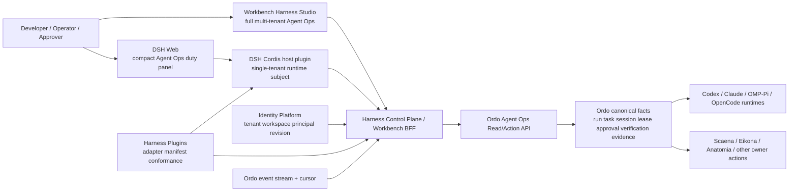
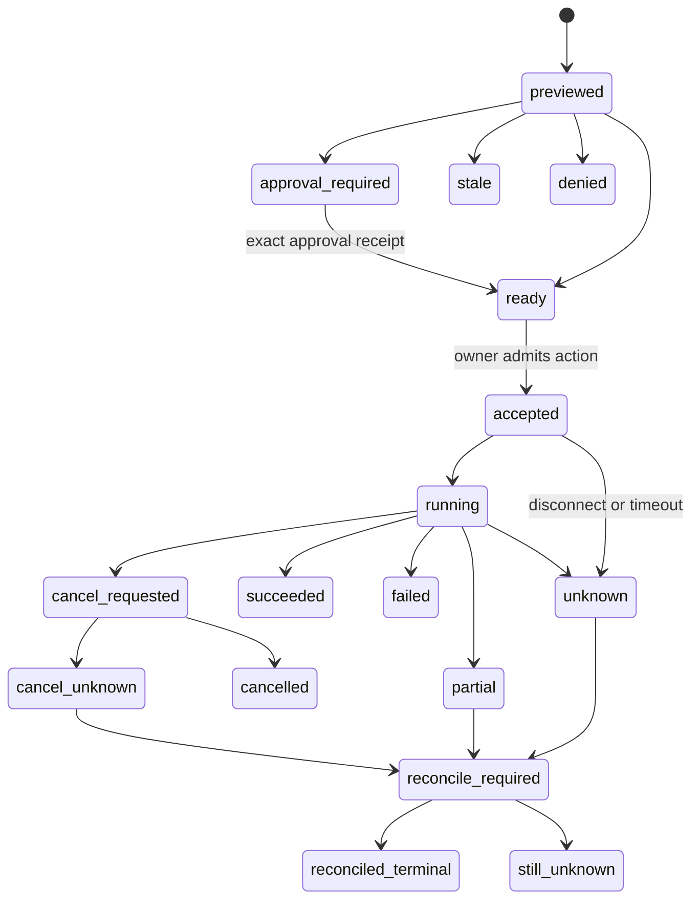

## Context

### 当前状态

Ordo 已经提供可直接使用的 Agent orchestration 命令：

```bash
ordo runtime list --json
ordo runtime doctor codex --json
ordo runtime qualify codex --approve --events
ordo run plan --team software-delivery --goal "implement approved change" --json
ordo run start --plan <plan-id> --agent
ordo run inspect <run-id> --json
ordo run watch <run-id> --events
ordo session list <goal-id> --json
ordo swarm worktree list <run-id> --json
```

同时也有直接 runtime 路径：

```bash
ordo run start --direct --runtimes codex,claude \
  --workspaces /path/codex-worktree,/path/claude-worktree \
  --goal "Implement and independently review the approved change." \
  --approve --model gpt-5.6-luna --events
```

但现有 `ordo harness capacity inspect` 只构建内存中的空 projection：它不会发现或终止 OS 进程，不创建 capacity reservation，也不会仅凭 caller 提供的 qualification ref 或 launcher ready 声明提升 route。全局上限 20、provider/role 限制和 one-writer-per-canonical-repository 是未来 admission 的 fail-closed 基线，而不是已经完成的云端进程调度器。

DSH 已经提供完整的官方扩展缝：Cordis plugin 贡献 service/event/effect；`dsh.bundle` 与 profile 组合插件树；`dsh.client` 暴露 browser client module；UI slots、Conversation Node、ToolView、settings、commands、tools 和 session event 可扩展。DSH 的设计原则是“没有需要 patch 的 privileged core”，因此 Ordo 接入应作为旁挂插件完成。

Workbench 已有 `workbench.harness_studio.v1alpha1` 的安全 projection、plugin descriptor、action gate 和 Ordo read-only canary，但当前 `OrdoHarnessProjection` 只有 `runRef`、`leaseRef`、`reconcileRef`，不足以支持完整 Agent Ops 体验。

### 目标用户

- 云原生/Agent 平台开发者：需要把 Codex、Claude、OMP/Pi、OpenCode 等 runtime 组成团队，查看 DAG、worktree、lease、验证和证据。
- 团队负责人/审批人：需要只看 attention、风险、exact effect 和验证结论，并从同一 owner receipt 判断结果。
- 企业平台管理员：需要 tenant/workspace、安装、权限、runtime binding、容量、审计和 stale/reconcile 状态。
- 漫剧/多模态工作流操作者：需要把 Scaena、Eikona、Anatomia 等领域 task 放入 Ordo 背景运行，并在同一工作台观察进度，不让 Ordo 接管领域 canonical state。

### 约束

1. Ordo 是唯一 Agent scheduling truth。
2. DSH instance 默认单 tenant、单 Harness workspace、单 runtime subject。
3. Workbench 只存布局/筛选/选择等 presentation state，不存 canonical Agent state。
4. 插件和浏览器只能消费 safe refs、短摘要、reason code、typed action 和 evidence ref。
5. timeout、unknown liveness 与断流都不能释放 writer 或自动重派。
6. 当前 DSH change 负责 DSH host/client/bundle 的实现规格；Ordo、Workbench、Harness Plugins 只通过 owner handoff 接入。

## Goals / Non-Goals

**Goals:**

- 冻结一套 DSH、Workbench 与后续 Pi/headless 都能消费的 Ordo Agent Ops 合同。
- 让 DSH 提供快速、上下文内、单租户的操作值班台；让 Workbench 提供完整的多租户控制与分析工作台。
- 明确 snapshot、event、cursor、stale、unknown、approval、receipt 和 reconcile 状态，确保两个客户端不产生语义漂移。
- 在不开放真实 launch 的情况下先交付高价值观察能力，为 durable reservation/lease/action 接口留下 additive 演进路径。
- 为 20 runtime process 的未来容量规划提供诚实的 projected/qualified/reserved 三层展示。

**Non-Goals:**

- 不设计或实现第二 scheduler、第二 worktree manager、第二 approval ledger 或第二 evidence store。
- 不把 DSH session log 当作 Ordo run ledger，也不把 Ordo run ledger当作 DSH 对话 transcript。
- 不设计同进程多 tenant DSH。
- 不让前端通过 command string、shell、URL 或 provider SDK直接控制 runtime。
- 不在本 change 创建新远程仓库、数据库 schema、生产 runtime 或真实 OAuth/SSO 配置。

## Decisions

### 1. 采用四层 split-owner，而不是把 Ordo 嵌进 DSH 或 Workbench



边界：

- Ordo 输出 canonical snapshot、event、action descriptor、receipt/evidence refs。
- Harness Control Plane/BFF 负责 tenant context、installation、audience、权限和 safe projection；它不重算 DAG 状态。
- DSH host plugin 负责同一 tenant runtime 内的 Ordo client、订阅生命周期、短期 cache 与 native client contribution。
- Workbench 负责完整视觉组合与 tenant 操作体验。
- Harness Plugins 负责生成/校验 DSH、Workbench、Pi 和 headless 映射，但插件 release 不能成为事实 owner。

替代方案“在 DSH 内重做 Ordo scheduler”会造成 lease、timeout、task terminal 和 verification 双重真相；拒绝。替代方案“只做 Workbench，不做 DSH”会丢失 DSH 对话上下文中的高频值班体验；拒绝。

### 2. 采用一个语义合同、两个不同密度的客户端

DSH 和 Workbench 必须消费相同的 owner refs、status、reason code、permission、approval、receipt、freshness 和 action schema；它们只在信息密度与工作流深度上不同。

| 关注点 | DSH Web 轻量值班台 | Workbench Agent Ops Studio |
| --- | --- | --- |
| 使用环境 | 单 tenant DSH runtime 内、对话旁 | 多 tenant/workspace 企业工作台 |
| 首屏 | 当前 run、attention、任务摘要、lease、capacity | context bar、run selector、DAG/table、inspector |
| DAG | 摘要/关键路径/失败节点列表 | 可缩放拓扑、分组、过滤、关键路径、依赖解释 |
| Runtime | 当前 runtime route 与 health | provider/model/effort/qualification/capacity 矩阵 |
| Worktree | 当前 lease/fence 简卡 | repository/worktree/owned-path/lease map |
| Approval | 收件箱与单项决策 | 队列、批量筛选、diff/effect/evidence 对比；决策仍逐项 owner receipt |
| Evidence | 最近验证与链接 | verification tree、artifact/evidence viewer、closeout timeline |
| Action | reconcile、批准的审批动作 | 同合同的完整 action/reconcile UX；后续 launch/control |
| 深度工作 | `Open in Studio` 安全深链 | 主工作区 |

#### DSH 线框

```text
┌──────────────── Agent Ops ────────────────┐
│ Tenant/Workspace   Run: running   fresh   │
│ Attention  2   Approval 1   Unknown 1     │
├───────────────────────────────────────────┤
│ Current run: manga-episode-12             │
│ ███████████░  18/24 tasks   ETA unknown   │
│ Critical: render-shot-08 · verifier wait  │
├───────────────────────────────────────────┤
│ Writer lease  retained · worktree wt_42   │
│ Runtime       codex / qualified            │
│ Capacity      4 observed / 20 policy cap   │
├───────────────────────────────────────────┤
│ [Review approval] [Reconcile] [Evidence]  │
│ [Open full Agent Ops Studio]              │
└───────────────────────────────────────────┘
```

#### Workbench 线框

```text
┌ Tenant / Workspace / Installation / Freshness ─────────────────────┐
├ Runs + Capacity ┬ DAG / Task table / Timeline ┬ Task inspector      │
│ run filters     │ ○ plan                       │ state / attempt      │
│ runtime matrix  │ ├─● implement               │ runtime route        │
│ attention       │ │ └─◐ verify                 │ lease/worktree/fence │
│ approvals       │ └─! closeout                 │ evidence / receipts  │
├─────────────────┴──────────────────────────────┴─────────────────────┤
│ Event timeline / approval drawer / reconcile status                 │
└──────────────────────────────────────────────────────────────────────┘
```

### 3. 定义 `ordo.agent_ops.snapshot.v1alpha1`，仅含安全投影

建议 envelope：

```text
schema_version: ordo.agent_ops.snapshot.v1alpha1
snapshot_ref
snapshot_version
generated_at
fresh_until
context:
  tenant_ref
  workspace_ref
  principal_ref
  context_revision
security:
  delegation_ref
  membership_revision
  policy_revision
installation_ref
plugin_release_ref
plugin_release_digest
ordo_contract_digest
stream_ref
cursor
run
tasks[]
edges[]
attempts[]
sessions[]
runtime_routes[]
leases[]
approvals[]
attention_items[]
verifications[]
evidence_refs[]
capacity
allowed_actions[]
```

最小实体：

| 实体 | 必需字段 | 禁止字段 |
| --- | --- | --- |
| `run` | run ref/version、goal safe summary、state、readiness、timestamps、closeout ref | raw goal prompt、private environment |
| `task` | task ref/version、safe title、state、role、dependency refs、critical/attention flags | model prompt、private tool args |
| `attempt/session` | attempt/session ref、runtime ref、state、liveness、last event time | raw transcript、provider native session secret |
| `runtime_route` | runtime id、model/effort label、profile/route digest、qualification state/ref、capability flags | API key、launcher env、arbitrary executable |
| `lease/worktree` | lease/worktree/fence refs、canonical repository ref、owned-path digest、state、retention reason | absolute host path、PID、unredacted file list |
| `approval` | approval ref、action type、target/effect summary、requester/approver refs、expiry、state、preview digest | full input payload、generic bearer |
| `verification` | verification ref、verifier role/runtime、status、candidate/evidence refs、safe summary | full logs、hidden prompts |
| `capacity` | policy cap、observed/retained/projected counts、provider/role buckets、source/freshness | 声称未获 reservation 的 launch capacity 可用 |

`snapshot_version` 必须随 authoritative read model 改变，客户端不能将本地拖拽、过滤或 optimistic action 合入 canonical snapshot。

### 4. 事件是增量观察，snapshot/owner receipt 才决定 terminal

```text
schema_version: ordo.agent_ops.event.v1alpha1
event_ref
stream_ref
sequence
cursor
occurred_at
observed_at
tenant_ref
workspace_ref
run_ref
entity_ref
entity_version
event_type
safe_delta_or_summary
evidence_refs
```

消费规则：

1. 同一 `stream_ref` 只按单调 `sequence` 应用。
2. duplicate event 幂等忽略。
3. gap、expired cursor、contract digest 变化、runtime generation 变化、tenant switch 或 membership/config revoke 立即停止应用并重读 snapshot。
4. event disconnect 只把 freshness 变为 `stale|offline`，不能把 task/run 映射为失败或成功。
5. terminal 状态必须由新 snapshot 或 owner receipt 确认。

### 5. 动作只允许 server-authored descriptor，按能力分期开放

动作复用 `harness.action.v1alpha1` 与 `harness.receipt.v1alpha1`。Ordo Agent Ops 只增加 owner-specific action type，不发明第二 envelope。

| 阶段 | 动作 | 开放条件 |
| --- | --- | --- |
| V1 | `ordo.reconcile.request` | read contract、tenant auth、target/version、idempotency 可验证 |
| V1.1 | `ordo.approval.decide` | approval owner、exact preview/effect、expiry、role 与 receipt 冻结 |
| V2 | `ordo.run.launch` | durable capacity reservation、qualification、workspace admission、lease/fence、cost/approval |
| V2 | `ordo.attempt.cancel` | cancel request 与 cancel_unknown/reconcile 合同完成 |
| V2 | `ordo.task.redispatch` | 原 attempt terminal/dead 可证明或 operator takeover 明确批准 |
| V2 | `ordo.lease.release` | worker 已停止、candidate/verification/closeout 规则满足 |

动作生命周期：



任何 `unknown|partial|cancel_unknown` 都禁止自动重试。UI 只能呈现 Ordo 返回的 `allowed_actions`，不能从 status 自行推导 `restart`。

### 6. DSH adapter 采用 host plugin + client module + bundle 三件套

建议首方包结构（最终路径由 Harness Plugins 子项目确认）：

```text
packages/ordo/agent-ops-service/       # Cordis host plugin
packages/ordo/client-ui-agent-ops/     # dsh.client Web module
packages/ordo/tool-agent-ops/          # optional model-facing safe tools
packages/bundle/yeisme-agent-ops/      # dsh.bundle patch composition
```

Host plugin 责任：

- 从 runtime-local、audience-scoped credential reference 获取短期访问能力；credential 值不下发浏览器。
- 连接 Harness Control Plane/Ordo read endpoint，验证 exact tenant/workspace/runtime binding。
- 管理 snapshot/event subscription、backoff、cursor、dispose、runtime switch 和 bounded in-memory cache。
- 通过 Cordis service/event 暴露安全 projection，不向 client module 暴露任意 base URL 或 generic fetch。
- 注册人类 command，例如 inspect/reconcile 的 typed dispatch；model-facing tool 只读或显式 approval，不能提交 shell。

Client module 责任：

- 使用 `dsh.client` 正式入口和现有 UI primitives/slots。
- 持久 Agent Ops 面板放入 reviewed first-party native slot；单次工具结果使用 `tool.call.toolview`/ToolView。
- 消费 host 提供的 typed projection；不读 browser cookie/token，不直连 Ordo。
- 失效或卸载时清理订阅、缓存、pending dialog 和 stale callbacks。

Bundle/profile 责任：

- 以预构建、固定版本、digest 和兼容范围安装 host/client/tool rows。
- `dsh --profile <profile> --dump-config` 可见所有 contribution；卸载/rollback 不改 DSH core。
- enterprise 启动器保证一个 profile/home/workspace 只属于一个 tenant/runtime subject。

### 7. Workbench 扩展现有 Harness contract，而不是导入 Ordo 私有模块

Workbench `OrdoHarnessProjection` 应从三 ref canary 演进为一组独立 safe view model：

- `OrdoRunSummaryProjection`
- `OrdoTaskGraphProjection`
- `OrdoAttemptSessionProjection`
- `OrdoRuntimeCapacityProjection`
- `OrdoLeaseWorktreeProjection`
- `OrdoApprovalAttentionProjection`
- `OrdoVerificationEvidenceProjection`
- `OrdoCloseoutProjection`

每个 view model 都必须带 exact `HarnessStudioContext`、resource version、contract digest、freshness、evidence refs 和 server-authored allowed actions。Workbench BFF 负责 fetch/dispatch；React route 只做渲染、筛选、布局和 dialog。

Canvas 可以保存 node position、group、viewport、用户注释和显示偏好，但 Ordo node 必须保存 owner ref/version/freshness；拖动节点不能改变 task dependency。

### 8. 可视状态必须完整、可访问且不只依赖颜色

统一状态词汇：

| 状态 | UI 语义 | 可执行性 |
| --- | --- | --- |
| `ready` | 合同、权限、freshness 正常 | 仅 owner 允许动作 |
| `running` | owner 报告正在执行 | 不推导成功 |
| `attention_required` | 需要人工查看 | 只显示 owner action |
| `approval_required` | exact action 等审批 | 无 receipt 前不可执行 |
| `reconcile_required` | terminal/liveness 未知 | 禁止重派；只 reconcile |
| `stale` | snapshot/event 已过期 | mutation disabled，刷新 snapshot |
| `offline` | owner/BFF 不可达 | 只显示最近安全快照和时间 |
| `permission_denied` | 当前 principal 无权 | 不泄露资源存在性或详情 |
| `contract_mismatch` | host/plugin/schema 不兼容 | fail closed，提示升级/回滚 |

所有状态同时使用图标、文本、可访问名称和说明；approval drawer 支持键盘、焦点回归和 screen reader live region；动效支持 reduced motion。桌面宽屏采用三栏，平板降为列表 + drawer，窄屏 DSH 只保留摘要卡和逐层 drill-down。

### 9. 容量展示区分 policy、observation、qualification 和 reservation

UI 不得只显示“4/20 可用”而隐瞒来源。容量视图至少显示：

- `policy_cap`：配置的全局上限，最大 20；
- `observed_or_retained`：authoritative projection 中仍占用的 active/timeout/unknown；
- `route_qualified`：runtime profile 的 protected qualification 是否有效；
- `reservation_state`：`not_supported|not_reserved|reserved|stale|revoked|unknown`；
- provider/role buckets；
- one-writer-per-canonical-repository 阻塞原因；
- snapshot source 与 freshness。

在 durable reservation 未实现前，按钮文案必须是“查看规划容量”而不是“启动可用容量”。

### 10. 多租户、安全与审计绑定 exact context

每次 read/action 必须绑定：

```text
tenant_ref
workspace_ref
principal_ref
context_revision
membership_revision
delegation_ref
policy_revision
installation_ref
plugin_release_digest
runtime_ref + runtime_generation (when present)
target_ref + target_version
ordo_contract_digest
```

安全规则：

- DSH bridge 使用 `aud=ordo-agent-ops` 的短期能力或由 host BFF 代理；浏览器不持有通用 bearer。
- tenant/workspace 切换必须先 teardown 旧 subscription/cache/selection/draft，再加载新上下文。
- native client module 仅限 reviewed first-party release；第三方 surface 默认 sandboxed iframe。
- safe summaries 不得含 URL、Authorization、token、absolute path、raw prompt、provider payload 或私有工具参数。
- plugin release、contract digest、installation config revision 漂移会使旧 action descriptor/approval/cursor 失效。
- receipt 和 evidence append-only；读取时重新做 tenant/resource authorization。

### 11. 性能目标采用分层投影与虚拟化

首版设计目标：单 run 可观察 1,000 task nodes、10,000 近期事件、100 active/retained attempts；这不是 Ordo hard limit，而是客户端验收预算。

- DAG 与 task table 使用 viewport/row virtualization。
- snapshot 支持 summary/detail 分层与 cursor pagination；首屏不下载完整 evidence/log。
- event UI 合并高频 progress 更新，但不得跨 sequence 丢失 terminal/approval/lease/verification 事件。
- DSH 只订阅当前 run + attention 摘要；Workbench 可按筛选订阅完整 run。
- 大图自动切换 overview/minimap/critical-path 模式，不能让 1,000 节点阻塞主线程。

### 12. 场景矩阵复用一个 shared engine

| Scenario id | 用户 | Job-to-be-done | 必需 artifact | Gate/Review | Evidence | Handoff | Readiness |
| --- | --- | --- | --- | --- | --- | --- | --- |
| `ops-direct-run` | Agent 开发者 | 观察 Codex/Claude direct run | run/task/session/runtime | qualification、workspace | run/evidence refs | DSH→Studio | first-support |
| `ops-team-delivery` | 技术负责人 | 观察 writer+verifier 团队交付 | DAG、lease、candidate、verification | single writer、approval | candidate/verification refs | Workbench | first-support |
| `ops-timeout-reconcile` | 操作员 | 处理 timeout/unknown | attempt、lease、cursor | 禁止重派 | reconcile receipt | 双端 | first-support |
| `ops-multi-repo` | 平台开发者 | 查看多个 worktree/repository | worktree/lease map | canonical repo/fence | lease evidence | Workbench | exploratory |
| `ops-drama-production` | 漫剧导演/制片 | 观察 Scaena/Eikona 背景 task | Ordo task + domain refs | 领域 approval/cost/rights | Ordo + owner receipts | Episode Workspace | exploratory |

场景可以增加，但必须复用同一 snapshot/event/action/receipt/owner-ref 引擎，不得为每种创作流程复制 Agent Ops stack。

## User Workflows

### 当前 CLI 使用

1. `ordo runtime doctor <runtime> --json` 检查环境。
2. `ordo runtime qualify <runtime> --approve --events` 在已认证环境运行 protected canary。
3. `ordo run plan ... --json` 生成 DAG，或用 `ordo run start --direct ...` 直接启动批准的本地运行。
4. `ordo run watch <run-id> --events` 观察事件，`ordo run inspect <run-id> --json` 读取 authoritative snapshot。
5. `ordo swarm worktree list <run-id> --json` 与 `ordo session list <goal-id> --json` 读取 worktree/session。
6. timeout/unknown 时运行 owner 提供的 reconcile 命令，而不是手工再启一个 writer。

### 插件后的 DSH 使用

1. 用户通过企业入口进入 tenant-isolated DSH runtime。
2. Ordo Agent Ops 面板自动加载当前 workspace 的 run/attention 摘要。
3. 用户在对话旁查看当前 run、lease、runtime qualification 和最近 verification。
4. 有 approval/reconcile 时打开 drawer，核对 exact target/effect/owner/expiry。
5. 复杂 DAG、多个 run、证据对比或管理操作通过 `Open in Studio` 进入 Workbench；目标重新鉴权，不信任 URL 参数。

### Workbench 使用

1. 选择 tenant/workspace/installation 后加载 snapshot。
2. 在 DAG/table/timeline 中定位 task/attempt/session。
3. inspector 展示 runtime route、worktree/lease/fence、verification/evidence 和 allowed actions。
4. mutation 先 preview；若 approval required 则生成 exact approval flow。
5. dispatch 后只显示 accepted/running/unknown/terminal owner receipt；断线进入 reconcile_required。

## Migration Plan

### Phase 0：合同冻结

- 完成本 DSH change。
- 在 Ordo、Workbench、Harness Plugins 分别创建 owner OpenSpec handoff。
- 将 `enterprise-harness-platform-v1` 的通用 action/receipt 作为 normative dependency，避免重复定义。

### Phase 1：只读 snapshot

- Ordo 提供 safe projection/read adapter 与 conformance fixtures。
- Workbench 扩展现有 `OrdoHarnessProjection` 并交付 DAG/table/inspector read-only canary。
- DSH 交付 host/client/bundle 的 read-only Agent Ops 面板。

### Phase 2：事件与 reconcile

- 接入 event stream/cursor、gap reload、tenant/runtime switch teardown。
- 开放 `ordo.reconcile.request`；未知结果不自动重试。

### Phase 3：审批动作

- 冻结 Ordo approval owner contract、exact preview binding 和 receipt。
- 双端开放相同 `ordo.approval.decide` descriptor。

### Phase 4：持久 launch/control

- 仅在 Ordo durable reservation、canonical repo authority、lease/worktree/fencing、qualification、crash/replay 验收完成后开放 launch/cancel/redispatch/release。

### Phase 5：插件供应链与更多宿主

- Harness Plugins 仓库提供签名 release、DSH/Pi/Workbench/headless conformance。
- 加入 Scaena/Eikona/Anatomia 等 workflow pack，但保留 domain owner receipts。

回滚策略：停用/回滚插件 release 只创建旧 release 的新 runtime generation；不删除 Ordo facts、receipt 或 evidence。客户端 contract mismatch 时退化为 read-only summary + CLI 命令提示。

## Risks / Trade-offs

- [Ordo 现有 headless capacity 仍只读] → UI 明示 projected/qualified/reserved 来源，V1 不开放 launch。
- [DSH 上游处于快速变化期] → 固定兼容版本与 conformance，使用公开 Cordis/client/bundle seam，不导入内部 React store。
- [双客户端造成语义漂移] → 共享 contract/reason code/fixtures；允许布局不同，不允许 status/action/receipt 不同。
- [event 流断线导致重复执行] → snapshot/receipt 决定 terminal；unknown 禁止 retry，只提供 reconcile。
- [大 DAG 影响性能] → 分层 projection、虚拟化、cursor、critical-path/overview 模式和性能基准。
- [跨 tenant 缓存污染] → exact context revision、先 teardown 后切换、BFF re-authorization、客户端 store tenant-keyed 且切换清空。
- [插件拥有过大权限] → first-party reviewed native module；第三方 iframe；host adapter 固定 typed action，无 arbitrary shell/url/token。
- [领域工作流被 Ordo 吸收] → Ordo task 只引用 domain owner action/receipt，剧本、资产、ProductionGraph 等继续由领域 owner 持有。

## Trace、Audit 与 Test Evidence

跨项目验收至少生成以下 redacted evidence：

- contract fixture digest、plugin release digest、host compatibility result；
- exact tenant/workspace/principal/context revision；
- snapshot ref/version、stream ref/cursor、gap/reload 记录；
- action/approval/idempotency/receipt/reconcile lineage；
- run/task/attempt/session/lease/worktree/verification/evidence refs；
- unknown、late result、duplicate event、tenant switch、membership revoke、contract mismatch 的负向证据；
- UI keyboard/focus/a11y、1,000 node/10,000 event 性能证据；
- 所有 summary/log 不含 secret、raw prompt、provider payload、private tool args、absolute host path 或完整思维链。

子项目 integration/component/system/e2e runner 必须将每次运行证据写到各自 `temp/integration-test-runs/<run-id>/`，保留 `summary.json`、`command.txt`、stdout/stderr、env 和 artifacts，并按仓库标准脱敏。

## Open Questions

1. Ordo Agent Ops Read/Action API 首期由 Ordo 直接暴露，还是先通过 Harness Control Plane BFF 的内进程 adapter 提供？建议先定义 transport-neutral service contract，再由 BFF adapter 消费。
2. DSH 的持久入口最终落在 sidebar slot、独立 panel 还是 command palette + drawer？建议 sidebar attention badge + main panel，ToolView 只承载单次动作。
3. approval owner 是否统一属于 Ordo，还是某些 action 由 Harness Control Plane/领域 owner 签发？建议 envelope 统一，issuer owner 明确，不强行集中 canonical approval state。
4. V1 是否允许 DSH 直接审批？建议仅对低/中风险、exact preview、非付费且 Ordo 合同已冻结的动作开放；高风险/付费/跨 repo 动作先只在 Workbench。
5. durable reservation 的 store 与 Runtime Plane 的本机 process observation 如何对账？需要 Ordo 后续 core design 冻结，不能由本 UI change 决定。
